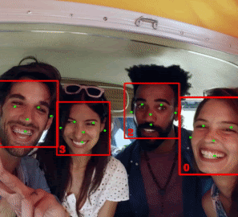
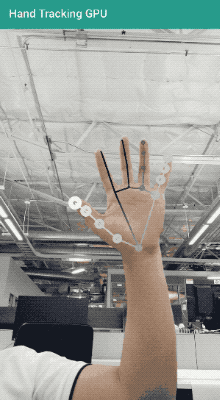

=======================================================================

[MediaPipe](http://mediapipe.dev) is a framework for building multimodal (eg. video, audio, any time series data) applied ML pipelines. With MediaPipe, a perception pipeline can be built as a graph of modular components, including, for instance, inference models (e.g., TensorFlow, TFLite) and media processing functions.

## ML Solutions in MediaPipe

* [Hand Tracking](mediapipe/docs/hand_tracking_mobile_gpu.md)
* [Face Detection](mediapipe/docs/face_detection_mobile_gpu.md)
* [Hair Segmentation](mediapipe/docs/hair_segmentation_mobile_gpu.md)
* [Object Detection](mediapipe/docs/object_detection_mobile_gpu.md)

## Installation
Follow these [instructions](mediapipe/docs/install.md).

## Getting started
See mobile and desktop [examples](mediapipe/docs/examples.md).

## Documentation
[MediaPipe Read-the-Docs](https://mediapipe.readthedocs.io/) or [docs.mediapipe.dev](https://docs.mediapipe.dev)

Check out the [Examples page](https://mediapipe.readthedocs.io/en/latest/examples.html) for tutorials on how to use MediaPipe. [Concepts page](https://mediapipe.readthedocs.io/en/latest/concepts.html) for basic definitions

## Visualizing MediaPipe graphs
A web-based visualizer is hosted on [viz.mediapipe.dev](https://viz.mediapipe.dev/). Please also see instructions [here](mediapipe/docs/visualizer.md).

## Community forum
*  [Discuss](https://groups.google.com/forum/#!forum/mediapipe) - General community discussion around MediaPipe

## Publications
* [MediaPipe: A Framework for Building Perception Pipelines](https://arxiv.org/abs/1906.08172)

## Events
[Open sourced at CVPR 2019](https://sites.google.com/corp/view/perception-cv4arvr/mediapipe) on June 17~20 in Long Beach, CA

## Alpha Disclaimer
MediaPipe is currently in alpha for v0.6. We are still making breaking API changes and expect to get to stable API by v1.0.

## Contributing
We welcome contributions. Please follow these [guidelines](./CONTRIBUTING.md).

We use GitHub issues for tracking requests and bugs. Please post questions to the MediaPipe Stack Overflow with a 'mediapipe' tag.
