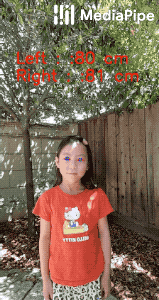
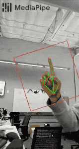
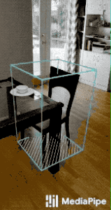

--------------------------------------------------------------------------------

## Cross-platform ML solutions made simple

[MediaPipe](https://google.github.io/mediapipe/) is the simplest way for researchers
and developers to build world-class ML solutions and applications for mobile,
desktop/cloud, web and IoT devices.

                                                               | 
:------------------------------------------------------------------------------------------------------------: | :----------------------------------------------------:
***End-to-End acceleration***: *built-in fast ML inference and processing accelerated even on common hardware* | ***Build one, deploy anywhere***: *Unified solution works across Android, iOS, desktop/cloud, web and IoT*
                                                             | 
***Ready-to-use solutions***: *Cutting-edge ML solutions demonstrating full power of the framework*            | ***Free and open source***: *Framework and solutions both under Apache 2.0, fully extensible and customizable*

## ML solutions in MediaPipe

Face Detection                                                                                                                 | Face Mesh                                                                                                       | Iris                                                                                                      | Hands
:----------------------------------------------------------------------------------------------------------------------------: | :-------------------------------------------------------------------------------------------------------------: | :-------------------------------------------------------------------------------------------------------: | :---:
 |  |  | 

Hair Segmentation                                                                                                                       | Object Detection                                                                                                                     | Box Tracking                                                                                                                | Objectron                                                                                                             | KNIFT
:-------------------------------------------------------------------------------------------------------------------------------------: | :----------------------------------------------------------------------------------------------------------------------------------: | :-------------------------------------------------------------------------------------------------------------------------: | :-------------------------------------------------------------------------------------------------------------------: | :---:
 |  |  |  | 

<!--  in the first cell is needed to preserve table formatting in GitHub Pages. -->
<!-- Whenever this table is updated, paste a copy to solutions/solutions.md. -->

                                                                          | Android | iOS | Desktop | Web | Coral
:---------------------------------------------------------------------------- | :-----: | :-: | :-----: | :-: | :---:
[Face Detection](https://google.github.io/mediapipe/solutions/face_detection)       | ✅       | ✅   | ✅       | ✅   | ✅
[Face Mesh](https://google.github.io/mediapipe/solutions/face_mesh)                 | ✅       | ✅   | ✅       |     |
[Iris](https://google.github.io/mediapipe/solutions/iris)                           | ✅       | ✅   | ✅       | ✅   |
[Hands](https://google.github.io/mediapipe/solutions/hands)                         | ✅       | ✅   | ✅       | ✅   |
[Hair Segmentation](https://google.github.io/mediapipe/solutions/hair_segmentation) | ✅       |     | ✅       | ✅   |
[Object Detection](https://google.github.io/mediapipe/solutions/object_detection)   | ✅       | ✅   | ✅       |     | ✅
[Box Tracking](https://google.github.io/mediapipe/solutions/box_tracking)           | ✅       | ✅   | ✅       |     |
[Objectron](https://google.github.io/mediapipe/solutions/objectron)                 | ✅       |     |         |     |
[KNIFT](https://google.github.io/mediapipe/solutions/knift)                         | ✅       |     |         |     |
[AutoFlip](https://google.github.io/mediapipe/solutions/autoflip)                   |         |     | ✅       |     |
[MediaSequence](https://google.github.io/mediapipe/solutions/media_sequence)        |         |     | ✅       |     |
[YouTube 8M](https://google.github.io/mediapipe/solutions/youtube_8m)               |         |     | ✅       |     |

## MediaPipe on the Web

MediaPipe on the Web is an effort to run the same ML solutions built for mobile
and desktop also in web browsers. The official API is under construction, but
the core technology has been proven effective. Please see
[MediaPipe on the Web](https://developers.googleblog.com/2020/01/mediapipe-on-web.html)
in Google Developers Blog for details.

You can use the following links to load a demo in the MediaPipe Visualizer, and
over there click the "Runner" icon in the top bar like shown below. The demos
use your webcam video as input, which is processed all locally in real-time and
never leaves your device.

*   [MediaPipe Face Detection](https://viz.mediapipe.dev/demo/face_detection)
*   [MediaPipe Iris](https://viz.mediapipe.dev/demo/iris_tracking)
*   [MediaPipe Iris: Depth-from-Iris](https://viz.mediapipe.dev/demo/iris_depth)
*   [MediaPipe Hands](https://viz.mediapipe.dev/demo/hand_tracking)
*   [MediaPipe Hands (palm/hand detection only)](https://viz.mediapipe.dev/demo/hand_detection)
*   [MediaPipe Hair Segmentation](https://viz.mediapipe.dev/demo/hair_segmentation)

## Getting started

Learn how to [install](https://google.github.io/mediapipe/getting_started/install)
MediaPipe and
[build example applications](https://google.github.io/mediapipe/getting_started/building_examples),
and start exploring our ready-to-use
[solutions](https://google.github.io/mediapipe/solutions/solutions) that you can
further extend and customize.

The source code is hosted in the
[MediaPipe Github repository](https://github.com/google/mediapipe), and you can
run code search using
[Google Open Source Code Search](https://cs.opensource.google/mediapipe/mediapipe).

## Publications

*   [MediaPipe Iris: Real-time Eye Tracking and Depth Estimation from a Single
    Image](https://mediapipe.page.link/iris-blog) in Google AI Blog
*   [MediaPipe KNIFT: Template-based feature matching](https://developers.googleblog.com/2020/04/mediapipe-knift-template-based-feature-matching.html)
    in Google Developers Blog
*   [Alfred Camera: Smart camera features using MediaPipe](https://developers.googleblog.com/2020/03/alfred-camera-smart-camera-features-using-mediapipe.html)
    in Google Developers Blog
*   [Real-Time 3D Object Detection on Mobile Devices with MediaPipe](https://ai.googleblog.com/2020/03/real-time-3d-object-detection-on-mobile.html)
    in Google AI Blog
*   [AutoFlip: An Open Source Framework for Intelligent Video Reframing](https://ai.googleblog.com/2020/02/autoflip-open-source-framework-for.html)
    in Google AI Blog
*   [MediaPipe on the Web](https://developers.googleblog.com/2020/01/mediapipe-on-web.html)
    in Google Developers Blog
*   [Object Detection and Tracking using MediaPipe](https://developers.googleblog.com/2019/12/object-detection-and-tracking-using-mediapipe.html)
    in Google Developers Blog
*   [On-Device, Real-Time Hand Tracking with MediaPipe](https://ai.googleblog.com/2019/08/on-device-real-time-hand-tracking-with.html)
    in Google AI Blog
*   [MediaPipe: A Framework for Building Perception Pipelines](https://arxiv.org/abs/1906.08172)

## Videos

*   [YouTube Channel](https://www.youtube.com/c/MediaPipe)

## Events

*   [MediaPipe Seattle Meetup, Google Building Waterside, 13 Feb 2020](https://mediapipe.page.link/seattle2020)
*   [AI Nextcon 2020, 12-16 Feb 2020, Seattle](http://aisea20.xnextcon.com/)
*   [MediaPipe Madrid Meetup, 16 Dec 2019](https://www.meetup.com/Madrid-AI-Developers-Group/events/266329088/)
*   [MediaPipe London Meetup, Google 123 Building, 12 Dec 2019](https://www.meetup.com/London-AI-Tech-Talk/events/266329038)
*   [ML Conference, Berlin, 11 Dec 2019](https://mlconference.ai/machine-learning-advanced-development/mediapipe-building-real-time-cross-platform-mobile-web-edge-desktop-video-audio-ml-pipelines/)
*   [MediaPipe Berlin Meetup, Google Berlin, 11 Dec 2019](https://www.meetup.com/Berlin-AI-Tech-Talk/events/266328794/)
*   [The 3rd Workshop on YouTube-8M Large Scale Video Understanding Workshop,
    Seoul, Korea ICCV
    2019](https://research.google.com/youtube8m/workshop2019/index.html)
*   [AI DevWorld 2019, 10 Oct 2019, San Jose, CA](https://aidevworld.com)
*   [Google Industry Workshop at ICIP 2019, 24 Sept 2019, Taipei, Taiwan](http://2019.ieeeicip.org/?action=page4&id=14#Google)
    ([presentation](https://docs.google.com/presentation/d/e/2PACX-1vRIBBbO_LO9v2YmvbHHEt1cwyqH6EjDxiILjuT0foXy1E7g6uyh4CesB2DkkEwlRDO9_lWfuKMZx98T/pub?start=false&loop=false&delayms=3000&slide=id.g556cc1a659_0_5))
*   [Open sourced at CVPR 2019, 17~20 June, Long Beach, CA](https://sites.google.com/corp/view/perception-cv4arvr/mediapipe)

## Community

*   [Awesome MediaPipe](https://mediapipe.org) - A curated list of awesome
    MediaPipe related frameworks, libraries and software
*   [Slack community](https://mediapipe.page.link/joinslack) for MediaPipe users
*   [Discuss](https://groups.google.com/forum/#!forum/mediapipe) - General
    community discussion around MediaPipe

## Alpha disclaimer

MediaPipe is currently in alpha at v0.7. We may be still making breaking API
changes and expect to get to stable APIs by v1.0.

## Contributing

We welcome contributions. Please follow these
[guidelines](https://github.com/google/mediapipe/blob/master/CONTRIBUTING.md).

We use GitHub issues for tracking requests and bugs. Please post questions to
the MediaPipe Stack Overflow with a `mediapipe` tag.
