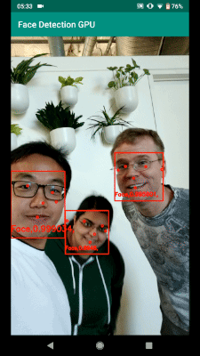
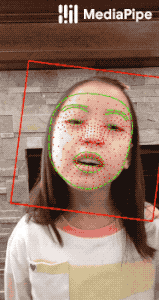
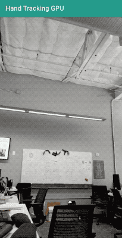
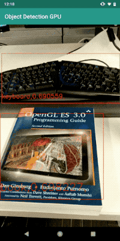
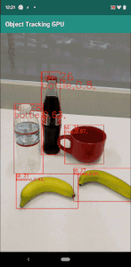
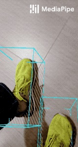

=======================================================================

[MediaPipe](http://mediapipe.dev) is the simplest way for researchers and developers to build world-class ML solutions and applications for mobile, edge, cloud and the web.

## ML Solutions in MediaPipe

* [Face Detection](mediapipe/docs/face_detection_mobile_gpu.md) [(web demo)](https://viz.mediapipe.dev/runner/demos/face_detection/face_detection.html)
* [Face Mesh](mediapipe/docs/face_mesh_mobile_gpu.md)
* [Hand Detection](mediapipe/docs/hand_detection_mobile_gpu.md)
* [Hand Tracking](mediapipe/docs/hand_tracking_mobile_gpu.md) [(web demo)](https://viz.mediapipe.dev/runner/demos/hand_tracking/hand_tracking.html)
* [Multi-hand Tracking](mediapipe/docs/multi_hand_tracking_mobile_gpu.md)
* [Hair Segmentation](mediapipe/docs/hair_segmentation_mobile_gpu.md) [(web demo)](https://viz.mediapipe.dev/runner/demos/hair_segmentation/hair_segmentation.html)
* [Object Detection](mediapipe/docs/object_detection_mobile_gpu.md)
* [Object Detection and Tracking](mediapipe/docs/object_tracking_mobile_gpu.md)
* [Objectron: 3D Object Detection and Tracking](mediapipe/docs/objectron_mobile_gpu.md)
* [AutoFlip: Intelligent Video Reframing](mediapipe/docs/autoflip.md)
* [KNIFT: Template Matching with Neural Image Features](mediapipe/docs/template_matching_mobile_cpu.md)

## Installation
Follow these [instructions](mediapipe/docs/install.md).

## Getting started
See mobile, desktop, web and Google Coral [examples](mediapipe/docs/examples.md).

## Documentation
[MediaPipe Read-the-Docs](https://mediapipe.readthedocs.io/) or [docs.mediapipe.dev](https://docs.mediapipe.dev)

Check out the [Examples page](https://mediapipe.readthedocs.io/en/latest/examples.html) for tutorials on how to use MediaPipe. [Concepts page](https://mediapipe.readthedocs.io/en/latest/concepts.html) for basic definitions

## Visualizing MediaPipe graphs
A web-based visualizer is hosted on [viz.mediapipe.dev](https://viz.mediapipe.dev/). Please also see instructions [here](mediapipe/docs/visualizer.md).

## Google Open Source Code search
Search MediaPipe Github repository using [Google Open Source code search](https://t.co/LSZnbMUUnT?amp=1)

## Videos
*  [YouTube Channel](https://www.youtube.com/channel/UCObqmpuSMx-usADtL_qdMAw)

## Publications
* [MediaPipe KNIFT: Template-based Feature Matching](https://mediapipe.page.link/knift-blog)
* [Alfred Camera: Smart camera features using MediaPipe](https://developers.googleblog.com/2020/03/alfred-camera-smart-camera-features-using-mediapipe.html)
* [MediaPipe Objectron: Real-time 3D Object Detection on Mobile Devices](https://mediapipe.page.link/objectron-aiblog)
* [AutoFlip: An Open Source Framework for Intelligent Video Reframing](https://mediapipe.page.link/autoflip)
* [Google Developer Blog: MediaPipe on the Web](https://mediapipe.page.link/webdevblog)
* [Google Developer Blog: Object Detection and Tracking using MediaPipe](https://mediapipe.page.link/objecttrackingblog)
* [On-Device, Real-Time Hand Tracking with MediaPipe](https://ai.googleblog.com/2019/08/on-device-real-time-hand-tracking-with.html)
* [MediaPipe: A Framework for Building Perception Pipelines](https://arxiv.org/abs/1906.08172)

## Events
* [MediaPipe Seattle Meetup, Google Building Waterside, 13 Feb 2020](https://mediapipe.page.link/seattle2020)
* [AI Nextcon 2020, 12-16 Feb 2020, Seattle](http://aisea20.xnextcon.com/)
* [MediaPipe Madrid Meetup, 16 Dec 2019](https://www.meetup.com/Madrid-AI-Developers-Group/events/266329088/)
* [MediaPipe London Meetup, Google 123 Building, 12 Dec 2019](https://www.meetup.com/London-AI-Tech-Talk/events/266329038)
* [ML Conference, Berlin, 11 Dec 2019](https://mlconference.ai/machine-learning-advanced-development/mediapipe-building-real-time-cross-platform-mobile-web-edge-desktop-video-audio-ml-pipelines/)
* [MediaPipe Berlin Meetup, Google Berlin, 11 Dec 2019](https://www.meetup.com/Berlin-AI-Tech-Talk/events/266328794/)
* [The 3rd Workshop on YouTube-8M Large Scale Video Understanding Workshop](https://research.google.com/youtube8m/workshop2019/index.html) Seoul, Korea ICCV 2019
* [AI DevWorld 2019](https://aidevworld.com) on Oct 10 in San Jose, California
* [Google Industry Workshop at ICIP 2019](http://2019.ieeeicip.org/?action=page4&id=14#Google) [Presentation](https://docs.google.com/presentation/d/e/2PACX-1vRIBBbO_LO9v2YmvbHHEt1cwyqH6EjDxiILjuT0foXy1E7g6uyh4CesB2DkkEwlRDO9_lWfuKMZx98T/pub?start=false&loop=false&delayms=3000&slide=id.g556cc1a659_0_5) on Sept 24 in Taipei, Taiwan
* [Open sourced at CVPR 2019](https://sites.google.com/corp/view/perception-cv4arvr/mediapipe) on June 17~20 in Long Beach, CA

## Community
*  [Awesome MediaPipe: curation of code related to MediaPipe](https://mediapipe.org)
*  [Slack community for MediaPipe users](https://mediapipe.slack.com)
*  [Discuss](https://groups.google.com/forum/#!forum/mediapipe) - General community discussion around MediaPipe

## Alpha Disclaimer
MediaPipe is currently in alpha for v0.7. We are still making breaking API changes and expect to get to stable API by v1.0.

## Contributing
We welcome contributions. Please follow these [guidelines](./CONTRIBUTING.md).

We use GitHub issues for tracking requests and bugs. Please post questions to the MediaPipe Stack Overflow with a 'mediapipe' tag.
