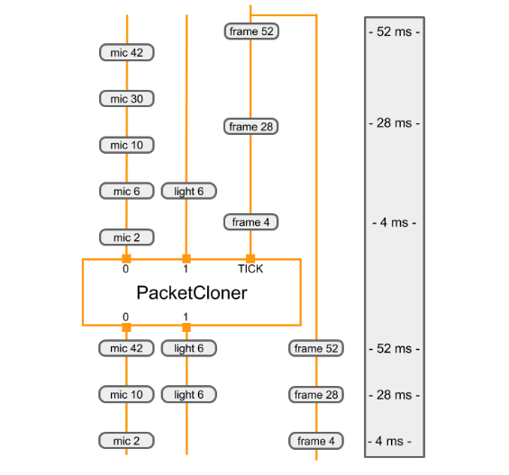

# Calculators
{: .no_toc }

1. TOC
{:toc}
---

Each calculator is a node of a graph. We describe how to create a new
calculator, how to initialize a calculator, how to perform its calculations,
input and output streams, timestamps, and options. Each node in the graph is
implemented as a `Calculator`. The bulk of graph execution happens inside its
calculators. A calculator may receive zero or more input streams and/or side
packets and produces zero or more output streams and/or side packets.

## CalculatorBase

A calculator is created by defining a new sub-class of the
[`CalculatorBase`](https://github.com/google/mediapipe/tree/master/mediapipe/framework/calculator_base.cc)
class, implementing a number of methods, and registering the new sub-class with
Mediapipe. At a minimum, a new calculator must implement the below four methods

*   `GetContract()`
    *   Calculator authors can specify the expected types of inputs and outputs
        of a calculator in GetContract(). When a graph is initialized, the
        framework calls a static method to verify if the packet types of the
        connected inputs and outputs match the information in this
        specification.
*   `Open()`
    *   After a graph starts, the framework calls `Open()`. The input side
        packets are available to the calculator at this point. `Open()`
        interprets the node configuration operations (see [Graphs](graphs.md))
        and prepares the calculator's per-graph-run state. This function may
        also write packets to calculator outputs. An error during `Open()` can
        terminate the graph run.
*   `Process()`
    *   For a calculator with inputs, the framework calls `Process()` repeatedly
        whenever at least one input stream has a packet available. The framework
        by default guarantees that all inputs have the same timestamp (see
        [Synchronization](synchronization.md) for more information). Multiple
        `Process()` calls can be invoked simultaneously when parallel execution
        is enabled. If an error occurs during `Process()`, the framework calls
        `Close()` and the graph run terminates.
*   `Close()`
    *   After all calls to `Process()` finish or when all input streams close,
        the framework calls `Close()`. This function is always called if
        `Open()` was called and succeeded and even if the graph run terminated
        because of an error. No inputs are available via any input streams
        during `Close()`, but it still has access to input side packets and
        therefore may write outputs. After `Close()` returns, the calculator
        should be considered a dead node. The calculator object is destroyed as
        soon as the graph finishes running.

The following are code snippets from
[CalculatorBase.h](https://github.com/google/mediapipe/tree/master/mediapipe/framework/calculator_base.h).

```c++
class CalculatorBase {
 public:
  ...

  // The subclasses of CalculatorBase must implement GetContract.
  // ...
  static absl::Status GetContract(CalculatorContract* cc);

  // Open is called before any Process() calls, on a freshly constructed
  // calculator.  Subclasses may override this method to perform necessary
  // setup, and possibly output Packets and/or set output streams' headers.
  // ...
  virtual absl::Status Open(CalculatorContext* cc) {
    return absl::OkStatus();
  }

  // Processes the incoming inputs. May call the methods on cc to access
  // inputs and produce outputs.
  // ...
  virtual absl::Status Process(CalculatorContext* cc) = 0;

  // Is called if Open() was called and succeeded.  Is called either
  // immediately after processing is complete or after a graph run has ended
  // (if an error occurred in the graph).  ...
  virtual absl::Status Close(CalculatorContext* cc) {
    return absl::OkStatus();
  }

  ...
};
```

## Life of a calculator

During initialization of a MediaPipe graph, the framework calls a
`GetContract()` static method to determine what kinds of packets are expected.

The framework constructs and destroys the entire calculator for each graph run
(e.g. once per video or once per image). Expensive or large objects that remain
constant across graph runs should be supplied as input side packets so the
calculations are not repeated on subsequent runs.

After initialization, for each run of the graph, the following sequence occurs:

*   `Open()`
*   `Process()` (repeatedly)
*   `Close()`

The framework calls `Open()` to initialize the calculator. `Open()` should
interpret any options and set up the calculator's per-graph-run state. `Open()`
may obtain input side packets and write packets to calculator outputs. If
appropriate, it should call `SetOffset()` to reduce potential packet buffering
of input streams.

If an error occurs during `Open()` or `Process()` (as indicated by one of them
returning a non-`Ok` status), the graph run is terminated with no further calls
to the calculator's methods, and the calculator is destroyed.

For a calculator with inputs, the framework calls `Process()` whenever at least
one input has a packet available. The framework guarantees that inputs all have
the same timestamp, that timestamps increase with each call to `Process()` and
that all packets are delivered. As a consequence, some inputs may not have any
packets when `Process()` is called. An input whose packet is missing appears to
produce an empty packet (with no timestamp).

The framework calls `Close()` after all calls to `Process()`. All inputs will
have been exhausted, but `Close()` has access to input side packets and may
write outputs. After Close returns, the calculator is destroyed.

Calculators with no inputs are referred to as sources. A source calculator
continues to have `Process()` called as long as it returns an `Ok` status. A
source calculator indicates that it is exhausted by returning a stop status
(i.e. MediaPipe::tool::StatusStop).

## Identifying inputs and outputs

The public interface to a calculator consists of a set of input streams and
output streams. In a CalculatorGraphConfiguration, the outputs from some
calculators are connected to the inputs of other calculators using named
streams. Stream names are normally lowercase, while input and output tags are
normally UPPERCASE. In the example below, the output with tag name `VIDEO` is
connected to the input with tag name `VIDEO_IN` using the stream named
`video_stream`.

```proto
# Graph describing calculator SomeAudioVideoCalculator
node {
  calculator: "SomeAudioVideoCalculator"
  input_stream: "INPUT:combined_input"
  output_stream: "VIDEO:video_stream"
}
node {
  calculator: "SomeVideoCalculator"
  input_stream: "VIDEO_IN:video_stream"
  output_stream: "VIDEO_OUT:processed_video"
}
```

Input and output streams can be identified by index number, by tag name, or by a
combination of tag name and index number. You can see some examples of input and
output identifiers in the example below. `SomeAudioVideoCalculator` identifies
its video output by tag and its audio outputs by the combination of tag and
index. The input with tag `VIDEO` is connected to the stream named
`video_stream`. The outputs with tag `AUDIO` and indices `0` and `1` are
connected to the streams named `audio_left` and `audio_right`.
`SomeAudioCalculator` identifies its audio inputs by index only (no tag needed).

```proto
# Graph describing calculator SomeAudioVideoCalculator
node {
  calculator: "SomeAudioVideoCalculator"
  input_stream: "combined_input"
  output_stream: "VIDEO:video_stream"
  output_stream: "AUDIO:0:audio_left"
  output_stream: "AUDIO:1:audio_right"
}

node {
  calculator: "SomeAudioCalculator"
  input_stream: "audio_left"
  input_stream: "audio_right"
  output_stream: "audio_energy"
}
```

In the calculator implementation, inputs and outputs are also identified by tag
name and index number. In the function below input and output are identified:

*   By index number: The combined input stream is identified simply by index
    `0`.
*   By tag name: The video output stream is identified by tag name "VIDEO".
*   By tag name and index number: The output audio streams are identified by the
    combination of the tag name `AUDIO` and the index numbers `0` and `1`.

```c++
// c++ Code snippet describing the SomeAudioVideoCalculator GetContract() method
class SomeAudioVideoCalculator : public CalculatorBase {
 public:
  static absl::Status GetContract(CalculatorContract* cc) {
    cc->Inputs().Index(0).SetAny();
    // SetAny() is used to specify that whatever the type of the
    // stream is, it's acceptable.  This does not mean that any
    // packet is acceptable.  Packets in the stream still have a
    // particular type.  SetAny() has the same effect as explicitly
    // setting the type to be the stream's type.
    cc->Outputs().Tag("VIDEO").Set<ImageFrame>();
    cc->Outputs().Get("AUDIO", 0).Set<Matrix>();
    cc->Outputs().Get("AUDIO", 1).Set<Matrix>();
    return absl::OkStatus();
  }
```

## Processing

`Process()` called on a non-source node must return `absl::OkStatus()` to
indicate that all went well, or any other status code to signal an error

If a non-source calculator returns `tool::StatusStop()`, then this signals the
graph is being cancelled early. In this case, all source calculators and graph
input streams will be closed (and remaining Packets will propagate through the
graph).

A source node in a graph will continue to have `Process()` called on it as long
as it returns `absl::OkStatus(`). To indicate that there is no more data to be
generated return `tool::StatusStop()`. Any other status indicates an error has
occurred.

`Close()` returns `absl::OkStatus()` to indicate success. Any other status
indicates a failure.

Here is the basic `Process()` function. It uses the `Input()` method (which can
be used only if the calculator has a single input) to request its input data. It
then uses `std::unique_ptr` to allocate the memory needed for the output packet,
and does the calculations. When done it releases the pointer when adding it to
the output stream.

```c++
absl::Status MyCalculator::Process() {
  const Matrix& input = Input()->Get<Matrix>();
  std::unique_ptr<Matrix> output(new Matrix(input.rows(), input.cols()));
  // do your magic here....
  //    output->row(n) =  ...
  Output()->Add(output.release(), InputTimestamp());
  return absl::OkStatus();
}
```

## Calculator options

Calculators accept processing parameters through (1) input stream packets (2)
input side packets, and (3) calculator options. Calculator options, if
specified, appear as literal values in the `node_options` field of the
`CalculatorGraphConfiguration.Node` message.

```
  node {
    calculator: "TfLiteInferenceCalculator"
    input_stream: "TENSORS:main_model_input"
    output_stream: "TENSORS:main_model_output"
    node_options: {
      [type.googleapis.com/mediapipe.TfLiteInferenceCalculatorOptions] {
        model_path: "mediapipe/models/detection_model.tflite"
      }
    }
  }
```

The `node_options` field accepts the proto3 syntax.  Alternatively, calculator
options can be specified in the `options` field using proto2 syntax.

```
  node {
    calculator: "TfLiteInferenceCalculator"
    input_stream: "TENSORS:main_model_input"
    output_stream: "TENSORS:main_model_output"
    node_options: {
      [type.googleapis.com/mediapipe.TfLiteInferenceCalculatorOptions] {
        model_path: "mediapipe/models/detection_model.tflite"
      }
    }
  }
```

Not all calculators accept calcuator options. In order to accept options, a
calculator will normally define a new protobuf message type to represent its
options, such as `PacketClonerCalculatorOptions`. The calculator will then
read that protobuf message in its `CalculatorBase::Open` method, and possibly
also in its `CalculatorBase::GetContract` function or its
`CalculatorBase::Process` method. Normally, the new protobuf message type will
be defined as a protobuf schema using a ".proto" file and a
`mediapipe_proto_library()` build rule.

```
  mediapipe_proto_library(
      name = "packet_cloner_calculator_proto",
      srcs = ["packet_cloner_calculator.proto"],
      visibility = ["//visibility:public"],
      deps = [
          "//mediapipe/framework:calculator_options_proto",
          "//mediapipe/framework:calculator_proto",
      ],
  )
```


## Example calculator

This section discusses the implementation of `PacketClonerCalculator`, which
does a relatively simple job, and is used in many calculator graphs.
`PacketClonerCalculator` simply produces a copy of its most recent input packets
on demand.

`PacketClonerCalculator` is useful when the timestamps of arriving data packets
are not aligned perfectly. Suppose we have a room with a microphone, light
sensor and a video camera that is collecting sensory data. Each of the sensors
operates independently and collects data intermittently. Suppose that the output
of each sensor is:

*   microphone = loudness in decibels of sound in the room (Integer)
*   light sensor = brightness of room (Integer)
*   video camera = RGB image frame of room (ImageFrame)

Our simple perception pipeline is designed to process sensory data from these 3
sensors such that at any time when we have image frame data from the camera that
is synchronized with the last collected microphone loudness data and light
sensor brightness data. To do this with MediaPipe, our perception pipeline has 3
input streams:

*   room_mic_signal - Each packet of data in this input stream is integer data
    representing how loud audio is in a room with timestamp.
*   room_lightening_sensor - Each packet of data in this input stream is integer
    data representing how bright is the room illuminated with timestamp.
*   room_video_tick_signal - Each packet of data in this input stream is
    imageframe of video data representing video collected from camera in the
    room with timestamp.

Below is the implementation of the `PacketClonerCalculator`. You can see the
`GetContract()`, `Open()`, and `Process()` methods as well as the instance
variable `current_` which holds the most recent input packets.

```c++
// This takes packets from N+1 streams, A_1, A_2, ..., A_N, B.
// For every packet that appears in B, outputs the most recent packet from each
// of the A_i on a separate stream.

#include <vector>

#include "absl/strings/str_cat.h"
#include "mediapipe/framework/calculator_framework.h"

namespace mediapipe {

// For every packet received on the last stream, output the latest packet
// obtained on all other streams. Therefore, if the last stream outputs at a
// higher rate than the others, this effectively clones the packets from the
// other streams to match the last.
//
// Example config:
// node {
//   calculator: "PacketClonerCalculator"
//   input_stream: "first_base_signal"
//   input_stream: "second_base_signal"
//   input_stream: "tick_signal"
//   output_stream: "cloned_first_base_signal"
//   output_stream: "cloned_second_base_signal"
// }
//
class PacketClonerCalculator : public CalculatorBase {
 public:
  static absl::Status GetContract(CalculatorContract* cc) {
    const int tick_signal_index = cc->Inputs().NumEntries() - 1;
    // cc->Inputs().NumEntries() returns the number of input streams
    // for the PacketClonerCalculator
    for (int i = 0; i < tick_signal_index; ++i) {
      cc->Inputs().Index(i).SetAny();
      // cc->Inputs().Index(i) returns the input stream pointer by index
      cc->Outputs().Index(i).SetSameAs(&cc->Inputs().Index(i));
    }
    cc->Inputs().Index(tick_signal_index).SetAny();
    return absl::OkStatus();
  }

  absl::Status Open(CalculatorContext* cc) final {
    tick_signal_index_ = cc->Inputs().NumEntries() - 1;
    current_.resize(tick_signal_index_);
    // Pass along the header for each stream if present.
    for (int i = 0; i < tick_signal_index_; ++i) {
      if (!cc->Inputs().Index(i).Header().IsEmpty()) {
        cc->Outputs().Index(i).SetHeader(cc->Inputs().Index(i).Header());
        // Sets the output stream of index i header to be the same as
        // the header for the input stream of index i
      }
    }
    return absl::OkStatus();
  }

  absl::Status Process(CalculatorContext* cc) final {
    // Store input signals.
    for (int i = 0; i < tick_signal_index_; ++i) {
      if (!cc->Inputs().Index(i).Value().IsEmpty()) {
        current_[i] = cc->Inputs().Index(i).Value();
      }
    }

    // Output if the tick signal is non-empty.
    if (!cc->Inputs().Index(tick_signal_index_).Value().IsEmpty()) {
      for (int i = 0; i < tick_signal_index_; ++i) {
        if (!current_[i].IsEmpty()) {
          cc->Outputs().Index(i).AddPacket(
              current_[i].At(cc->InputTimestamp()));
          // Add a packet to output stream of index i a packet from inputstream i
          // with timestamp common to all present inputs
        } else {
          cc->Outputs().Index(i).SetNextTimestampBound(
              cc->InputTimestamp().NextAllowedInStream());
          // if current_[i], 1 packet buffer for input stream i is empty, we will set
          // next allowed timestamp for input stream i to be current timestamp + 1
        }
      }
    }
    return absl::OkStatus();
  }

 private:
  std::vector<Packet> current_;
  int tick_signal_index_;
};

REGISTER_CALCULATOR(PacketClonerCalculator);
}  // namespace mediapipe
```

Typically, a calculator has only a .cc file. No .h is required, because
mediapipe uses registration to make calculators known to it. After you have
defined your calculator class, register it with a macro invocation
REGISTER_CALCULATOR(calculator_class_name).

Below is a trivial MediaPipe graph that has 3 input streams, 1 node
(PacketClonerCalculator) and 2 output streams.

```proto
input_stream: "room_mic_signal"
input_stream: "room_lighting_sensor"
input_stream: "room_video_tick_signal"

node {
   calculator: "PacketClonerCalculator"
   input_stream: "room_mic_signal"
   input_stream: "room_lighting_sensor"
   input_stream: "room_video_tick_signal"
   output_stream: "cloned_room_mic_signal"
   output_stream: "cloned_lighting_sensor"
 }
```

The diagram below shows how the `PacketClonerCalculator` defines its output
packets (bottom) based on its series of input packets (top).

  |
:--------------------------------------------------------------------------: |
*Each time it receives a packet on its TICK input stream, the PacketClonerCalculator outputs the most recent packet from each of its input streams. The sequence of output packets (bottom) is determined by the sequence of input packets (top) and their timestamps. The timestamps are shown along the right side of the diagram.* |
