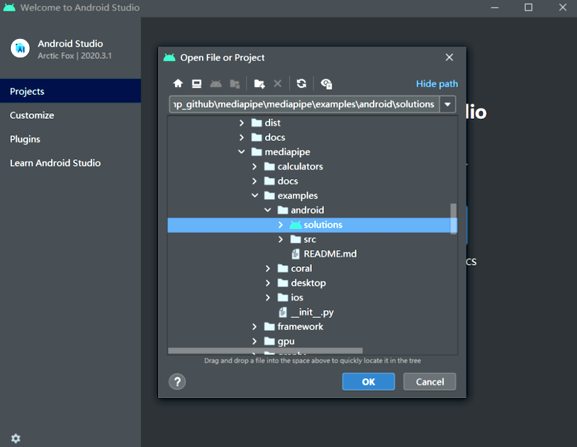
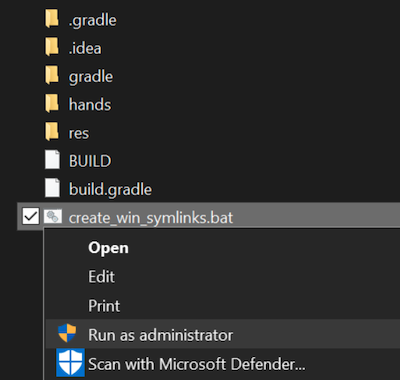
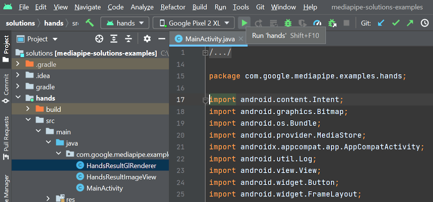

# MediaPipe Android Solutions
{: .no_toc }

1. TOC
{:toc}
---

MediaPipe Android Solution APIs (currently in alpha) are available in:

*   [MediaPipe Face Detection](../solutions/face_detection#android-solution-api)
*   [MediaPipe Face Mesh](../solutions/face_mesh#android-solution-api)
*   [MediaPipe Hands](../solutions/hands#android-solution-api)

## Incorporation in Android Studio

Prebuilt packages of Android Solution APIs can be found in
[Google's Maven Repository](https://maven.google.com/web/index.html?#com.google.mediapipe).
To incorporate them into an Android Studio project, add the following into the
project's Gradle dependencies:

```
dependencies {
    // MediaPipe solution-core is the foundation of any MediaPipe Solutions.
    implementation 'com.google.mediapipe:solution-core:latest.release'
    // Optional: MediaPipe Face Detection Solution.
    implementation 'com.google.mediapipe:facedetection:latest.release'
    // Optional: MediaPipe Face Mesh Solution.
    implementation 'com.google.mediapipe:facemesh:latest.release'
    // Optional: MediaPipe Hands Solution.
    implementation 'com.google.mediapipe:hands:latest.release'
}
```

If you need further customization, instead of using the prebuilt maven packages
consider building a MediaPipe Android Archive library locally from source by
following these [instructions](./android_archive_library.md).

## Building solution example apps

Detailed usage examples of the Android Solution APIs can be found in the
[source code](https://github.com/google/mediapipe/tree/master/mediapipe/examples/android/solutions)
of the solution example apps.

To build these apps:

1.  Open Android Studio Arctic Fox on Linux, macOS, or Windows.

2.  Import mediapipe/examples/android/solutions directory into Android Studio.

    

3.  For Windows users, run `create_win_symlinks.bat` as administrator to create
    res directory symlinks.

    

4.  Select "File" -> "Sync Project with Gradle Files" to sync project.

5.  Run solution example app in Android Studio.

    

6.  (Optional) Run solutions on CPU.

    MediaPipe solution example apps run the pipeline and model inference on GPU
    by default. If needed, for example to run the apps on Android Emulator, set
    the `RUN_ON_GPU` boolean variable to `false` in the app's
    `MainActivity.java` to run the pipeline and model inference on CPU.

## MediaPipe Solution APIs Terms of Service

Last modified: November 12, 2021

Use of MediaPipe Solution APIs is subject to the
[Google APIs Terms of Service](https://developers.google.com/terms),
[Google API Services User Data Policy](https://developers.google.com/terms/api-services-user-data-policy),
and the terms below. Please check back from time to time as these terms and
policies are occasionally updated.

**Privacy**

When you use MediaPipe Solution APIs, processing of the input data (e.g. images,
video, text) fully happens on-device, and **MediaPipe does not send that input
data to Google servers**. As a result, you can use our APIs for processing data
that should not leave the device.

MediaPipe Android Solution APIs will contact Google servers from time to time in
order to receive things like bug fixes, updated models, and hardware accelerator
compatibility information. MediaPipe Android Solution APIs also send metrics
about the performance and utilization of the APIs in your app to Google. Google
uses this metrics data to measure performance, API usage, debug, maintain and
improve the APIs, and detect misuse or abuse, as further described in our
[Privacy Policy](https://policies.google.com/privacy).

**You are responsible for obtaining informed consent from your app users about
Google’s processing of MediaPipe metrics data as required by applicable law.**

Data we collect may include the following, across all MediaPipe Android Solution
APIs:

-   Device information (such as manufacturer, model, OS version and build) and
    available ML hardware accelerators (GPU and DSP). Used for diagnostics and
    usage analytics.

-   App identification information (package name / bundle id, app version). Used
    for diagnostics and usage analytics.

-   API configuration (such as image format, resolution, and MediaPipe version
    used). Used for diagnostics and usage analytics.

-   Event type (such as initialize, download model, update, run, and detection).
    Used for diagnostics and usage analytics.

-   Error codes. Used for diagnostics.

-   Performance metrics. Used for diagnostics.

-   Per-installation identifiers that do not uniquely identify a user or
    physical device. Used for operation of remote configuration and usage
    analytics.

-   Network request sender IP addresses. Used for remote configuration
    diagnostics. Collected IP addresses are retained temporarily.
