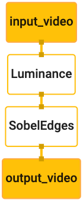

# Hello World! on iOS
{: .no_toc }

1. TOC
{:toc}
---

## Introduction

This codelab uses MediaPipe on an iOS device.

### What you will learn

How to develop an iOS application that uses MediaPipe and run a MediaPipe graph
on iOS.

### What you will build

A simple camera app for real-time Sobel edge detection applied to a live video
stream on an iOS device.


## Setup

1.  Install MediaPipe on your system, see [MediaPipe installation guide] for
    details.
2.  Setup your iOS device for development.
3.  Setup [Bazel] on your system to build and deploy the iOS app.

## Graph for edge detection

We will be using the following graph, [`edge_detection_mobile_gpu.pbtxt`]:

```
# MediaPipe graph that performs GPU Sobel edge detection on a live video stream.
# Used in the examples
# mediapipe/examples/android/src/java/com/google/mediapipe/apps/basic:helloworld
# and mediapipe/examples/ios/helloworld.

# Images coming into and out of the graph.
input_stream: "input_video"
output_stream: "output_video"

# Converts RGB images into luminance images, still stored in RGB format.
node: {
  calculator: "LuminanceCalculator"
  input_stream: "input_video"
  output_stream: "luma_video"
}

# Applies the Sobel filter to luminance images stored in RGB format.
node: {
  calculator: "SobelEdgesCalculator"
  input_stream: "luma_video"
  output_stream: "output_video"
}
```

A visualization of the graph is shown below:



This graph has a single input stream named `input_video` for all incoming frames
that will be provided by your device's camera.

The first node in the graph, `LuminanceCalculator`, takes a single packet (image
frame) and applies a change in luminance using an OpenGL shader. The resulting
image frame is sent to the `luma_video` output stream.

The second node, `SobelEdgesCalculator` applies edge detection to incoming
packets in the `luma_video` stream and outputs results in `output_video` output
stream.

Our iOS application will display the output image frames of the `output_video`
stream.

## Initial minimal application setup

We first start with a simple iOS application and demonstrate how to use `bazel`
to build it.

First, create an XCode project via File > New > Single View App.

Set the product name to "HelloWorld", and use an appropriate organization
identifier, such as `com.google.mediapipe`. The organization identifier
alongwith the product name will be the `bundle_id` for the application, such as
`com.google.mediapipe.HelloWorld`.

Set the language to Objective-C.

Save the project to an appropriate location. Let's call this
`$PROJECT_TEMPLATE_LOC`. So your project will be in the
`$PROJECT_TEMPLATE_LOC/HelloWorld` directory. This directory will contain
another directory named `HelloWorld` and an `HelloWorld.xcodeproj` file.

The `HelloWorld.xcodeproj` will not be useful for this tutorial, as we will use
bazel to build the iOS application. The content of the
`$PROJECT_TEMPLATE_LOC/HelloWorld/HelloWorld` directory is listed below:

1.  `AppDelegate.h` and `AppDelegate.m`
2.  `ViewController.h` and `ViewController.m`
3.  `main.m`
4.  `Info.plist`
5.  `Main.storyboard` and `Launch.storyboard`
6.  `Assets.xcassets` directory.

Copy these files to a directory named `HelloWorld` to a location that can access
the MediaPipe source code. For example, the source code of the application that
we will build in this tutorial is located in
`mediapipe/examples/ios/HelloWorld`. We will refer to this path as the
`$APPLICATION_PATH` throughout the codelab.

Note: MediaPipe provides Objective-C bindings for iOS. The edge detection
application in this tutorial and all iOS examples using MediaPipe use
Objective-C with C++ in `.mm` files.

Create a `BUILD` file in the `$APPLICATION_PATH` and add the following build
rules:

```
MIN_IOS_VERSION = "10.0"

load(
    "@build_bazel_rules_apple//apple:ios.bzl",
    "ios_application",
)

ios_application(
    name = "HelloWorldApp",
    bundle_id = "com.google.mediapipe.HelloWorld",
    families = [
        "iphone",
        "ipad",
    ],
    infoplists = ["Info.plist"],
    minimum_os_version = MIN_IOS_VERSION,
    provisioning_profile = "//mediapipe/examples/ios:developer_provisioning_profile",
    deps = [":HelloWorldAppLibrary"],
)

objc_library(
    name = "HelloWorldAppLibrary",
    srcs = [
        "AppDelegate.m",
        "ViewController.m",
        "main.m",
    ],
    hdrs = [
        "AppDelegate.h",
        "ViewController.h",
    ],
    data = [
        "Base.lproj/LaunchScreen.storyboard",
        "Base.lproj/Main.storyboard",
    ],
    sdk_frameworks = [
        "UIKit",
    ],
    deps = [],
)
```

The `objc_library` rule adds dependencies for the `AppDelegate` and
`ViewController` classes, `main.m` and the application storyboards. The
templated app depends only on the `UIKit` SDK.

The `ios_application` rule uses the `HelloWorldAppLibrary` Objective-C library
generated to build an iOS application for installation on your iOS device.

Note: You need to point to your own iOS developer provisioning profile to be
able to run the application on your iOS device.

To build the app, use the following command in a terminal:

```
bazel build -c opt --config=ios_arm64 <$APPLICATION_PATH>:HelloWorldApp'
```

For example, to build the `HelloWorldApp` application in
`mediapipe/examples/ios/helloworld`, use the following command:

```
bazel build -c opt --config=ios_arm64 mediapipe/examples/ios/helloworld:HelloWorldApp
```

Then, go back to XCode, open Window > Devices and Simulators, select your
device, and add the `.ipa` file generated by the command above to your device.
Here is the document on [setting up and compiling](./building_examples.md#ios)
iOS MediaPipe apps.

Open the application on your device. Since it is empty, it should display a
blank white screen.

## Use the camera for the live view feed

In this tutorial, we will use the `MPPCameraInputSource` class to access and
grab frames from the camera. This class uses the `AVCaptureSession` API to get
the frames from the camera.

But before using this class, change the `Info.plist` file to support camera
usage in the app.

In `ViewController.m`, add the following import line:

```
#import "mediapipe/objc/MPPCameraInputSource.h"
```

Add the following to its implementation block to create an object
`_cameraSource`:

```
@implementation ViewController {
  // Handles camera access via AVCaptureSession library.
  MPPCameraInputSource* _cameraSource;
}
```

Add the following code to `viewDidLoad()`:

```
-(void)viewDidLoad {
  [super viewDidLoad];

  _cameraSource = [[MPPCameraInputSource alloc] init];
  _cameraSource.sessionPreset = AVCaptureSessionPresetHigh;
  _cameraSource.cameraPosition = AVCaptureDevicePositionBack;
  // The frame's native format is rotated with respect to the portrait orientation.
  _cameraSource.orientation = AVCaptureVideoOrientationPortrait;
}
```

The code initializes `_cameraSource`, sets the capture session preset, and which
camera to use.

We need to get frames from the `_cameraSource` into our application
`ViewController` to display them. `MPPCameraInputSource` is a subclass of
`MPPInputSource`, which provides a protocol for its delegates, namely the
`MPPInputSourceDelegate`. So our application `ViewController` can be a delegate
of `_cameraSource`.

To handle camera setup and process incoming frames, we should use a queue
different from the main queue. Add the following to the implementation block of
the `ViewController`:

```
// Process camera frames on this queue.
dispatch_queue_t _videoQueue;
```

In `viewDidLoad()`, add the following line after initializing the
`_cameraSource` object:

```
[_cameraSource setDelegate:self queue:_videoQueue];
```

And add the following code to initialize the queue before setting up the
`_cameraSource` object:

```
dispatch_queue_attr_t qosAttribute = dispatch_queue_attr_make_with_qos_class(
      DISPATCH_QUEUE_SERIAL, QOS_CLASS_USER_INTERACTIVE, /*relative_priority=*/0);
_videoQueue = dispatch_queue_create(kVideoQueueLabel, qosAttribute);
```

We will use a serial queue with the priority `QOS_CLASS_USER_INTERACTIVE` for
processing camera frames.

Add the following line after the header imports at the top of the file, before
the interface/implementation of the `ViewController`:

```
static const char* kVideoQueueLabel = "com.google.mediapipe.example.videoQueue";
```

Before implementing any method from `MPPInputSourceDelegate` protocol, we must
first set up a way to display the camera frames. MediaPipe provides another
utility called `MPPLayerRenderer` to display images on the screen. This utility
can be used to display `CVPixelBufferRef` objects, which is the type of the
images provided by `MPPCameraInputSource` to its delegates.

To display images of the screen, we need to add a new `UIView` object called
`_liveView` to the `ViewController`.

Add the following lines to the implementation block of the `ViewController`:

```
// Display the camera preview frames.
IBOutlet UIView* _liveView;
// Render frames in a layer.
MPPLayerRenderer* _renderer;
```

Go to `Main.storyboard`, add a `UIView` object from the object library to the
`View` of the `ViewController` class. Add a referencing outlet from this view to
the `_liveView` object you just added to the `ViewController` class. Resize the
view so that it is centered and covers the entire application screen.

Go back to `ViewController.m` and add the following code to `viewDidLoad()` to
initialize the `_renderer` object:

```
_renderer = [[MPPLayerRenderer alloc] init];
_renderer.layer.frame = _liveView.layer.bounds;
[_liveView.layer addSublayer:_renderer.layer];
_renderer.frameScaleMode = MPPFrameScaleModeFillAndCrop;
```

To get frames from the camera, we will implement the following method:

```
// Must be invoked on _videoQueue.
- (void)processVideoFrame:(CVPixelBufferRef)imageBuffer
                timestamp:(CMTime)timestamp
               fromSource:(MPPInputSource*)source {
  if (source != _cameraSource) {
    NSLog(@"Unknown source: %@", source);
    return;
  }
  // Display the captured image on the screen.
  CFRetain(imageBuffer);
  dispatch_async(dispatch_get_main_queue(), ^{
    [_renderer renderPixelBuffer:imageBuffer];
    CFRelease(imageBuffer);
  });
}
```

This is a delegate method of `MPPInputSource`. We first check that we are
getting frames from the right source, i.e. the `_cameraSource`. Then we display
the frame received from the camera via `_renderer` on the main queue.

Now, we need to start the camera as soon as the view to display the frames is
about to appear. To do this, we will implement the
`viewWillAppear:(BOOL)animated` function:

```
-(void)viewWillAppear:(BOOL)animated {
  [super viewWillAppear:animated];
}
```

Before we start running the camera, we need the user's permission to access it.
`MPPCameraInputSource` provides a function
`requestCameraAccessWithCompletionHandler:(void (^_Nullable)(BOOL
granted))handler` to request camera access and do some work when the user has
responded. Add the following code to `viewWillAppear:animated`:

```
[_cameraSource requestCameraAccessWithCompletionHandler:^void(BOOL granted) {
  if (granted) {
    dispatch_async(_videoQueue, ^{
      [_cameraSource start];
    });
  }
}];
```

Before building the application, add the following dependencies to your `BUILD`
file:

```
sdk_frameworks = [
    "AVFoundation",
    "CoreGraphics",
    "CoreMedia",
],
deps = [
    "//mediapipe/objc:mediapipe_framework_ios",
    "//mediapipe/objc:mediapipe_input_sources_ios",
    "//mediapipe/objc:mediapipe_layer_renderer",
],
```

Now build and run the application on your iOS device. You should see a live
camera view feed after accepting camera permissions.

We are now ready to use camera frames in a MediaPipe graph.

## Using a MediaPipe graph in iOS

### Add relevant dependencies

We already added the dependencies of the MediaPipe framework code which contains
the iOS API to use a MediaPipe graph. To use a MediaPipe graph, we need to add a
dependency on the graph we intend to use in our application. Add the following
line to the `data` list in your `BUILD` file:

```
"//mediapipe/graphs/edge_detection:mobile_gpu_binary_graph",
```

Now add the dependency to the calculators used in this graph in the `deps` field
in the `BUILD` file:

```
"//mediapipe/graphs/edge_detection:mobile_calculators",
```

Finally, rename the file `ViewController.m` to `ViewController.mm` to support
Objective-C++.

### Use the graph in `ViewController`

Declare a static constant with the name of the graph, the input stream and the
output stream:

```
static NSString* const kGraphName = @"mobile_gpu";

static const char* kInputStream = "input_video";
static const char* kOutputStream = "output_video";
```

Add the following property to the interface of the `ViewController`:

```
// The MediaPipe graph currently in use. Initialized in viewDidLoad, started in viewWillAppear: and
// sent video frames on _videoQueue.
@property(nonatomic) MPPGraph* mediapipeGraph;
```

As explained in the comment above, we will initialize this graph in
`viewDidLoad` first. To do so, we need to load the graph from the `.pbtxt` file
using the following function:

```
+ (MPPGraph*)loadGraphFromResource:(NSString*)resource {
  // Load the graph config resource.
  NSError* configLoadError = nil;
  NSBundle* bundle = [NSBundle bundleForClass:[self class]];
  if (!resource || resource.length == 0) {
    return nil;
  }
  NSURL* graphURL = [bundle URLForResource:resource withExtension:@"binarypb"];
  NSData* data = [NSData dataWithContentsOfURL:graphURL options:0 error:&configLoadError];
  if (!data) {
    NSLog(@"Failed to load MediaPipe graph config: %@", configLoadError);
    return nil;
  }

  // Parse the graph config resource into mediapipe::CalculatorGraphConfig proto object.
  mediapipe::CalculatorGraphConfig config;
  config.ParseFromArray(data.bytes, data.length);

  // Create MediaPipe graph with mediapipe::CalculatorGraphConfig proto object.
  MPPGraph* newGraph = [[MPPGraph alloc] initWithGraphConfig:config];
  [newGraph addFrameOutputStream:kOutputStream outputPacketType:MPPPacketTypePixelBuffer];
  return newGraph;
}
```

Use this function to initialize the graph in `viewDidLoad` as follows:

```
self.mediapipeGraph = [[self class] loadGraphFromResource:kGraphName];
```

The graph should send the results of processing camera frames back to the
`ViewController`. Add the following line after initializing the graph to set the
`ViewController` as a delegate of the `mediapipeGraph` object:

```
self.mediapipeGraph.delegate = self;
```

To avoid memory contention while processing frames from the live video feed, add
the following line:

```
// Set maxFramesInFlight to a small value to avoid memory contention for real-time processing.
self.mediapipeGraph.maxFramesInFlight = 2;
```

Now, start the graph when the user has granted the permission to use the camera
in our app:

```
[_cameraSource requestCameraAccessWithCompletionHandler:^void(BOOL granted) {
  if (granted) {
    // Start running self.mediapipeGraph.
    NSError* error;
    if (![self.mediapipeGraph startWithError:&error]) {
      NSLog(@"Failed to start graph: %@", error);
    }

    dispatch_async(_videoQueue, ^{
      [_cameraSource start];
    });
  }
}];
```

Note: It is important to start the graph before starting the camera, so that the
graph is ready to process frames as soon as the camera starts sending them.

Earlier, when we received frames from the camera in the `processVideoFrame`
function, we displayed them in the `_liveView` using the `_renderer`. Now, we
need to send those frames to the graph and render the results instead. Modify
this function's implementation to do the following:

```
- (void)processVideoFrame:(CVPixelBufferRef)imageBuffer
                timestamp:(CMTime)timestamp
               fromSource:(MPPInputSource*)source {
  if (source != _cameraSource) {
    NSLog(@"Unknown source: %@", source);
    return;
  }
  [self.mediapipeGraph sendPixelBuffer:imageBuffer
                            intoStream:kInputStream
                            packetType:MPPPacketTypePixelBuffer];
}
```

We send the `imageBuffer` to `self.mediapipeGraph` as a packet of type
`MPPPacketTypePixelBuffer` into the input stream `kInputStream`, i.e.
"input_video".

The graph will run with this input packet and output a result in
`kOutputStream`, i.e. "output_video". We can implement the following delegate
method to receive packets on this output stream and display them on the screen:

```
- (void)mediapipeGraph:(MPPGraph*)graph
   didOutputPixelBuffer:(CVPixelBufferRef)pixelBuffer
             fromStream:(const std::string&)streamName {
  if (streamName == kOutputStream) {
    // Display the captured image on the screen.
    CVPixelBufferRetain(pixelBuffer);
    dispatch_async(dispatch_get_main_queue(), ^{
      [_renderer renderPixelBuffer:pixelBuffer];
      CVPixelBufferRelease(pixelBuffer);
    });
  }
}
```

And that is all! Build and run the app on your iOS device. You should see the
results of running the edge detection graph on a live video feed. Congrats!


Please note that the iOS examples now use a [common] template app. The code in
this tutorial is used in the [common] template app. The [helloworld] app has the
appropriate `BUILD` file dependencies for the edge detection graph.

[Bazel]:https://bazel.build/
[`edge_detection_mobile_gpu.pbtxt`]:https://github.com/google/mediapipe/tree/master/mediapipe/graphs/edge_detection/edge_detection_mobile_gpu.pbtxt
[MediaPipe installation guide]:./install.md
[common]:(https://github.com/google/mediapipe/tree/master/mediapipe/examples/ios/common)
[helloworld]:(https://github.com/google/mediapipe/tree/master/mediapipe/examples/ios/helloworld)
