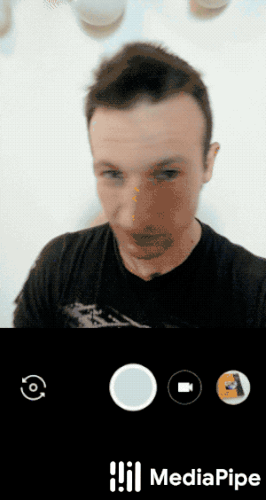

# MediaPipe Hair Segmentation
{: .no_toc }

1. TOC
{:toc}
---

## Example Apps

Please first see general instructions for
[Android](../getting_started/building_examples.md#android), [iOS](../getting_started/building_examples.md#ios)
and [desktop](../getting_started/building_examples.md#desktop) on how to build MediaPipe
examples.

Note: To visualize a graph, copy the graph and paste it into
[MediaPipe Visualizer](https://viz.mediapipe.dev/). For more information on how
to visualize its associated subgraphs, please see
[visualizer documentation](../tools/visualizer.md).

### Mobile

*   Graph:
    [`mediapipe/graphs/hair_segmentation/hair_segmentation_mobile_gpu.pbtxt`](https://github.com/google/mediapipe/tree/master/mediapipe/graphs/hair_segmentation/hair_segmentation_mobile_gpu.pbtxt)
*   Android target:
    [(or download prebuilt ARM64 APK)](https://drive.google.com/open?id=1mmLtyL8IRfCUbqqu0-E-Hgjr_e6P3XAy)
    [`mediapipe/examples/android/src/java/com/google/mediapipe/apps/hairsegmentationgpu:hairsegmentationgpu`](https://github.com/google/mediapipe/tree/master/mediapipe/examples/android/src/java/com/google/mediapipe/apps/hairsegmentationgpu/BUILD)
*   iOS target: Not available

### Desktop

*   Running on CPU: Not available
*   Running on GPU
    *   Graph:
        [`mediapipe/graphs/hair_segmentation/hair_segmentation_mobile_gpu.pbtxt`](https://github.com/google/mediapipe/tree/master/mediapipe/graphs/hair_segmentation/hair_segmentation_mobile_gpu.pbtxt)
    *   Target:
        [`mediapipe/examples/desktop/hair_segmentation:hair_segmentation_gpu`](https://github.com/google/mediapipe/tree/master/mediapipe/examples/desktop/hair_segmentation/BUILD)

### Web

Please refer to [these instructions](../index.md#mediapipe-on-the-web).

## Resources

*   Paper:
    [Real-time Hair segmentation and recoloring on Mobile GPUs](https://arxiv.org/abs/1907.06740)
    ([presentation](https://drive.google.com/file/d/1C8WYlWdDRNtU1_pYBvkkG5Z5wqYqf0yj/view))
    ([supplementary video](https://drive.google.com/file/d/1LPtM99Ch2ogyXYbDNpEqnUfhFq0TfLuf/view))
*   [Models and model cards](./models.md#hair_segmentation)
