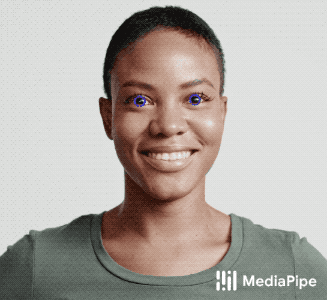
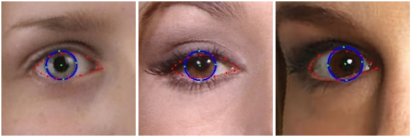

# MediaPipe Iris
{: .no_toc }

1. TOC
{:toc}
---

## Overview

A wide range of real-world applications, including computational photography
(glint reflection) and augmented reality effects (virtual avatars) rely on
accurately tracking the iris within an eye. This is a challenging task to solve
on mobile devices, due to the limited computing resources, variable light
conditions and the presence of occlusions, such as hair or people squinting.
Iris tracking can also be utilized to determine the metric distance of the
camera to the user. This can improve a variety of use cases, ranging from
virtual try-on of properly sized glasses and hats to accessibility features that
adopt the font size depending on the viewer’s distance. Often, sophisticated
specialized hardware is employed to compute the metric distance, limiting the
range of devices on which the solution could be applied.

MediaPipe Iris is a ML solution for accurate iris estimation, able to track
landmarks involving the iris, pupil and the eye contours using a single RGB
camera, in real-time, without the need for specialized hardware. Through use of
iris landmarks, the solution is also able to determine the metric distance
between the subject and the camera with relative error less than 10%. Note that
iris tracking does not infer the location at which people are looking, nor does
it provide any form of identity recognition. With the cross-platfrom capability
of the MediaPipe framework, MediaPipe Iris can run on most modern
[mobile phones](#mobile), [desktops/laptops](#desktop) and even on the
[web](#web).

   |
:------------------------------------------------------------------------: |
*Fig 1. Example of MediaPipe Iris: eyelid (red) and iris (blue) contours.* |

## ML Pipeline

The first step in the pipeline leverages [MediaPipe Face Mesh](./face_mesh.md),
which generates a mesh of the approximate face geometry. From this mesh, we
isolate the eye region in the original image for use in the subsequent iris
tracking step.

The pipeline is implemented as a MediaPipe
[graph](https://github.com/google/mediapipe/tree/master/mediapipe/graphs/iris_tracking/iris_tracking_gpu.pbtxt)
that uses a
[face landmark subgraph](https://github.com/google/mediapipe/tree/master/mediapipe/modules/face_landmark/face_landmark_front_gpu.pbtxt)
from the
[face landmark module](https://github.com/google/mediapipe/tree/master/mediapipe/modules/face_landmark),
an
[iris landmark subgraph](https://github.com/google/mediapipe/tree/master/mediapipe/modules/iris_landmark/iris_landmark_left_and_right_gpu.pbtxt)
from the
[iris landmark module](https://github.com/google/mediapipe/tree/master/mediapipe/modules/iris_landmark),
and renders using a dedicated
[iris-and-depth renderer subgraph](https://github.com/google/mediapipe/tree/master/mediapipe/graphs/iris_tracking/subgraphs/iris_and_depth_renderer_gpu.pbtxt).
The
[face landmark subgraph](https://github.com/google/mediapipe/tree/master/mediapipe/modules/face_landmark/face_landmark_front_gpu.pbtxt)
internally uses a
[face detection subgraph](https://github.com/google/mediapipe/tree/master/mediapipe/modules/face_detection/face_detection_front_gpu.pbtxt)
from the
[face detection module](https://github.com/google/mediapipe/tree/master/mediapipe/modules/face_detection).

Note: To visualize a graph, copy the graph and paste it into
[MediaPipe Visualizer](https://viz.mediapipe.dev/). For more information on how
to visualize its associated subgraphs, please see
[visualizer documentation](../tools/visualizer.md).

The output of the pipeline is a set of 478 3D landmarks, including 468 face
landmarks from [MediaPipe Face Mesh](./face_mesh.md), with those around the eyes
further refined (see Fig 2), and 10 additional iris landmarks appended at the
end (5 for each eye, and see Fig 2 also).

## Models

### Face Detection Model

The face detector is the same [BlazeFace](https://arxiv.org/abs/1907.05047)
model used in [MediaPipe Face Detection](./face_detection.md).

### Face Landmark Model

The face landmark model is the same as in [MediaPipe Face Mesh](./face_mesh.md).
You can also find more details in this
[paper](https://arxiv.org/abs/1907.06724).

### Iris Landmark Model

The iris model takes an image patch of the eye region and estimates both the eye
landmarks (along the eyelid) and iris landmarks (along ths iris contour). You
can find more details in this [paper](https://arxiv.org/abs/2006.11341).

 |
:----------------------------------------------------------------------------------------------------: |
*Fig 2. Eye landmarks (red) and iris landmarks (green).*                                               |

## Depth-from-Iris

MediaPipe Iris is able to determine the metric distance of a subject to the
camera with less than 10% error, without requiring any specialized hardware.
This is done by relying on the fact that the horizontal iris diameter of the
human eye remains roughly constant at 11.7±0.5 mm across a wide population,
along with some simple geometric arguments. For more details please refer to our
[Google AI Blog post](https://ai.googleblog.com/2020/08/mediapipe-iris-real-time-iris-tracking.html).

 |
:--------------------------------------------------------------------------------------------: |
*Fig 3. (Left) MediaPipe Iris predicting metric distance in cm on a Pixel 2 from iris tracking without use of a depth sensor. (Right) Ground-truth depth.* |

## Example Apps

Please first see general instructions for
[Android](../getting_started/building_examples.md#android),
[iOS](../getting_started/building_examples.md#ios) and
[desktop](../getting_started/building_examples.md#desktop) on how to build
MediaPipe examples.

Note: To visualize a graph, copy the graph and paste it into
[MediaPipe Visualizer](https://viz.mediapipe.dev/). For more information on how
to visualize its associated subgraphs, please see
[visualizer documentation](../tools/visualizer.md).

### Mobile

*   Graph:
    [`mediapipe/graphs/iris_tracking/iris_tracking_gpu.pbtxt`](https://github.com/google/mediapipe/tree/master/mediapipe/graphs/iris_tracking/iris_tracking_gpu.pbtxt)
*   Android target:
    [(or download prebuilt ARM64 APK)](https://drive.google.com/file/d/1cywcNtqk764TlZf1lvSTV4F3NGB2aL1R/view?usp=sharing)
    [`mediapipe/examples/android/src/java/com/google/mediapipe/apps/iristrackinggpu:iristrackinggpu`](https://github.com/google/mediapipe/tree/master/mediapipe/examples/android/src/java/com/google/mediapipe/apps/iristrackinggpu/BUILD)
*   iOS target:
    [`mediapipe/examples/ios/iristrackinggpu:IrisTrackingGpuApp`](http:/mediapipe/examples/ios/iristrackinggpu/BUILD)

### Desktop

#### Live Camera Input

Please first see general instructions for
[desktop](../getting_started/building_examples.md#desktop) on how to build
MediaPipe examples.

*   Running on CPU
    *   Graph:
        [`mediapipe/graphs/iris_tracking/iris_tracking_cpu.pbtxt`](https://github.com/google/mediapipe/tree/master/mediapipe/graphs/iris_tracking/iris_tracking_cpu.pbtxt)
    *   Target:
        [`mediapipe/examples/desktop/iris_tracking:iris_tracking_cpu`](https://github.com/google/mediapipe/tree/master/mediapipe/examples/desktop/iris_tracking/BUILD)
*   Running on GPU
    *   Graph:
        [`mediapipe/graphs/iris_tracking/iris_tracking_gpu.pbtxt`](https://github.com/google/mediapipe/tree/master/mediapipe/graphs/iris_tracking/iris_tracking_gpu.pbtxt)
    *   Target:
        [`mediapipe/examples/desktop/iris_tracking:iris_tracking_gpu`](https://github.com/google/mediapipe/tree/master/mediapipe/examples/desktop/iris_tracking/BUILD)

#### Video File Input

1.  To build the application, run:

    ```bash
    bazel build -c opt --define MEDIAPIPE_DISABLE_GPU=1 mediapipe/examples/desktop/iris_tracking:iris_tracking_cpu_video_input
    ```

2.  To run the application, replace `<input video path>` and `<output video
    path>` in the command below with your own paths:

    ```
    bazel-bin/mediapipe/examples/desktop/iris_tracking/iris_tracking_cpu_video_input \
      --calculator_graph_config_file=mediapipe/graphs/iris_tracking/iris_tracking_cpu_video_input.pbtxt \
      --input_side_packets=input_video_path=<input video path>,output_video_path=<output video path>
    ```

#### Single-image Depth Estimation

1.  To build the application, run:

    ```bash
    bazel build -c opt --define MEDIAPIPE_DISABLE_GPU=1 mediapipe/examples/desktop/iris_tracking:iris_depth_from_image_desktop
    ```

2.  To run the application, replace `<input image path>` and `<output image
    path>` in the command below with your own paths:

    ```bash
    GLOG_logtostderr=1 bazel-bin/mediapipe/examples/desktop/iris_tracking/iris_depth_from_image_desktop \
      --input_image_path=<input image path> --output_image_path=<output image path>
    ```

### Web

Please refer to [these instructions](../index.md#mediapipe-on-the-web).

## Resources

*   Google AI Blog:
    [MediaPipe Iris: Real-time Eye Tracking and Depth Estimation](https://ai.googleblog.com/2020/08/mediapipe-iris-real-time-iris-tracking.html)
*   Paper:
    [Real-time Pupil Tracking from Monocular Video for Digital Puppetry](https://arxiv.org/abs/2006.11341)
    ([presentation](https://youtu.be/cIhXkiiapQI))
*   [Models and model cards](./models.md#iris)
