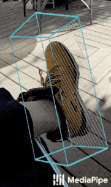
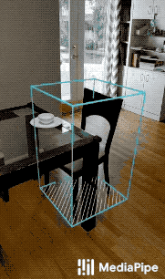
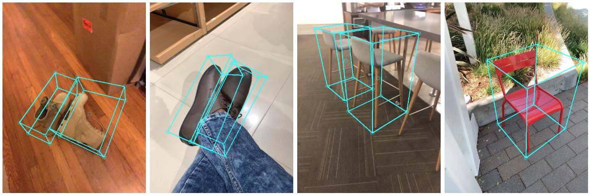
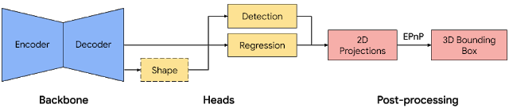
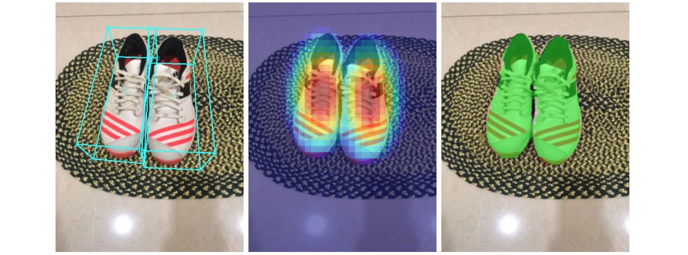

# MediaPipe Objectron
{: .no_toc }

1. TOC
{:toc}
---

## Overview

MediaPipe Objectron is a mobile real-time 3D object detection solution for
everyday objects. It detects objects in 2D images, and estimates their poses and
sizes through a machine learning (ML) model, trained on a newly created 3D
dataset.

 | 
:--------------------------------------------------------------------------------: | :----------------------------------------------------------------------------------:
*Fig 1(a). Objectron for Shoes.*                                                   | *Fig 1(b). Objectron for Chairs.*

Object detection is an extensively studied computer vision problem, but most of
the research has focused on
[2D object prediction](https://ai.googleblog.com/2017/06/supercharge-your-computer-vision-models.html).
While 2D prediction only provides 2D bounding boxes, by extending prediction to
3D, one can capture an object’s size, position and orientation in the world,
leading to a variety of applications in robotics, self-driving vehicles, image
retrieval, and augmented reality. Although 2D object detection is relatively
mature and has been widely used in the industry, 3D object detection from 2D
imagery is a challenging problem, due to the lack of data and diversity of
appearances and shapes of objects within a category.

 |
:-----------------------------------------------------------------------: |
*Fig 2. Objectron example results.*                                       |

## Obtaining Real-World 3D Training Data

While there are ample amounts of 3D data for street scenes, due to the
popularity of research into self-driving cars that rely on 3D capture sensors
like LIDAR, datasets with ground truth 3D annotations for more granular everyday
objects are extremely limited. To overcome this problem, we developed a novel
data pipeline using mobile augmented reality (AR) session data. With the arrival
of [ARCore](https://developers.google.com/ar) and
[ARKit](https://developer.apple.com/augmented-reality/),
[hundreds of millions](https://arinsider.co/2019/05/13/arcore-reaches-400-million-devices/)
of smartphones now have AR capabilities and the ability to capture additional
information during an AR session, including the camera pose, sparse 3D point
clouds, estimated lighting, and planar surfaces.

In order to label ground truth data, we built a novel annotation tool for use
with AR session data, which allows annotators to quickly label 3D bounding boxes
for objects. This tool uses a split-screen view to display 2D video frames on
which are overlaid 3D bounding boxes on the left, alongside a view showing 3D
point clouds, camera positions and detected planes on the right. Annotators draw
3D bounding boxes in the 3D view, and verify its location by reviewing the
projections in 2D video frames. For static objects, we only need to annotate an
object in a single frame and propagate its location to all frames using the
ground truth camera pose information from the AR session data, which makes the
procedure highly efficient.

|     |
| :--------------------------------------------------------------------------: |
| *Fig 3. Real-world data annotation for 3D object detection. (Right) 3D bounding boxes are annotated in the 3D world with detected surfaces and point clouds. (Left) Projections of annotated 3D bounding boxes are overlaid on top of video frames making it easy to validate the annotation.* |

## AR Synthetic Data Generation

A popular approach is to complement real-world data with synthetic data in order
to increase the accuracy of prediction. However, attempts to do so often yield
poor, unrealistic data or, in the case of photorealistic rendering, require
significant effort and compute. Our novel approach, called AR Synthetic Data
Generation, places virtual objects into scenes that have AR session data, which
allows us to leverage camera poses, detected planar surfaces, and estimated
lighting to generate placements that are physically probable and with lighting
that matches the scene. This approach results in high-quality synthetic data
with rendered objects that respect the scene geometry and fit seamlessly into
real backgrounds. By combining real-world data and AR synthetic data, we are
able to increase the accuracy by about 10%.

 |
:-------------------------------------------------------------------------------------------: |
*Fig 4. An example of AR synthetic data generation. The virtual white-brown cereal box is rendered into the real scene, next to the real blue book.* |

## ML Model for 3D Object Detection

 |
:---------------------------------------------------------------------------------: |
*Fig 5. Network architecture and post-processing for 3D object detection.*          |

We [built a single-stage model](https://arxiv.org/abs/2003.03522) to predict the
pose and physical size of an object from a single RGB image. The model backbone
has an encoder-decoder architecture, built upon
[MobileNetv2](https://ai.googleblog.com/2018/04/mobilenetv2-next-generation-of-on.html).
We employ a multi-task learning approach, jointly predicting an object's shape
with detection and regression. The shape task predicts the object's shape
signals depending on what ground truth annotation is available, e.g.
segmentation. This is optional if there is no shape annotation in training data.
For the detection task, we use the annotated bounding boxes and fit a Gaussian
to the box, with center at the box centroid, and standard deviations
proportional to the box size. The goal for detection is then to predict this
distribution with its peak representing the object’s center location. The
regression task estimates the 2D projections of the eight bounding box vertices.
To obtain the final 3D coordinates for the bounding box, we leverage a well
established pose estimation algorithm
([EPnP](https://www.epfl.ch/labs/cvlab/software/multi-view-stereo/epnp/)). It
can recover the 3D bounding box of an object, without a priori knowledge of the
object dimensions. Given the 3D bounding box, we can easily compute pose and
size of the object. The model is light enough to run real-time on mobile devices
(at 26 FPS on an Adreno 650 mobile GPU).

 |
:-------------------------------------------------------------------------------------: |
*Fig 6. Sample results of our network — (Left) original 2D image with estimated bounding boxes, (Middle) object detection by Gaussian distribution, (Right) predicted segmentation mask.* |

## Detection and Tracking Pipeline

When the model is applied to every frame captured by the mobile device, it can
suffer from jitter due to the ambiguity of the 3D bounding box estimated in each
frame. To mitigate this, we adopt the same detection+tracking strategy in our
[2D object detection and tracking pipeline](./box_tracking.md#object-detection-and-tracking)
in [MediaPipe Box Tracking](./box_tracking.md). This mitigates the need to run
the network on every frame, allowing the use of heavier and therefore more
accurate models, while keeping the pipeline real-time on mobile devices. It also
retains object identity across frames and ensures that the prediction is
temporally consistent, reducing the jitter.

The Objectron 3D object detection and tracking pipeline is implemented as a
MediaPipe
[graph](https://github.com/google/mediapipe/tree/master/mediapipe/graphs/object_detection_3d/shoe_classic_occlusion_tracking.pbtxt),
which internally uses a
[detection subgraph](https://github.com/google/mediapipe/tree/master/mediapipe/graphs/object_detection_3d/subgraphs/objectron_detection_gpu.pbtxt)
and a
[tracking subgraph](https://github.com/google/mediapipe/tree/master/mediapipe/graphs/object_detection_3d/subgraphs/objectron_tracking_gpu.pbtxt).
The detection subgraph performs ML inference only once every few frames to
reduce computation load, and decodes the output tensor to a FrameAnnotation that
contains nine keypoints: the 3D bounding box's center and its eight vertices.
The tracking subgraph runs every frame, using the box traker in
[MediaPipe Box Tracking](./box_tracking.md) to track the 2D box tightly
enclosing the projection of the 3D bounding box, and lifts the tracked 2D
keypoints to 3D with
[EPnP](https://www.epfl.ch/labs/cvlab/software/multi-view-stereo/epnp/). When
new detection becomes available from the detection subgraph, the tracking
subgraph is also responsible for consolidation between the detection and
tracking results, based on the area of overlap.

## Example Apps

Please first see general instructions for
[Android](../getting_started/building_examples.md#android) and
[iOS](../getting_started/building_examples.md#ios) on how to build MediaPipe examples.

Note: To visualize a graph, copy the graph and paste it into
[MediaPipe Visualizer](https://viz.mediapipe.dev/). For more information on how
to visualize its associated subgraphs, please see
[visualizer documentation](../tools/visualizer.md).

### Objectron for Shoes

*   Graph:
    [`mediapipe/graphs/object_detection_3d/shoe_classic_occlusion_tracking.pbtxt`](https://github.com/google/mediapipe/tree/master/mediapipe/graphs/object_detection_3d/shoe_classic_occlusion_tracking.pbtxt)
*   Android target:
    [(or download prebuilt ARM64 APK)](https://drive.google.com/open?id=1S0K4hbWt3o31FfQ4QU3Rz7IHrvOUMx1d)
    [`mediapipe/examples/android/src/java/com/google/mediapipe/apps/objectdetection3d:objectdetection3d`](https://github.com/google/mediapipe/tree/master/mediapipe/examples/android/src/java/com/google/mediapipe/apps/objectdetection3d/BUILD)
*   iOS target: Not available

### Objectron for Chairs

*   Graph:
    [`mediapipe/graphs/hair_segmentation/hair_segmentation_mobile_gpu.pbtxt`](https://github.com/google/mediapipe/tree/master/mediapipe/graphs/object_detection_3d/chair_classic_occlusion_tracking.pbtxt)
*   Android target:
    [(or download prebuilt ARM64 APK)](https://drive.google.com/open?id=1MM8K-13bXLCVS1EHQ-KgkVyEahEPrKej)
    [`mediapipe/examples/android/src/java/com/google/mediapipe/apps/objectdetection3d:objectdetection3d`](https://github.com/google/mediapipe/tree/master/mediapipe/examples/android/src/java/com/google/mediapipe/apps/objectdetection3d/BUILD)
    and add `--define chair=true` to the build command, i.e.,

    ```bash
    bazel build -c opt --config android_arm64 --define chair=true mediapipe/examples/android/src/java/com/google/mediapipe/apps/objectdetection3d:objectdetection3d
    ```

*   iOS target: Not available

## Resources

*   Google AI Blog:
    [Real-Time 3D Object Detection on Mobile Devices with MediaPipe](https://ai.googleblog.com/2020/03/real-time-3d-object-detection-on-mobile.html)
*   Paper: [MobilePose: Real-Time Pose Estimation for Unseen Objects with Weak
    Shape Supervision](https://arxiv.org/abs/2003.03522)
*   Paper:
    [Instant 3D Object Tracking with Applications in Augmented Reality](https://drive.google.com/open?id=1O_zHmlgXIzAdKljp20U_JUkEHOGG52R8)
    ([presentation](https://www.youtube.com/watch?v=9ndF1AIo7h0))
*   [Models and model cards](./models.md#objectron)
