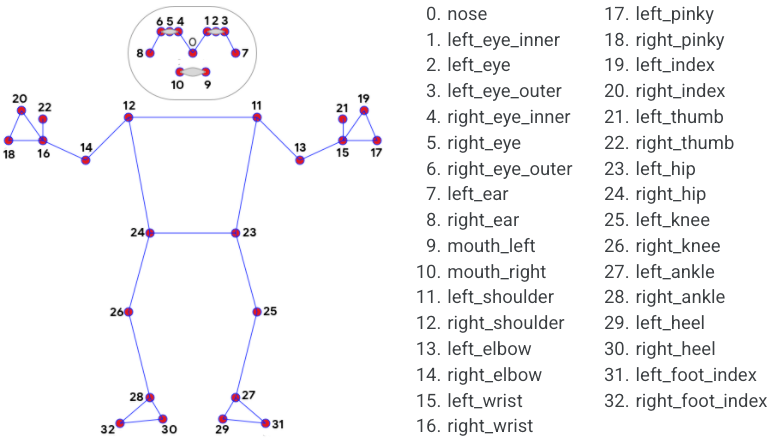

# MediaPipe Pose
{: .no_toc }

<details close markdown="block">
  <summary>
    Table of contents
  </summary>
  {: .text-delta }
1. TOC
{:toc}
</details>
---

## Overview

Human pose estimation from video plays a critical role in various applications
such as [quantifying physical exercises](./pose_classification.md), sign
language recognition, and full-body gesture control. For example, it can form
the basis for yoga, dance, and fitness applications. It can also enable the
overlay of digital content and information on top of the physical world in
augmented reality.

MediaPipe Pose is a ML solution for high-fidelity body pose tracking, inferring
33 3D landmarks on the whole body (or 25 upper-body landmarks) from RGB video
frames utilizing our
[BlazePose](https://ai.googleblog.com/2020/08/on-device-real-time-body-pose-tracking.html)
research that also powers the
[ML Kit Pose Detection API](https://developers.google.com/ml-kit/vision/pose-detection).
Current state-of-the-art approaches rely primarily on powerful desktop
environments for inference, whereas our method achieves real-time performance on
most modern [mobile phones](#mobile), [desktops/laptops](#desktop), in
[python](#python-solution-api) and even on the [web](#javascript-solution-api).

 |
:--------------------------------------------------------------------------------------------: |
*Fig 1. Example of MediaPipe Pose for upper-body pose tracking.*                               |

## ML Pipeline

The solution utilizes a two-step detector-tracker ML pipeline, proven to be
effective in our [MediaPipe Hands](./hands.md) and
[MediaPipe Face Mesh](./face_mesh.md) solutions. Using a detector, the pipeline
first locates the person/pose region-of-interest (ROI) within the frame. The
tracker subsequently predicts the pose landmarks within the ROI using the
ROI-cropped frame as input. Note that for video use cases the detector is
invoked only as needed, i.e., for the very first frame and when the tracker
could no longer identify body pose presence in the previous frame. For other
frames the pipeline simply derives the ROI from the previous frame’s pose
landmarks.

The pipeline is implemented as a MediaPipe
[graph](https://github.com/google/mediapipe/tree/master/mediapipe/graphs/pose_tracking/pose_tracking_gpu.pbtxt)
that uses a
[pose landmark subgraph](https://github.com/google/mediapipe/tree/master/mediapipe/modules/pose_landmark/pose_landmark_gpu.pbtxt)
from the
[pose landmark module](https://github.com/google/mediapipe/tree/master/mediapipe/modules/pose_landmark)
and renders using a dedicated
[pose renderer subgraph](https://github.com/google/mediapipe/tree/master/mediapipe/graphs/pose_tracking/subgraphs/pose_renderer_gpu.pbtxt).
The
[pose landmark subgraph](https://github.com/google/mediapipe/tree/master/mediapipe/modules/pose_landmark/pose_landmark_gpu.pbtxt)
internally uses a
[pose detection subgraph](https://github.com/google/mediapipe/tree/master/mediapipe/modules/pose_detection/pose_detection_gpu.pbtxt)
from the
[pose detection module](https://github.com/google/mediapipe/tree/master/mediapipe/modules/pose_detection).

Note: To visualize a graph, copy the graph and paste it into
[MediaPipe Visualizer](https://viz.mediapipe.dev/). For more information on how
to visualize its associated subgraphs, please see
[visualizer documentation](../tools/visualizer.md).

## Models

### Person/pose Detection Model (BlazePose Detector)

The detector is inspired by our own lightweight
[BlazeFace](https://arxiv.org/abs/1907.05047) model, used in
[MediaPipe Face Detection](./face_detection.md), as a proxy for a person
detector. It explicitly predicts two additional virtual keypoints that firmly
describe the human body center, rotation and scale as a circle. Inspired by
[Leonardo’s Vitruvian man](https://en.wikipedia.org/wiki/Vitruvian_Man), we
predict the midpoint of a person's hips, the radius of a circle circumscribing
the whole person, and the incline angle of the line connecting the shoulder and
hip midpoints.

 |
:----------------------------------------------------------------------------------------------------: |
*Fig 2. Vitruvian man aligned via two virtual keypoints predicted by BlazePose detector in addition to the face bounding box.* |

### Pose Landmark Model (BlazePose GHUM 3D)

The landmark model in MediaPipe Pose comes in two versions: a full-body model
that predicts the location of 33 pose landmarks (see figure below), and an
upper-body version that only predicts the first 25. The latter may be more
accurate than the former in scenarios where the lower-body parts are mostly out
of view.

Please find more detail in the
[BlazePose Google AI Blog](https://ai.googleblog.com/2020/08/on-device-real-time-body-pose-tracking.html),
this [paper](https://arxiv.org/abs/2006.10204) and
[the model card](./models.md#pose), and the attributes in each landmark
[below](#pose_landmarks).

 |
:----------------------------------------------------------------------------------------------: |
*Fig 3. 33 pose landmarks.*                                                                      |

## Solution APIs

### Cross-platform Configuration Options

Naming style and availability may differ slightly across platforms/languages.

#### static_image_mode

If set to `false`, the solution treats the input images as a video stream. It
will try to detect the most prominent person in the very first images, and upon
a successful detection further localizes the pose landmarks. In subsequent
images, it then simply tracks those landmarks without invoking another detection
until it loses track, on reducing computation and latency. If set to `true`,
person detection runs every input image, ideal for processing a batch of static,
possibly unrelated, images. Default to `false`.

#### upper_body_only

If set to `true`, the solution outputs only the 25 upper-body pose landmarks.
Otherwise, it outputs the full set of 33 pose landmarks. Note that
upper-body-only prediction may be more accurate for use cases where the
lower-body parts are mostly out of view. Default to `false`.

#### smooth_landmarks

If set to `true`, the solution filters pose landmarks across different input
images to reduce jitter, but ignored if [static_image_mode](#static_image_mode)
is also set to `true`. Default to `true`.

#### min_detection_confidence

Minimum confidence value (`[0.0, 1.0]`) from the person-detection model for the
detection to be considered successful. Default to `0.5`.

#### min_tracking_confidence

Minimum confidence value (`[0.0, 1.0]`) from the landmark-tracking model for the
pose landmarks to be considered tracked successfully, or otherwise person
detection will be invoked automatically on the next input image. Setting it to a
higher value can increase robustness of the solution, at the expense of a higher
latency. Ignored if [static_image_mode](#static_image_mode) is `true`, where
person detection simply runs on every image. Default to `0.5`.

### Output

Naming style may differ slightly across platforms/languages.

#### pose_landmarks

A list of pose landmarks. Each lanmark consists of the following:

*   `x` and `y`: Landmark coordinates normalized to `[0.0, 1.0]` by the image
    width and height respectively.
*   `z`: Represents the landmark depth with the depth at the midpoint of hips
    being the origin, and the smaller the value the closer the landmark is to
    the camera. The magnitude of `z` uses roughly the same scale as `x`.

    Note: `z` is predicted only in full-body mode, and should be discarded when
    [upper_body_only](#upper_body_only) is `true`.

*   `visibility`: A value in `[0.0, 1.0]` indicating the likelihood of the
    landmark being visible (present and not occluded) in the image.

### Python Solution API

Please first follow general [instructions](../getting_started/python.md) to
install MediaPipe Python package, then learn more in the companion
[Python Colab](#resources) and the following usage example.

Supported configuration options:

*   [static_image_mode](#static_image_mode)
*   [upper_body_only](#upper_body_only)
*   [smooth_landmarks](#smooth_landmarks)
*   [min_detection_confidence](#min_detection_confidence)
*   [min_tracking_confidence](#min_tracking_confidence)

```python
import cv2
import mediapipe as mp
mp_drawing = mp.solutions.drawing_utils
mp_pose = mp.solutions.pose

# For static images:
with mp_pose.Pose(
    static_image_mode=True, min_detection_confidence=0.5) as pose:
  for idx, file in enumerate(file_list):
    image = cv2.imread(file)
    image_height, image_width, _ = image.shape
    # Convert the BGR image to RGB before processing.
    results = pose.process(cv2.cvtColor(image, cv2.COLOR_BGR2RGB))

    if not results.pose_landmarks:
      continue
    print(
        f'Nose coordinates: ('
        f'{results.pose_landmarks.landmark[mp_holistic.PoseLandmark.NOSE].x * image_width}, '
        f'{results.pose_landmarks.landmark[mp_holistic.PoseLandmark.NOSE].y * image_height})'
    )
    # Draw pose landmarks on the image.
    annotated_image = image.copy()
    # Use mp_pose.UPPER_BODY_POSE_CONNECTIONS for drawing below when
    # upper_body_only is set to True.
    mp_drawing.draw_landmarks(
        annotated_image, results.pose_landmarks, mp_pose.POSE_CONNECTIONS)
    cv2.imwrite('/tmp/annotated_image' + str(idx) + '.png', annotated_image)

# For webcam input:
cap = cv2.VideoCapture(0)
with mp_pose.Pose(
    min_detection_confidence=0.5,
    min_tracking_confidence=0.5) as pose:
  while cap.isOpened():
    success, image = cap.read()
    if not success:
      print("Ignoring empty camera frame.")
      # If loading a video, use 'break' instead of 'continue'.
      continue

    # Flip the image horizontally for a later selfie-view display, and convert
    # the BGR image to RGB.
    image = cv2.cvtColor(cv2.flip(image, 1), cv2.COLOR_BGR2RGB)
    # To improve performance, optionally mark the image as not writeable to
    # pass by reference.
    image.flags.writeable = False
    results = pose.process(image)

    # Draw the pose annotation on the image.
    image.flags.writeable = True
    image = cv2.cvtColor(image, cv2.COLOR_RGB2BGR)
    mp_drawing.draw_landmarks(
        image, results.pose_landmarks, mp_pose.POSE_CONNECTIONS)
    cv2.imshow('MediaPipe Pose', image)
    if cv2.waitKey(5) & 0xFF == 27:
      break
cap.release()
```

### JavaScript Solution API

Please first see general [introduction](../getting_started/javascript.md) on
MediaPipe in JavaScript, then learn more in the companion [web demo](#resources)
and the following usage example.

Supported configuration options:

*   [upperBodyOnly](#upper_body_only)
*   [smoothLandmarks](#smooth_landmarks)
*   [minDetectionConfidence](#min_detection_confidence)
*   [minTrackingConfidence](#min_tracking_confidence)

```html
<!DOCTYPE html>
<html>
<head>
  <meta charset="utf-8">
  <script src="https://cdn.jsdelivr.net/npm/@mediapipe/camera_utils/camera_utils.js" crossorigin="anonymous"></script>
  <script src="https://cdn.jsdelivr.net/npm/@mediapipe/control_utils/control_utils.js" crossorigin="anonymous"></script>
  <script src="https://cdn.jsdelivr.net/npm/@mediapipe/drawing_utils/drawing_utils.js" crossorigin="anonymous"></script>
  <script src="https://cdn.jsdelivr.net/npm/@mediapipe/pose/pose.js" crossorigin="anonymous"></script>
</head>

<body>
  <div class="container">
    <video class="input_video"></video>
    <canvas class="output_canvas" width="1280px" height="720px"></canvas>
  </div>
</body>
</html>
```

```javascript
<script type="module">
const videoElement = document.getElementsByClassName('input_video')[0];
const canvasElement = document.getElementsByClassName('output_canvas')[0];
const canvasCtx = canvasElement.getContext('2d');

function onResults(results) {
  canvasCtx.save();
  canvasCtx.clearRect(0, 0, canvasElement.width, canvasElement.height);
  canvasCtx.drawImage(
      results.image, 0, 0, canvasElement.width, canvasElement.height);
  drawConnectors(canvasCtx, results.poseLandmarks, POSE_CONNECTIONS,
                 {color: '#00FF00', lineWidth: 4});
  drawLandmarks(canvasCtx, results.poseLandmarks,
                {color: '#FF0000', lineWidth: 2});
  canvasCtx.restore();
}

const pose = new Pose({locateFile: (file) => {
  return `https://cdn.jsdelivr.net/npm/@mediapipe/pose/${file}`;
}});
pose.setOptions({
  upperBodyOnly: false,
  smoothLandmarks: true,
  minDetectionConfidence: 0.5,
  minTrackingConfidence: 0.5
});
pose.onResults(onResults);

const camera = new Camera(videoElement, {
  onFrame: async () => {
    await pose.send({image: videoElement});
  },
  width: 1280,
  height: 720
});
camera.start();
</script>
```

## Example Apps

Please first see general instructions for
[Android](../getting_started/android.md), [iOS](../getting_started/ios.md), and
[desktop](../getting_started/cpp.md) on how to build MediaPipe examples.

Note: To visualize a graph, copy the graph and paste it into
[MediaPipe Visualizer](https://viz.mediapipe.dev/). For more information on how
to visualize its associated subgraphs, please see
[visualizer documentation](../tools/visualizer.md).

### Mobile

#### Main Example

*   Graph:
    [`mediapipe/graphs/pose_tracking/pose_tracking_gpu.pbtxt`](https://github.com/google/mediapipe/tree/master/mediapipe/graphs/pose_tracking/pose_tracking_gpu.pbtxt)
*   Android target:
    [(or download prebuilt ARM64 APK)](https://drive.google.com/file/d/17GFIrqEJS6W8UHKXlYevTtSCLxN9pWlY/view?usp=sharing)
    [`mediapipe/examples/android/src/java/com/google/mediapipe/apps/posetrackinggpu:posetrackinggpu`](https://github.com/google/mediapipe/tree/master/mediapipe/examples/android/src/java/com/google/mediapipe/apps/posetrackinggpu/BUILD)
*   iOS target:
    [`mediapipe/examples/ios/posetrackinggpu:PoseTrackingGpuApp`](http:/mediapipe/examples/ios/posetrackinggpu/BUILD)

#### Upper-body Only

*   Graph:
    [`mediapipe/graphs/pose_tracking/upper_body_pose_tracking_gpu.pbtxt`](https://github.com/google/mediapipe/tree/master/mediapipe/graphs/pose_tracking/upper_body_pose_tracking_gpu.pbtxt)
*   Android target:
    [(or download prebuilt ARM64 APK)](https://drive.google.com/file/d/1uKc6T7KSuA0Mlq2URi5YookHu0U3yoh_/view?usp=sharing)
    [`mediapipe/examples/android/src/java/com/google/mediapipe/apps/upperbodyposetrackinggpu:upperbodyposetrackinggpu`](https://github.com/google/mediapipe/tree/master/mediapipe/examples/android/src/java/com/google/mediapipe/apps/upperbodyposetrackinggpu/BUILD)
*   iOS target:
    [`mediapipe/examples/ios/upperbodyposetrackinggpu:UpperBodyPoseTrackingGpuApp`](http:/mediapipe/examples/ios/upperbodyposetrackinggpu/BUILD)

### Desktop

Please first see general instructions for [desktop](../getting_started/cpp.md)
on how to build MediaPipe examples.

#### Main Example

*   Running on CPU
    *   Graph:
        [`mediapipe/graphs/pose_tracking/pose_tracking_cpu.pbtxt`](https://github.com/google/mediapipe/tree/master/mediapipe/graphs/pose_tracking/pose_tracking_cpu.pbtxt)
    *   Target:
        [`mediapipe/examples/desktop/pose_tracking:pose_tracking_cpu`](https://github.com/google/mediapipe/tree/master/mediapipe/examples/desktop/pose_tracking/BUILD)
*   Running on GPU
    *   Graph:
        [`mediapipe/graphs/pose_tracking/pose_tracking_gpu.pbtxt`](https://github.com/google/mediapipe/tree/master/mediapipe/graphs/pose_tracking/pose_tracking_gpu.pbtxt)
    *   Target:
        [`mediapipe/examples/desktop/pose_tracking:pose_tracking_gpu`](https://github.com/google/mediapipe/tree/master/mediapipe/examples/desktop/pose_tracking/BUILD)

#### Upper-body Only

*   Running on CPU
    *   Graph:
        [`mediapipe/graphs/pose_tracking/upper_body_pose_tracking_cpu.pbtxt`](https://github.com/google/mediapipe/tree/master/mediapipe/graphs/pose_tracking/upper_body_pose_tracking_cpu.pbtxt)
    *   Target:
        [`mediapipe/examples/desktop/upper_body_pose_tracking:upper_body_pose_tracking_cpu`](https://github.com/google/mediapipe/tree/master/mediapipe/examples/desktop/upper_body_pose_tracking/BUILD)
*   Running on GPU
    *   Graph:
        [`mediapipe/graphs/pose_tracking/upper_body_pose_tracking_gpu.pbtxt`](https://github.com/google/mediapipe/tree/master/mediapipe/graphs/pose_tracking/upper_body_pose_tracking_gpu.pbtxt)
    *   Target:
        [`mediapipe/examples/desktop/upper_body_pose_tracking:upper_body_pose_tracking_gpu`](https://github.com/google/mediapipe/tree/master/mediapipe/examples/desktop/upper_body_pose_tracking/BUILD)

## Resources

*   Google AI Blog:
    [BlazePose - On-device Real-time Body Pose Tracking](https://ai.googleblog.com/2020/08/on-device-real-time-body-pose-tracking.html)
*   Paper:
    [BlazePose: On-device Real-time Body Pose Tracking](https://arxiv.org/abs/2006.10204)
    ([presentation](https://youtu.be/YPpUOTRn5tA))
*   [Models and model cards](./models.md#pose)
*   [Web demo](https://code.mediapipe.dev/codepen/pose)
*   [Python Colab](https://mediapipe.page.link/pose_py_colab)
