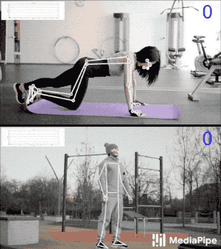
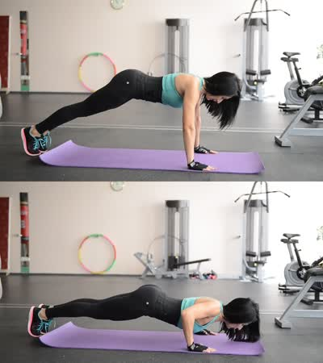
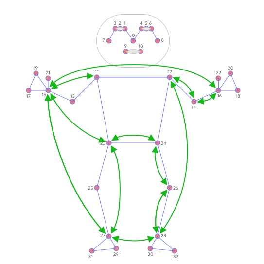

# Pose Classification
{: .no_toc }

  

    Table of contents
  

  {: .text-delta }
1. TOC
{:toc}

---

## Overview

One of the applications
[BlazePose](https://ai.googleblog.com/2020/08/on-device-real-time-body-pose-tracking.html)
can enable is fitness. More specifically - pose classification and repetition
counting. In this section we'll provide basic guidance on building a custom pose
classifier with the help of [Colabs](#colabs) and wrap it in a simple fitness
demo within
[ML Kit quickstart app](https://developers.google.com/ml-kit/vision/pose-detection/classifying-poses#4_integrate_with_the_ml_kit_quickstart_app).
Push-ups and squats are used for demonstration purposes as the most common
exercises.

 |
:--------------------------------------------------------------------------------------------------------: |
*Fig 1. Pose classification and repetition counting with MediaPipe Pose.*                                  |

We picked the
[k-nearest neighbors algorithm](https://en.wikipedia.org/wiki/K-nearest_neighbors_algorithm)
(k-NN) as the classifier. It's simple and easy to start with. The algorithm
determines the object's class based on the closest samples in the training set.

**To build it, one needs to:**

1.  Collect image samples of the target exercises and run pose prediction on
    them,
2.  Convert obtained pose landmarks to a representation suitable for the k-NN
    classifier and form a training set using these [Colabs](#colabs),
3.  Perform the classification itself followed by repetition counting (e.g., in
    the
    [ML Kit quickstart app](https://developers.google.com/ml-kit/vision/pose-detection/classifying-poses#4_integrate_with_the_ml_kit_quickstart_app)).

## Training Set

To build a good classifier appropriate samples should be collected for the
training set: about a few hundred samples for each terminal state of each
exercise (e.g., "up" and "down" positions for push-ups). It's important that
collected samples cover different camera angles, environment conditions, body
shapes, and exercise variations.

 |
:--------------------------------------------------------------------------------------------------------------------------: |
*Fig 2. Two terminal states of push-ups.*                                                                                    |

To transform samples into a k-NN classifier training set, both
[`Pose Classification Colab (Basic)`] and
[`Pose Classification Colab (Extended)`] could be used. They use the
[Python Solution API](./pose.md#python-solution-api) to run the BlazePose models
on given images and dump predicted pose landmarks to a CSV file. Additionally,
the [`Pose Classification Colab (Extended)`] provides useful tools to find
outliers (e.g., wrongly predicted poses) and underrepresented classes (e.g., not
covering all camera angles) by classifying each sample against the entire
training set. After that, you'll be able to test the classifier on an arbitrary
video right in the Colab.

## Classification

Code of the classifier is available both in the
[`Pose Classification Colab (Extended)`] and in the
[ML Kit quickstart app](https://developers.google.com/ml-kit/vision/pose-detection/classifying-poses#4_integrate_with_the_ml_kit_quickstart_app).
Please refer to them for details of the approach described below.

The k-NN algorithm used for pose classification requires a feature vector
representation of each sample and a metric to compute the distance between two
such vectors to find the nearest pose samples to a target one.

To convert pose landmarks to a feature vector, we use pairwise distances between
predefined lists of pose joints, such as distances between wrist and shoulder,
ankle and hip, and two wrists. Since the algorithm relies on distances, all
poses are normalized to have the same torso size and vertical torso orientation
before the conversion.

 |
:--------------------------------------------------------------------------------------------------------: |
*Fig 3. Main pairwise distances used for the pose feature vector.*                                         |

To get a better classification result, k-NN search is invoked twice with
different distance metrics:

*   First, to filter out samples that are almost the same as the target one but
    have only a few different values in the feature vector (which means
    differently bent joints and thus other pose class), minimum per-coordinate
    distance is used as distance metric,
*   Then average per-coordinate distance is used to find the nearest pose
    cluster among those from the first search.

Finally, we apply
[exponential moving average](https://en.wikipedia.org/wiki/Moving_average#Exponential_moving_average)
(EMA) smoothing to level any noise from pose prediction or classification. To do
that, we search not only for the nearest pose cluster, but we calculate a
probability for each of them and use it for smoothing over time.

## Repetition Counting

To count the repetitions, the algorithm monitors the probability of a target
pose class. Let's take push-ups with its "up" and "down" terminal states:

*   When the probability of the "down" pose class passes a certain threshold for
    the first time, the algorithm marks that the "down" pose class is entered.
*   Once the probability drops below the threshold, the algorithm marks that the
    "down" pose class has been exited and increases the counter.

To avoid cases when the probability fluctuates around the threshold (e.g., when
the user pauses between "up" and "down" states) causing phantom counts, the
threshold used to detect when the state is exited is actually slightly lower
than the one used to detect when the state is entered. It creates an interval
where the pose class and the counter can't be changed.

## Future Work

We are actively working on improving
[BlazePose GHUM 3D](./pose.md#pose-landmark-model-blazepose-ghum-3d)'s Z
prediction. It will allow us to use joint angles in the feature vectors, which
are more natural and easier to configure (although distances can still be useful
to detect touches between body parts) and to perform rotation normalization of
poses and reduce the number of camera angles required for accurate k-NN
classification.

## Colabs

*   [`Pose Classification Colab (Basic)`]
*   [`Pose Classification Colab (Extended)`]

[`Pose Classification Colab (Basic)`]: https://mediapipe.page.link/pose_classification_basic
[`Pose Classification Colab (Extended)`]: https://mediapipe.page.link/pose_classification_extended
