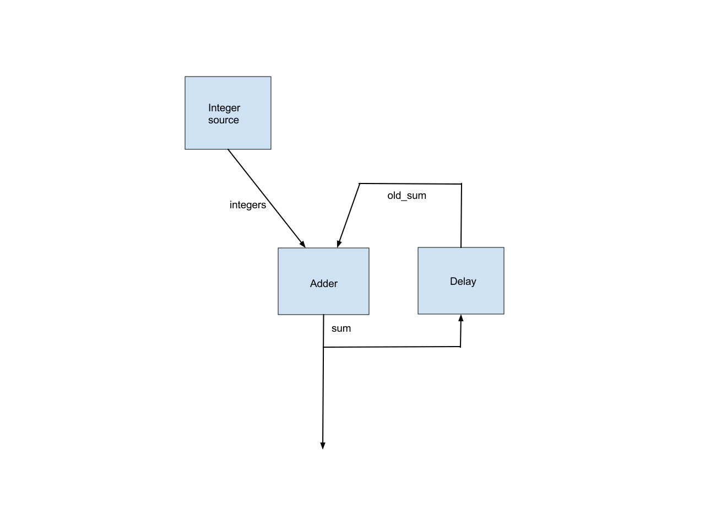

# Cycles in MediaPipe Graphs

<!-- TODO: add discussion of PreviousLoopbackCalculator -->

[TOC]

By default, MediaPipe requires calculator graphs to be acyclic and treats cycles
in a graph as errors. If a graph is intended to have cycles, the cycles need to
be annotated in the graph config. This page describes how to do that.

NOTE: The current approach is experimental and subject to change. We welcome
your feedback.

Please use the `CalculatorGraphTest.Cycle` unit test in
`mediapipe/framework/calculator_graph_test.cc` as sample code. Shown
below is the cyclic graph in the test. The `sum` output of the adder is the sum
of the integers generated by the integer source calculator.



This simple graph illustrates all the issues in supporting cyclic graphs.

## Back Edge Annotation

We require that an edge in each cycle be annotated as a back edge. This allows
MediaPipe’s topological sort to work, after removing all the back edges.

There are usually multiple ways to select the back edges. Which edges are marked
as back edges affects which nodes are considered as upstream and which nodes are
considered as downstream, which in turn affects the priorities MediaPipe assigns
to the nodes.

For example, the `CalculatorGraphTest.Cycle` test marks the `old_sum` edge as a
back edge, so the Delay node is considered as a downstream node of the adder
node and is given a higher priority. Alternatively, we could mark the `sum`
input to the delay node as the back edge, in which case the delay node would be
considered as an upstream node of the adder node and is given a lower priority.

## Initial Packet

For the adder calculator to be runnable when the first integer from the integer
source arrives, we need an initial packet, with value 0 and with the same
timestamp, on the `old_sum` input stream to the adder. This initial packet
should be output by the delay calculator in the `Open()` method.

## Delay in a Loop

Each loop should incur a delay to align the previous `sum` output with the next
integer input. This is also done by the delay node. So the delay node needs to
know the following about the timestamps of the integer source calculator:

*   The timestamp of the first output.

*   The timestamp delta between successive outputs.

We plan to add an alternative scheduling policy that only cares about packet
ordering and ignores packet timestamps, which will eliminate this inconvenience.

## Early Termination of a Calculator When One Input Stream is Done

By default, MediaPipe calls the `Close()` method of a non-source calculator when
all of its input streams are done. In the example graph, we want to stop the
adder node as soon as the integer source is done. This is accomplished by
configuring the adder node with an alternative input stream handler,
`EarlyCloseInputStreamHandler`.

## Relevant Source Code

### Delay Calculator

Note the code in `Open()` that outputs the initial packet and the code in
`Process()` that adds a (unit) delay to input packets. As noted above, this
delay node assumes that its output stream is used alongside an input stream with
packet timestamps 0, 1, 2, 3, ...

```c++
class UnitDelayCalculator : public Calculator {
 public:
  static ::util::Status FillExpectations(
      const CalculatorOptions& extendable_options, PacketTypeSet* inputs,
      PacketTypeSet* outputs, PacketTypeSet* input_side_packets) {
    inputs->Index(0)->Set<int>("An integer.");
    outputs->Index(0)->Set<int>("The input delayed by one time unit.");
    return ::mediapipe::OkStatus();
  }

  ::util::Status Open() final {
    Output()->Add(new int(0), Timestamp(0));
    return ::mediapipe::OkStatus();
  }

  ::util::Status Process() final {
    const Packet& packet = Input()->Value();
    Output()->AddPacket(packet.At(packet.Timestamp().NextAllowedInStream()));
    return ::mediapipe::OkStatus();
  }
};
```

### Graph Config

Note the `back_edge` annotation and the alternative `input_stream_handler`.

```proto
node {
  calculator: 'GlobalCountSourceCalculator'
  input_side_packet: 'global_counter'
  output_stream: 'integers'
}
node {
  calculator: 'IntAdderCalculator'
  input_stream: 'integers'
  input_stream: 'old_sum'
  input_stream_info: {
    tag_index: ':1'  # 'old_sum'
    back_edge: true
  }
  output_stream: 'sum'
  input_stream_handler {
    input_stream_handler: 'EarlyCloseInputStreamHandler'
  }
}
node {
  calculator: 'UnitDelayCalculator'
  input_stream: 'sum'
  output_stream: 'old_sum'
}
```
