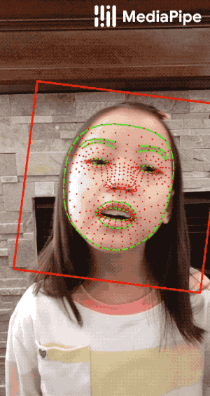
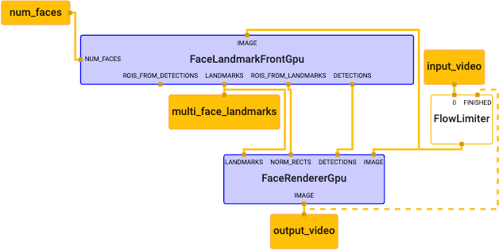
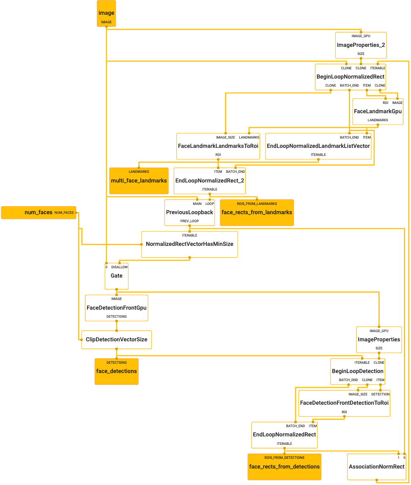

# Face Mesh (GPU)

This example focuses on running the **MediaPipe Face Mesh** pipeline on mobile
devices to perform 3D face landmark estimation in real-time, utilizing GPU
acceleration. The pipeline internally incorporates TensorFlow Lite models. To
know more about the models, please refer to the model
[README file](https://github.com/google/mediapipe/tree/master/mediapipe/models/README.md#face-mesh).
The pipeline is related to the
[face detection example](./face_detection_mobile_gpu.md) as it internally
utilizes face detection and performs landmark estimation only within the
detected region.



**MediaPipe Face Mesh** generates 468 3D face landmarks in real-time on mobile
devices. In the visualization above, the red dots represent the landmarks, and
the green lines connecting landmarks illustrate the contours around the eyes,
eyebrows, lips and the entire face.

## Android

[Source](https://github.com/google/mediapipe/tree/master/mediapipe/examples/android/src/java/com/google/mediapipe/apps/facemeshgpu)

A prebuilt arm64 APK can be
[downloaded here](https://drive.google.com/open?id=1pUmd7CXCL_onYMbsZo5p91cH0oNnR4gi).

To build the app yourself, run:

```bash
bazel build -c opt --config=android_arm64 mediapipe/examples/android/src/java/com/google/mediapipe/apps/facemeshgpu
```

Once the app is built, install it on Android device with:

```bash
adb install bazel-bin/mediapipe/examples/android/src/java/com/google/mediapipe/apps/facemeshgpu/facemeshgpu.apk
```

## iOS

[Source](https://github.com/google/mediapipe/tree/master/mediapipe/examples/ios/facemeshgpu).

See the general [instructions](./building_examples.md#ios) for building iOS
examples and generating an Xcode project. This will be the FaceMeshGpuApp
target.

To build on the command line:

```bash
bazel build -c opt --config=ios_arm64 mediapipe/examples/ios/facemeshgpu:FaceMeshGpuApp
```

## Graph

The face mesh [main graph](#main-graph) utilizes a
[face landmark subgraph](#face-landmark-subgraph) from the
[face landmark module](https://github.com/google/mediapipe/tree/master/mediapipe/modules/face_landmark),
and renders using a dedicated [face renderer subgraph](#face-renderer-subgraph).

The subgraphs show up in the main graph visualization as nodes colored in
purple, and the subgraph itself can also be visualized just like a regular
graph. For more information on how to visualize a graph that includes subgraphs,
see the Visualizing Subgraphs section in the
[visualizer documentation](./visualizer.md).

### Main Graph



[Source pbtxt file](https://github.com/google/mediapipe/tree/master/mediapipe/graphs/face_mesh/face_mesh_mobile.pbtxt)

### Face Landmark Subgraph

The
[face landmark module](https://github.com/google/mediapipe/tree/master/mediapipe/modules/face_landmark)
contains several subgraphs that can be used to detect and track face landmarks.
In particular, in this example the
[FaceLandmarkFrontGPU](https://github.com/google/mediapipe/tree/master/mediapipe/modules/face_landmark/face_landmark_front_gpu.pbtxt)
subgraph, suitable for images from front-facing cameras (i.e., selfie images)
and utilizing GPU acceleration, is selected.



[Source pbtxt file](https://github.com/google/mediapipe/tree/master/mediapipe/modules/face_landmark/face_landmark_front_gpu.pbtxt)

### Face Renderer Subgraph


[Source pbtxt file](https://github.com/google/mediapipe/tree/master/mediapipe/graphs/face_mesh/subgraphs/face_renderer_gpu.pbtxt)
