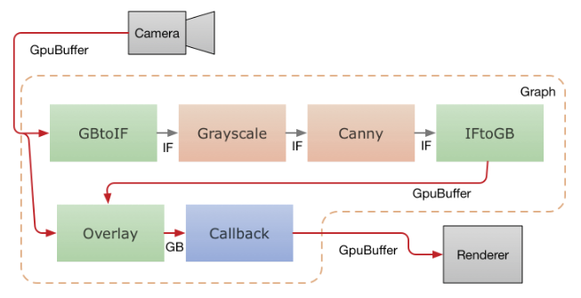

## Running on GPUs

-   [Overview](#overview)
-   [OpenGL ES Support](#opengl-es-support)
-   [Disable OpenGL ES Support](#disable-opengl-es-support)
-   [OpenGL ES Setup on Linux Desktop](#opengl-es-setup-on-linux-desktop)
-   [TensorFlow CUDA Support and Setup on Linux Desktop](#tensorflow-cuda-support-and-setup-on-linux-desktop)
-   [Life of a GPU Calculator](#life-of-a-gpu-calculator)
-   [GpuBuffer to ImageFrame Converters](#gpubuffer-to-imageframe-converters)

### Overview

MediaPipe supports calculator nodes for GPU compute and rendering, and allows combining multiple GPU nodes, as well as mixing them with CPU based calculator nodes. There exist several GPU APIs on mobile platforms (eg, OpenGL ES, Metal and Vulkan). MediaPipe does not attempt to offer a single cross-API GPU abstraction. Individual nodes can be written using different APIs, allowing them to take advantage of platform specific features when needed.

GPU support is essential for good performance on mobile platforms, especially for real-time video. MediaPipe enables developers to write GPU compatible calculators that support the use of GPU for:

   * On-device real-time processing, not just batch processing
   * Video rendering and effects, not just analysis

Below are the design principles for GPU support in MediaPipe

   * GPU-based calculators should be able to occur anywhere in the graph, and not necessarily be used for on-screen rendering.
   * Transfer of frame data from one GPU-based calculator to another should be fast, and not incur expensive copy operations.
   * Transfer of frame data between CPU and GPU should be as efficient as the platform allows.
   * Because different platforms may require different techniques for best performance, the API should allow flexibility in the way things are implemented behind the scenes.
   * A calculator should be allowed maximum flexibility in using the GPU for all or part of its operation, combining it with the CPU if necessary.

### OpenGL ES Support

MediaPipe supports OpenGL ES up to version 3.2 on Android/Linux and up to ES 3.0
on iOS. In addition, MediaPipe also supports Metal on iOS.

OpenGL ES 3.1 or greater is required (on Android/Linux systems) for running
machine learning inference calculators and graphs.

MediaPipe allows graphs to run OpenGL in multiple GL contexts. For example, this
can be very useful in graphs that combine a slower GPU inference path (eg, at 10
FPS) with a faster GPU rendering path (eg, at 30 FPS): since one GL context
corresponds to one sequential command queue, using the same context for both
tasks would reduce the rendering frame rate.

One challenge MediaPipe's use of multiple contexts solves is the ability to
communicate across them. An example scenario is one with an input video that is
sent to both the rendering and inferences paths, and rendering needs to have
access to the latest output from inference.

An OpenGL context cannot be accessed by multiple threads at the same time.
Furthermore, switching the active GL context on the same thread can be slow on
some Android devices. Therefore, our approach is to have one dedicated thread
per context. Each thread issues GL commands, building up a serial command queue
on its context, which is then executed by the GPU asynchronously.

### Disable OpenGL ES Support

By default, building MediaPipe (with no special bazel flags) attempts to compile
and link against OpenGL ES (and for iOS also Metal) libraries.

On platforms where OpenGL ES is not available (see also
[OpenGL ES Setup on Linux Desktop](#opengl-es-setup-on-linux-desktop)), you
should disable OpenGL ES support with:

```
$ bazel build --define MEDIAPIPE_DISABLE_GPU=1 <my-target>
```

Note: On Android and iOS, OpenGL ES is required by MediaPipe framework and the
support should never be disabled.

### OpenGL ES Setup on Linux Desktop

On Linux desktop with video cards that support OpenGL ES 3.1+, MediaPipe can run
GPU compute and rendering and perform TFLite inference on GPU.

To check if your Linux desktop GPU can run MediaPipe with OpenGL ES:

```bash
$ sudo apt-get install mesa-common-dev libegl1-mesa-dev libgles2-mesa-dev
$ sudo apt-get install mesa-utils
$ glxinfo | grep -i opengl
```

For example, it may print:

```bash
$ glxinfo | grep -i opengl
...
OpenGL ES profile version string: OpenGL ES 3.2 NVIDIA 430.50
OpenGL ES profile shading language version string: OpenGL ES GLSL ES 3.20
OpenGL ES profile extensions:
```

*Notice the ES 3.20 text above.*

You need to see ES 3.1 or greater printed in order to perform TFLite inference
on GPU in MediaPipe. With this setup, build with:

```
$ bazel build --copt -DMESA_EGL_NO_X11_HEADERS --copt -DEGL_NO_X11 <my-target>
```

If only ES 3.0 or below is supported, you can still build MediaPipe targets that
don't require TFLite inference on GPU with:

```
$ bazel build --copt -DMESA_EGL_NO_X11_HEADERS --copt -DEGL_NO_X11 --copt -DMEDIAPIPE_DISABLE_GL_COMPUTE <my-target>
```

Note: MEDIAPIPE_DISABLE_GL_COMPUTE is already defined automatically on all Apple
systems (Apple doesn't support OpenGL ES 3.1+).

### TensorFlow CUDA Support and Setup on Linux Desktop

MediaPipe framework doesn't require CUDA for GPU compute and rendering. However,
MediaPipe can work with TensorFlow to perform GPU inference on video cards that
support CUDA.

To enable TensorFlow GPU inference with MediaPipe, the first step is to follow
the
[TensorFlow GPU documentation](https://www.tensorflow.org/install/gpu#software_requirements)
to install the required NVIDIA software on your Linux desktop.

After installation, update `$PATH` and `$LD_LIBRARY_PATH` and run `ldconfig`
with:

```
$ export PATH=/usr/local/cuda-10.1/bin${PATH:+:${PATH}}
$ export LD_LIBRARY_PATH=/usr/local/cuda/extras/CUPTI/lib64,/usr/local/cuda-10.1/lib64${LD_LIBRARY_PATH:+:${LD_LIBRARY_PATH}}
$ sudo ldconfig
```

It's recommended to verify the installation of CUPTI, CUDA, CuDNN, and NVCC:

```
$ ls /usr/local/cuda/extras/CUPTI
/lib64
libcupti.so       libcupti.so.10.1.208  libnvperf_host.so        libnvperf_target.so
libcupti.so.10.1  libcupti_static.a     libnvperf_host_static.a

$ ls /usr/local/cuda-10.1
LICENSE  bin  extras   lib64      libnvvp           nvml  samples  src      tools
README   doc  include  libnsight  nsightee_plugins  nvvm  share    targets  version.txt

$ nvcc -V
nvcc: NVIDIA (R) Cuda compiler driver
Copyright (c) 2005-2019 NVIDIA Corporation
Built on Sun_Jul_28_19:07:16_PDT_2019
Cuda compilation tools, release 10.1, V10.1.243

$ ls /usr/lib/x86_64-linux-gnu/ | grep libcudnn.so
libcudnn.so
libcudnn.so.7
libcudnn.so.7.6.4
```

Setting `$TF_CUDA_PATHS` is the way to declare where the CUDA library is. Note
that the following code snippet also adds `/usr/lib/x86_64-linux-gnu` and
`/usr/include` into `$TF_CUDA_PATHS` for cudablas and libcudnn.

```
$ export TF_CUDA_PATHS=/usr/local/cuda-10.1,/usr/lib/x86_64-linux-gnu,/usr/include
```

To make MediaPipe get TensorFlow's CUDA settings, find TensorFlow's
[.bazelrc](https://github.com/tensorflow/tensorflow/blob/master/.bazelrc) and
copy the `build:using_cuda` and `build:cuda` section into MediaPipe's .bazelrc
file. For example, as of April 23, 2020, TensorFlow's CUDA setting is the
following:

```
# This config refers to building with CUDA available. It does not necessarily
# mean that we build CUDA op kernels.
build:using_cuda --define=using_cuda=true
build:using_cuda --action_env TF_NEED_CUDA=1
build:using_cuda --crosstool_top=@local_config_cuda//crosstool:toolchain

# This config refers to building CUDA op kernels with nvcc.
build:cuda --config=using_cuda
build:cuda --define=using_cuda_nvcc=true
```

Finally, build MediaPipe with TensorFlow GPU with two more flags `--config=cuda`
and `--spawn_strategy=local`. For example:

```
$ bazel build -c opt --config=cuda --spawn_strategy=local \
    --define no_aws_support=true --copt -DMESA_EGL_NO_X11_HEADERS \
    mediapipe/examples/desktop/object_detection:object_detection_tensorflow
```

While the binary is running, it prints out the GPU device info:

```
I external/org_tensorflow/tensorflow/stream_executor/platform/default/dso_loader.cc:44] Successfully opened dynamic library libcuda.so.1
I external/org_tensorflow/tensorflow/core/common_runtime/gpu/gpu_device.cc:1544] Found device 0 with properties: pciBusID: 0000:00:04.0 name: Tesla T4 computeCapability: 7.5 coreClock: 1.59GHz coreCount: 40 deviceMemorySize: 14.75GiB deviceMemoryBandwidth: 298.08GiB/s
I external/org_tensorflow/tensorflow/core/common_runtime/gpu/gpu_device.cc:1686] Adding visible gpu devices: 0
```

You can monitor the GPU usage to verify whether the GPU is used for model
inference.

```
$ nvidia-smi --query-gpu=utilization.gpu --format=csv --loop=1

0 %
0 %
4 %
5 %
83 %
21 %
22 %
27 %
29 %
100 %
0 %
0%
```

### Life of a GPU Calculator

This section presents the basic structure of the Process method of a GPU
calculator derived from base class GlSimpleCalculator. The GPU calculator
`LuminanceCalculator` is shown as an example. The method
`LuminanceCalculator::GlRender` is called from `GlSimpleCalculator::Process`.

```c++
// Converts RGB images into luminance images, still stored in RGB format.
// See GlSimpleCalculator for inputs, outputs and input side packets.
class LuminanceCalculator : public GlSimpleCalculator {
 public:
  ::mediapipe::Status GlSetup() override;
  ::mediapipe::Status GlRender(const GlTexture& src,
                               const GlTexture& dst) override;
  ::mediapipe::Status GlTeardown() override;

 private:
  GLuint program_ = 0;
  GLint frame_;
};
REGISTER_CALCULATOR(LuminanceCalculator);

::mediapipe::Status LuminanceCalculator::GlRender(const GlTexture& src,
                                                  const GlTexture& dst) {
  static const GLfloat square_vertices[] = {
      -1.0f, -1.0f,  // bottom left
      1.0f,  -1.0f,  // bottom right
      -1.0f, 1.0f,   // top left
      1.0f,  1.0f,   // top right
  };
  static const GLfloat texture_vertices[] = {
      0.0f, 0.0f,  // bottom left
      1.0f, 0.0f,  // bottom right
      0.0f, 1.0f,  // top left
      1.0f, 1.0f,  // top right
  };

  // program
  glUseProgram(program_);
  glUniform1i(frame_, 1);

  // vertex storage
  GLuint vbo[2];
  glGenBuffers(2, vbo);
  GLuint vao;
  glGenVertexArrays(1, &vao);
  glBindVertexArray(vao);

  // vbo 0
  glBindBuffer(GL_ARRAY_BUFFER, vbo[0]);
  glBufferData(GL_ARRAY_BUFFER, 4 * 2 * sizeof(GLfloat), square_vertices,
               GL_STATIC_DRAW);
  glEnableVertexAttribArray(ATTRIB_VERTEX);
  glVertexAttribPointer(ATTRIB_VERTEX, 2, GL_FLOAT, 0, 0, nullptr);

  // vbo 1
  glBindBuffer(GL_ARRAY_BUFFER, vbo[1]);
  glBufferData(GL_ARRAY_BUFFER, 4 * 2 * sizeof(GLfloat), texture_vertices,
               GL_STATIC_DRAW);
  glEnableVertexAttribArray(ATTRIB_TEXTURE_POSITION);
  glVertexAttribPointer(ATTRIB_TEXTURE_POSITION, 2, GL_FLOAT, 0, 0, nullptr);

  // draw
  glDrawArrays(GL_TRIANGLE_STRIP, 0, 4);

  // cleanup
  glDisableVertexAttribArray(ATTRIB_VERTEX);
  glDisableVertexAttribArray(ATTRIB_TEXTURE_POSITION);
  glBindBuffer(GL_ARRAY_BUFFER, 0);
  glBindVertexArray(0);
  glDeleteVertexArrays(1, &vao);
  glDeleteBuffers(2, vbo);

  return ::mediapipe::OkStatus();
}
```

The design principles mentioned above have resulted in the following design
choices for MediaPipe GPU support:

   * We have a GPU data type, called `GpuBuffer`, for representing image data, optimized for GPU usage. The exact contents of this data type are opaque and platform-specific.
   * A low-level API based on composition, where any calculator that wants to make use of the GPU creates and owns an instance of the `GlCalculatorHelper` class. This class offers a platform-agnostic API for managing the OpenGL context, setting up textures for inputs and outputs, etc.
   * A high-level API based on subclassing, where simple calculators implementing image filters subclass from `GlSimpleCalculator` and only need to override a couple of virtual methods with their specific OpenGL code, while the superclass takes care of all the plumbing.
   * Data that needs to be shared between all GPU-based calculators is provided as a external input that is implemented as a graph service and is managed by the `GlCalculatorHelper` class.
   * The combination of calculator-specific helpers and a shared graph service allows us great flexibility in managing the GPU resource: we can have a separate context per calculator, share a single context, share a lock or other synchronization primitives, etc. -- and all of this is managed by the helper and hidden from the individual calculators.

### GpuBuffer to ImageFrame Converters

We provide two calculators called `GpuBufferToImageFrameCalculator` and `ImageFrameToGpuBufferCalculator`. These calculators convert between `ImageFrame` and `GpuBuffer`, allowing the construction of graphs that combine GPU and CPU calculators. They are supported on both iOS and Android

When possible, these calculators use platform-specific functionality to share data between the CPU and the GPU without copying.

The below diagram shows the data flow in a mobile application that captures video from the camera, runs it through a MediaPipe graph, and renders the output on the screen in real time. The dashed line indicates which parts are inside the MediaPipe graph proper. This application runs a Canny edge-detection filter on the CPU using OpenCV, and overlays it on top of the original video using the GPU.

|  |
|:--:|
| *Video frames from the camera are fed into the graph as `GpuBuffer` packets. The input stream is accessed by two calculators in parallel. `GpuBufferToImageFrameCalculator` converts the buffer into an `ImageFrame`, which is then sent through a grayscale converter and a canny filter (both based on OpenCV and running on the CPU), whose output is then converted into a `GpuBuffer` again. A multi-input GPU calculator, GlOverlayCalculator, takes as input both the original `GpuBuffer` and the one coming out of the edge detector, and overlays them using a shader. The output is then sent back to the application using a callback calculator, and the application renders the image to the screen using OpenGL.* |
