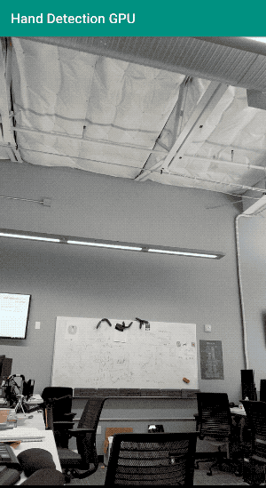
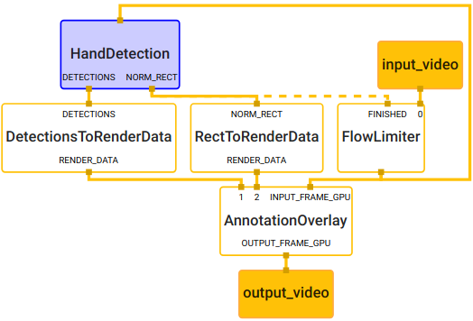
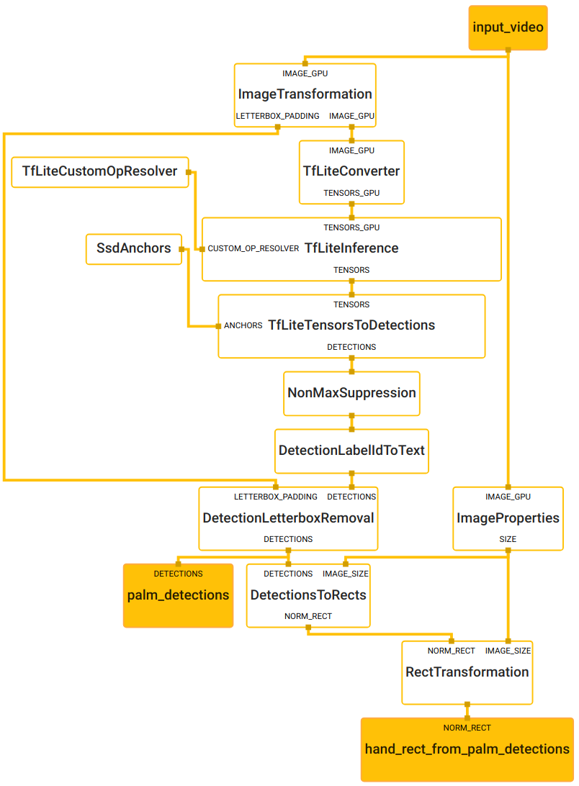

# Hand Detection (GPU)

This doc focuses on the
[example graph](https://github.com/google/mediapipe/tree/master/mediapipe/graphs/hand_tracking/hand_detection_mobile.pbtxt)
that performs hand detection with TensorFlow Lite on GPU. It is related to the
[hand tracking example](./hand_tracking_mobile_gpu.md).

For overall context on hand detection and hand tracking, please read this
[Google AI Blog post](https://mediapipe.page.link/handgoogleaiblog).



In the visualization above, green boxes represent the results of palm detection,
and the red box represents the extended hand rectangle designed to cover the
entire hand. The palm detection ML model (see also
[model card](https://mediapipe.page.link/handmc)) supports detection of multiple
palms, and this example selects only the one with the highest detection
confidence score to generate the hand rectangle, to be further utilized in the
[hand tracking example](./hand_tracking_mobile_gpu.md).

## Android

[Source](https://github.com/google/mediapipe/tree/master/mediapipe/examples/android/src/java/com/google/mediapipe/apps/handdetectiongpu)

An arm64 APK can be
[downloaded here](https://drive.google.com/open?id=1qUlTtH7Ydg-wl_H6VVL8vueu2UCTu37E).

To build the app yourself:

```bash
bazel build -c opt --config=android_arm64 mediapipe/examples/android/src/java/com/google/mediapipe/apps/handdetectiongpu
```

Once the app is built, install it on Android device with:

```bash
adb install bazel-bin/mediapipe/examples/android/src/java/com/google/mediapipe/apps/handdetectiongpu/handdetectiongpu.apk
```

## iOS

[Source](https://github.com/google/mediapipe/tree/master/mediapipe/examples/ios/handdetectiongpu).

See the general [instructions](./building_examples.md#ios) for building iOS
examples and generating an Xcode project. This will be the HandDetectionGpuApp
target.

To build on the command line:

```bash
bazel build -c opt --config=ios_arm64 mediapipe/examples/ios/handdetectiongpu:HandDetectionGpuApp
```

## Graph

The hand detection [main graph](#main-graph) internally utilizes a
[hand detection subgraph](#hand-detection-subgraph). The subgraph shows up in
the main graph visualization as the `HandDetection` node colored in purple, and
the subgraph itself can also be visualized just like a regular graph. For more
information on how to visualize a graph that includes subgraphs, see the
Visualizing Subgraphs section in the
[visualizer documentation](./visualizer.md).

### Main Graph



[Source pbtxt file](https://github.com/google/mediapipe/tree/master/mediapipe/graphs/hand_tracking/hand_detection_mobile.pbtxt)

```bash
# MediaPipe graph that performs hand detection with TensorFlow Lite on GPU.
# Used in the examples in
# mediapipie/examples/android/src/java/com/mediapipe/apps/handdetectiongpu and
# mediapipie/examples/ios/handdetectiongpu.

# Images coming into and out of the graph.
input_stream: "input_video"
output_stream: "output_video"

# Throttles the images flowing downstream for flow control. It passes through
# the very first incoming image unaltered, and waits for HandDetectionSubgraph
# downstream in the graph to finish its tasks before it passes through another
# image. All images that come in while waiting are dropped, limiting the number
# of in-flight images in HandDetectionSubgraph to 1. This prevents the nodes in
# HandDetectionSubgraph from queuing up incoming images and data excessively,
# which leads to increased latency and memory usage, unwanted in real-time
# mobile applications. It also eliminates unnecessarily computation, e.g., the
# output produced by a node in the subgraph may get dropped downstream if the
# subsequent nodes are still busy processing previous inputs.
node {
  calculator: "FlowLimiterCalculator"
  input_stream: "input_video"
  input_stream: "FINISHED:hand_rect_from_palm_detections"
  input_stream_info: {
    tag_index: "FINISHED"
    back_edge: true
  }
  output_stream: "throttled_input_video"
}

# Subgraph that detections hands (see hand_detection_gpu.pbtxt).
node {
  calculator: "HandDetectionSubgraph"
  input_stream: "throttled_input_video"
  output_stream: "DETECTIONS:palm_detections"
  output_stream: "NORM_RECT:hand_rect_from_palm_detections"
}

# Converts detections to drawing primitives for annotation overlay.
node {
  calculator: "DetectionsToRenderDataCalculator"
  input_stream: "DETECTIONS:palm_detections"
  output_stream: "RENDER_DATA:detection_render_data"
  node_options: {
    [type.googleapis.com/mediapipe.DetectionsToRenderDataCalculatorOptions] {
      thickness: 4.0
      color { r: 0 g: 255 b: 0 }
    }
  }
}

# Converts normalized rects to drawing primitives for annotation overlay.
node {
  calculator: "RectToRenderDataCalculator"
  input_stream: "NORM_RECT:hand_rect_from_palm_detections"
  output_stream: "RENDER_DATA:rect_render_data"
  node_options: {
    [type.googleapis.com/mediapipe.RectToRenderDataCalculatorOptions] {
      filled: false
      color { r: 255 g: 0 b: 0 }
      thickness: 4.0
    }
  }
}

# Draws annotations and overlays them on top of the input images.
node {
  calculator: "AnnotationOverlayCalculator"
  input_stream: "IMAGE_GPU:throttled_input_video"
  input_stream: "detection_render_data"
  input_stream: "rect_render_data"
  output_stream: "IMAGE_GPU:output_video"
}
```

### Hand Detection Subgraph



[Source pbtxt file](https://github.com/google/mediapipe/tree/master/mediapipe/graphs/hand_tracking/subgraphs/hand_detection_gpu.pbtxt)

```bash
# MediaPipe hand detection subgraph.

type: "HandDetectionSubgraph"

input_stream: "input_video"
output_stream: "DETECTIONS:palm_detections"
output_stream: "NORM_RECT:hand_rect_from_palm_detections"

# Transforms the input image on GPU to a 256x256 image. To scale the input
# image, the scale_mode option is set to FIT to preserve the aspect ratio,
# resulting in potential letterboxing in the transformed image.
node: {
  calculator: "ImageTransformationCalculator"
  input_stream: "IMAGE_GPU:input_video"
  output_stream: "IMAGE_GPU:transformed_input_video"
  output_stream: "LETTERBOX_PADDING:letterbox_padding"
  node_options: {
    [type.googleapis.com/mediapipe.ImageTransformationCalculatorOptions] {
      output_width: 256
      output_height: 256
      scale_mode: FIT
    }
  }
}

# Generates a single side packet containing a TensorFlow Lite op resolver that
# supports custom ops needed by the model used in this graph.
node {
  calculator: "TfLiteCustomOpResolverCalculator"
  output_side_packet: "opresolver"
  node_options: {
    [type.googleapis.com/mediapipe.TfLiteCustomOpResolverCalculatorOptions] {
      use_gpu: true
    }
  }
}

# Converts the transformed input image on GPU into an image tensor stored as a
# TfLiteTensor.
node {
  calculator: "TfLiteConverterCalculator"
  input_stream: "IMAGE_GPU:transformed_input_video"
  output_stream: "TENSORS_GPU:image_tensor"
}

# Runs a TensorFlow Lite model on GPU that takes an image tensor and outputs a
# vector of tensors representing, for instance, detection boxes/keypoints and
# scores.
node {
  calculator: "TfLiteInferenceCalculator"
  input_stream: "TENSORS_GPU:image_tensor"
  output_stream: "TENSORS:detection_tensors"
  input_side_packet: "CUSTOM_OP_RESOLVER:opresolver"
  node_options: {
    [type.googleapis.com/mediapipe.TfLiteInferenceCalculatorOptions] {
      model_path: "palm_detection.tflite"
      use_gpu: true
    }
  }
}

# Generates a single side packet containing a vector of SSD anchors based on
# the specification in the options.
node {
  calculator: "SsdAnchorsCalculator"
  output_side_packet: "anchors"
  node_options: {
    [type.googleapis.com/mediapipe.SsdAnchorsCalculatorOptions] {
      num_layers: 5
      min_scale: 0.1171875
      max_scale: 0.75
      input_size_height: 256
      input_size_width: 256
      anchor_offset_x: 0.5
      anchor_offset_y: 0.5
      strides: 8
      strides: 16
      strides: 32
      strides: 32
      strides: 32
      aspect_ratios: 1.0
      fixed_anchor_size: true
    }
  }
}

# Decodes the detection tensors generated by the TensorFlow Lite model, based on
# the SSD anchors and the specification in the options, into a vector of
# detections. Each detection describes a detected object.
node {
  calculator: "TfLiteTensorsToDetectionsCalculator"
  input_stream: "TENSORS:detection_tensors"
  input_side_packet: "ANCHORS:anchors"
  output_stream: "DETECTIONS:detections"
  node_options: {
    [type.googleapis.com/mediapipe.TfLiteTensorsToDetectionsCalculatorOptions] {
      num_classes: 1
      num_boxes: 2944
      num_coords: 18
      box_coord_offset: 0
      keypoint_coord_offset: 4
      num_keypoints: 7
      num_values_per_keypoint: 2
      sigmoid_score: true
      score_clipping_thresh: 100.0
      reverse_output_order: true

      x_scale: 256.0
      y_scale: 256.0
      h_scale: 256.0
      w_scale: 256.0
      min_score_thresh: 0.7
    }
  }
}

# Performs non-max suppression to remove excessive detections.
node {
  calculator: "NonMaxSuppressionCalculator"
  input_stream: "detections"
  output_stream: "filtered_detections"
  node_options: {
    [type.googleapis.com/mediapipe.NonMaxSuppressionCalculatorOptions] {
      min_suppression_threshold: 0.3
      overlap_type: INTERSECTION_OVER_UNION
      algorithm: WEIGHTED
      return_empty_detections: true
    }
  }
}

# Maps detection label IDs to the corresponding label text ("Palm"). The label
# map is provided in the label_map_path option.
node {
  calculator: "DetectionLabelIdToTextCalculator"
  input_stream: "filtered_detections"
  output_stream: "labeled_detections"
  node_options: {
    [type.googleapis.com/mediapipe.DetectionLabelIdToTextCalculatorOptions] {
      label_map_path: "palm_detection_labelmap.txt"
    }
  }
}

# Adjusts detection locations (already normalized to [0.f, 1.f]) on the
# letterboxed image (after image transformation with the FIT scale mode) to the
# corresponding locations on the same image with the letterbox removed (the
# input image to the graph before image transformation).
node {
  calculator: "DetectionLetterboxRemovalCalculator"
  input_stream: "DETECTIONS:labeled_detections"
  input_stream: "LETTERBOX_PADDING:letterbox_padding"
  output_stream: "DETECTIONS:palm_detections"
}

# Extracts image size from the input images.
node {
  calculator: "ImagePropertiesCalculator"
  input_stream: "IMAGE_GPU:input_video"
  output_stream: "SIZE:image_size"
}

# Converts results of palm detection into a rectangle (normalized by image size)
# that encloses the palm and is rotated such that the line connecting center of
# the wrist and MCP of the middle finger is aligned with the Y-axis of the
# rectangle.
node {
  calculator: "DetectionsToRectsCalculator"
  input_stream: "DETECTIONS:palm_detections"
  input_stream: "IMAGE_SIZE:image_size"
  output_stream: "NORM_RECT:palm_rect"
  node_options: {
    [type.googleapis.com/mediapipe.DetectionsToRectsCalculatorOptions] {
      rotation_vector_start_keypoint_index: 0  # Center of wrist.
      rotation_vector_end_keypoint_index: 2  # MCP of middle finger.
      rotation_vector_target_angle_degrees: 90
      output_zero_rect_for_empty_detections: true
    }
  }
}

# Expands and shifts the rectangle that contains the palm so that it's likely
# to cover the entire hand.
node {
  calculator: "RectTransformationCalculator"
  input_stream: "NORM_RECT:palm_rect"
  input_stream: "IMAGE_SIZE:image_size"
  output_stream: "hand_rect_from_palm_detections"
  node_options: {
    [type.googleapis.com/mediapipe.RectTransformationCalculatorOptions] {
      scale_x: 2.6
      scale_y: 2.6
      shift_y: -0.5
      square_long: true
    }
  }
}
```
