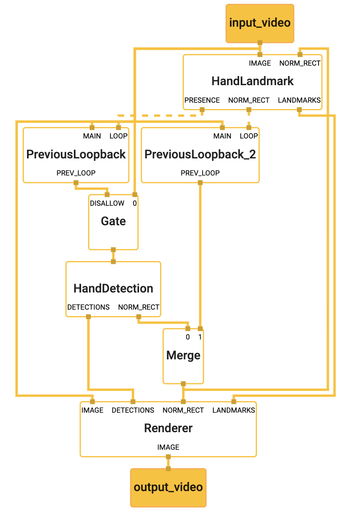

## Hand Tracking on Desktop

This is an example of using MediaPipe to run hand tracking models (TensorFlow
Lite) and render bounding boxes on the detected hand (one hand only). To know
more about the hand tracking models, please refer to the model [`README file`].
Moreover, if you are interested in running the same TensorfFlow Lite model on
Android/iOS, please see the
[Hand Tracking on GPU on Android/iOS](hand_tracking_mobile_gpu.md) and

We show the hand tracking demos with TensorFlow Lite model using the Webcam:

-   [TensorFlow Lite Hand Tracking Demo with Webcam (CPU)](#tensorflow-lite-hand-tracking-demo-with-webcam-cpu)

-   [TensorFlow Lite Hand Tracking Demo with Webcam (GPU)](#tensorflow-lite-hand-tracking-demo-with-webcam-gpu)

Note: If MediaPipe depends on OpenCV 2, please see the
[known issues with OpenCV 2](./object_detection_desktop.md#known-issues-with-opencv-2)
section.

### TensorFlow Lite Hand Tracking Demo with Webcam (CPU)

To build and run the TensorFlow Lite example on desktop (CPU) with Webcam, run:

```bash
# Video from webcam running on desktop CPU
$ bazel build -c opt --define MEDIAPIPE_DISABLE_GPU=1 \
    mediapipe/examples/desktop/hand_tracking:hand_tracking_cpu

# It should print:
#Target //mediapipe/examples/desktop/hand_tracking:hand_tracking_cpu up-to-date:
#  bazel-bin/mediapipe/examples/desktop/hand_tracking/hand_tracking_cpu
#INFO: Build completed successfully, 12517 total actions

# This will open up your webcam as long as it is connected and on
# Any errors is likely due to your webcam being not accessible
$ GLOG_logtostderr=1 bazel-bin/mediapipe/examples/desktop/hand_tracking/hand_tracking_cpu \
    --calculator_graph_config_file=mediapipe/graphs/hand_tracking/hand_tracking_desktop_live.pbtxt
```

### TensorFlow Lite Hand Tracking Demo with Webcam (GPU)

Note: This currently works only on Linux, and please first follow
[OpenGL ES Setup on Linux Desktop](./gpu.md#opengl-es-setup-on-linux-desktop).

To build and run the TensorFlow Lite example on desktop (GPU) with Webcam, run:

```bash
# Video from webcam running on desktop GPU
# This works only for Linux currently
$ bazel build -c opt --copt -DMESA_EGL_NO_X11_HEADERS --copt -DEGL_NO_X11 \
    mediapipe/examples/desktop/hand_tracking:hand_tracking_gpu

# It should print:
# Target //mediapipe/examples/desktop/hand_tracking:hand_tracking_gpu up-to-date:
#  bazel-bin/mediapipe/examples/desktop/hand_tracking/hand_tracking_gpu
#INFO: Build completed successfully, 22455 total actions

# This will open up your webcam as long as it is connected and on
# Any errors is likely due to your webcam being not accessible,
# or GPU drivers not setup properly.
$ GLOG_logtostderr=1 bazel-bin/mediapipe/examples/desktop/hand_tracking/hand_tracking_gpu \
    --calculator_graph_config_file=mediapipe/graphs/hand_tracking/hand_tracking_mobile.pbtxt
```

#### Graph



To visualize the graph as shown above, copy the text specification of the graph
below and paste it into
[MediaPipe Visualizer](https://viz.mediapipe.dev).

```bash
# MediaPipe graph that performs hand tracking on desktop with TensorFlow Lite
# on CPU & GPU.
# Used in the example in
# mediapipe/examples/desktop/hand_tracking:hand_tracking_cpu.

# Images coming into and out of the graph.
input_stream: "input_video"
output_stream: "output_video"

# Caches a hand-presence decision fed back from HandLandmarkSubgraph, and upon
# the arrival of the next input image sends out the cached decision with the
# timestamp replaced by that of the input image, essentially generating a packet
# that carries the previous hand-presence decision. Note that upon the arrival
# of the very first input image, an empty packet is sent out to jump start the
# feedback loop.
node {
  calculator: "PreviousLoopbackCalculator"
  input_stream: "MAIN:input_video"
  input_stream: "LOOP:hand_presence"
  input_stream_info: {
    tag_index: "LOOP"
    back_edge: true
  }
  output_stream: "PREV_LOOP:prev_hand_presence"
}

# Drops the incoming image if HandLandmarkSubgraph was able to identify hand
# presence in the previous image. Otherwise, passes the incoming image through
# to trigger a new round of hand detection in HandDetectionSubgraph.
node {
  calculator: "GateCalculator"
  input_stream: "input_video"
  input_stream: "DISALLOW:prev_hand_presence"
  output_stream: "hand_detection_input_video"

  node_options: {
    [type.googleapis.com/mediapipe.GateCalculatorOptions] {
      empty_packets_as_allow: true
    }
  }
}

# Subgraph that detections hands (see hand_detection_cpu.pbtxt).
node {
  calculator: "HandDetectionSubgraph"
  input_stream: "hand_detection_input_video"
  output_stream: "DETECTIONS:palm_detections"
  output_stream: "NORM_RECT:hand_rect_from_palm_detections"
}

# Subgraph that localizes hand landmarks (see hand_landmark_cpu.pbtxt).
node {
  calculator: "HandLandmarkSubgraph"
  input_stream: "IMAGE:input_video"
  input_stream: "NORM_RECT:hand_rect"
  output_stream: "LANDMARKS:hand_landmarks"
  output_stream: "NORM_RECT:hand_rect_from_landmarks"
  output_stream: "PRESENCE:hand_presence"
  output_stream: "HANDEDNESS:handedness"
}

# Caches a hand rectangle fed back from HandLandmarkSubgraph, and upon the
# arrival of the next input image sends out the cached rectangle with the
# timestamp replaced by that of the input image, essentially generating a packet
# that carries the previous hand rectangle. Note that upon the arrival of the
# very first input image, an empty packet is sent out to jump start the
# feedback loop.
node {
  calculator: "PreviousLoopbackCalculator"
  input_stream: "MAIN:input_video"
  input_stream: "LOOP:hand_rect_from_landmarks"
  input_stream_info: {
    tag_index: "LOOP"
    back_edge: true
  }
  output_stream: "PREV_LOOP:prev_hand_rect_from_landmarks"
}

# Merges a stream of hand rectangles generated by HandDetectionSubgraph and that
# generated by HandLandmarkSubgraph into a single output stream by selecting
# between one of the two streams. The former is selected if the incoming packet
# is not empty, i.e., hand detection is performed on the current image by
# HandDetectionSubgraph (because HandLandmarkSubgraph could not identify hand
# presence in the previous image). Otherwise, the latter is selected, which is
# never empty because HandLandmarkSubgraphs processes all images (that went
# through FlowLimiterCaculator).
node {
  calculator: "MergeCalculator"
  input_stream: "hand_rect_from_palm_detections"
  input_stream: "prev_hand_rect_from_landmarks"
  output_stream: "hand_rect"
}

# Subgraph that renders annotations and overlays them on top of the input
# images (see renderer_cpu.pbtxt).
node {
  calculator: "RendererSubgraph"
  input_stream: "IMAGE:input_video"
  input_stream: "LANDMARKS:hand_landmarks"
  input_stream: "NORM_RECT:hand_rect"
  input_stream: "DETECTIONS:palm_detections"
  input_stream: "HANDEDNESS:handedness"
  output_stream: "IMAGE:output_video"
}

```

[`README file`]:https://github.com/google/mediapipe/tree/master/mediapipe/README.md
