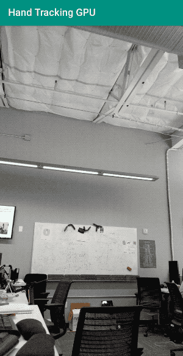
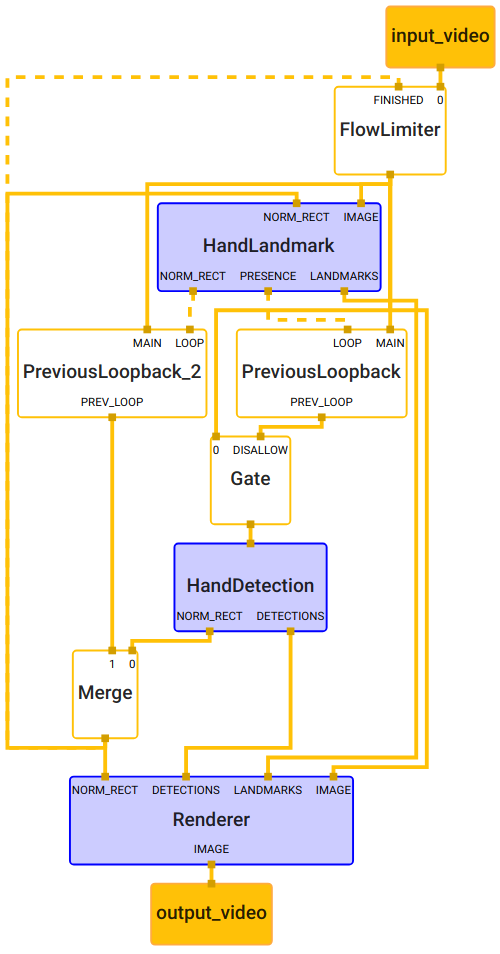
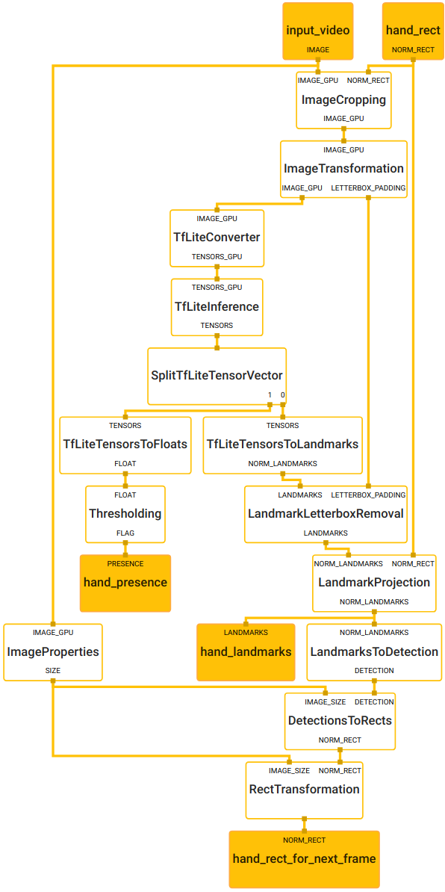
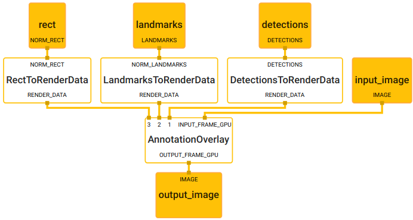

# Hand Tracking (GPU)

This doc focuses on the
[example graph](https://github.com/google/mediapipe/tree/master/mediapipe/graphs/hand_tracking/hand_detection_android_gpu.pbtxt)
that performs hand tracking with TensorFlow Lite on GPU. This hand tracking
example is related to
[hand detection GPU example](./hand_detection_mobile_gpu.md). We recommend users
to review the hand detection GPU example first. Here is the
[model card](https://mediapipe.page.link/handmc) for hand tracking.

For overall context on hand detection and hand tracking, please read
[this Google AI blog post](https://mediapipe.page.link/handgoogleaiblog).

{width="300"}

## Android

Please see [Hello World! in MediaPipe on Android](hello_world_android.md) for
general instructions to develop an Android application that uses MediaPipe.

The graph is used in the
[Hand Tracking GPU](https://github.com/google/mediapipe/tree/master/mediapipe/examples/android/src/java/com/google/mediapipe/apps/handtrackinggpu)
example app. To build the app, run:

```bash
bazel build -c opt --config=android_arm64 mediapipe/examples/android/src/java/com/google/mediapipe/apps/handtrackinggpu
```

To further install the app on android device, run:

```bash
adb install bazel-bin/mediapipe/examples/android/src/java/com/google/mediapipe/apps/handtrackinggpu/handtrackinggpu.apk
```

## iOS

Please see [Hello World! in MediaPipe on iOS](hello_world_ios.md) for general
instructions to develop an iOS application that uses MediaPipe. The graph below
is used in the
[Hand Tracking GPU iOS example app](https://github.com/google/mediapipe/tree/master/mediapipe/examples/ios/handtrackinggpu)

To build the iOS app, please see the general
[MediaPipe iOS app building and setup instructions](./mediapipe_ios_setup.md).
Specifically, run:

```bash
bazel build -c opt --config=ios_arm64 mediapipe/examples/ios/handtrackinggpu:HandTrackingGpuApp
```

## Graph

For more information on how to visualize a graph that includes subgraphs, see
[subgraph documentation](./visualizer.md#visualizing-subgraphs) for Visualizer.

The hand tracking graph is
[hand_tracking_mobile.pbtxt](https://github.com/google/mediapipe/tree/master/mediapipe/graphs/hand_tracking/hand_tracking_mobile.pbtxt)
and it includes 3 [subgraphs](./framework_concepts.md#subgraph):

*   [HandDetectionSubgraph - hand_detection_gpu.pbtxt](https://github.com/google/mediapipe/tree/master/mediapipe/graphs/hand_tracking/hand_detection_gpu.pbtxt)

*   [HandLandmarkSubgraph - hand_landmark_gpu.pbtxt](https://github.com/google/mediapipe/tree/master/mediapipe/graphs/hand_tracking/hand_landmark_gpu.pbtxt)

*   [RendererSubgraph - renderer_gpu.pbtxt](https://github.com/google/mediapipe/tree/master/mediapipe/graphs/hand_tracking/renderer_gpu.pbtxt)

{width="400"}

```bash
# MediaPipe graph that performs hand tracking with TensorFlow Lite on GPU.
# Used in the example in
# mediapipie/examples/android/src/java/com/mediapipe/apps/handtrackinggpu.

# Images coming into and out of the graph.
input_stream: "input_video"
output_stream: "output_video"

node {
  calculator: "FlowLimiterCalculator"
  input_stream: "input_video"
  input_stream: "FINISHED:hand_rect"
  input_stream_info: {
    tag_index: "FINISHED"
    back_edge: true
  }
  output_stream: "throttled_input_video"
}

node {
  calculator: "PreviousLoopbackCalculator"
  input_stream: "MAIN:throttled_input_video"
  input_stream: "LOOP:hand_presence"
  input_stream_info: {
    tag_index: "LOOP"
    back_edge: true
  }
  output_stream: "PREV_LOOP:prev_hand_presence"
}

node {
  calculator: "GateCalculator"
  input_stream: "throttled_input_video"
  input_stream: "DISALLOW:prev_hand_presence"
  output_stream: "hand_detection_input_video"

  node_options: {
    [type.googleapis.com/mediapipe.GateCalculatorOptions] {
      empty_packets_as_allow: true
    }
  }
}

node {
  calculator: "HandDetectionSubgraph"
  input_stream: "hand_detection_input_video"
  output_stream: "DETECTIONS:palm_detections"
  output_stream: "NORM_RECT:hand_rect_from_palm_detections"
}

node {
  calculator: "HandLandmarkSubgraph"
  input_stream: "IMAGE:throttled_input_video"
  input_stream: "NORM_RECT:hand_rect"
  output_stream: "LANDMARKS:hand_landmarks"
  output_stream: "NORM_RECT:hand_rect_from_landmarks"
  output_stream: "PRESENCE:hand_presence"
}

node {
  calculator: "PreviousLoopbackCalculator"
  input_stream: "MAIN:throttled_input_video"
  input_stream: "LOOP:hand_rect_from_landmarks"
  input_stream_info: {
    tag_index: "LOOP"
    back_edge: true
  }
  output_stream: "PREV_LOOP:prev_hand_rect_from_landmarks"
}

node {
  calculator: "MergeCalculator"
  input_stream: "hand_rect_from_palm_detections"
  input_stream: "prev_hand_rect_from_landmarks"
  output_stream: "hand_rect"
}

node {
  calculator: "RendererSubgraph"
  input_stream: "IMAGE:throttled_input_video"
  input_stream: "LANDMARKS:hand_landmarks"
  input_stream: "NORM_RECT:hand_rect"
  input_stream: "DETECTIONS:palm_detections"
  output_stream: "IMAGE:output_video"
}
```

{width="500"}

```bash
type: "HandDetectionSubgraph"

input_stream: "input_video"
output_stream: "DETECTIONS:palm_detections"
output_stream: "NORM_RECT:hand_rect_from_palm_detections"

# Transforms the input image on GPU to a 256x256 image. To scale the input
# image, the scale_mode option is set to FIT to preserve the aspect ratio,
# resulting in potential letterboxing in the transformed image.
node: {
  calculator: "ImageTransformationCalculator"
  input_stream: "IMAGE_GPU:input_video"
  output_stream: "IMAGE_GPU:transformed_input_video"
  output_stream: "LETTERBOX_PADDING:letterbox_padding"
  node_options: {
    [type.googleapis.com/mediapipe.ImageTransformationCalculatorOptions] {
      output_width: 256
      output_height: 256
      scale_mode: FIT
    }
  }
}

# Generates a single side packet containing a TensorFlow Lite op resolver that
# supports custom ops needed by the model used in this graph.
node {
  calculator: "TfLiteCustomOpResolverCalculator"
  output_side_packet: "opresolver"
  node_options: {
    [type.googleapis.com/mediapipe.TfLiteCustomOpResolverCalculatorOptions] {
      use_gpu: true
    }
  }
}

# Converts the transformed input image on GPU into an image tensor stored as a
# TfLiteTensor.
node {
  calculator: "TfLiteConverterCalculator"
  input_stream: "IMAGE_GPU:transformed_input_video"
  output_stream: "TENSORS_GPU:image_tensor"
}

# Runs a TensorFlow Lite model on GPU that takes an image tensor and outputs a
# vector of tensors representing, for instance, detection boxes/keypoints and
# scores.
node {
  calculator: "TfLiteInferenceCalculator"
  input_stream: "TENSORS_GPU:image_tensor"
  output_stream: "TENSORS:detection_tensors"
  input_side_packet: "CUSTOM_OP_RESOLVER:opresolver"
  node_options: {
    [type.googleapis.com/mediapipe.TfLiteInferenceCalculatorOptions] {
      model_path: "palm_detection.tflite"
      use_gpu: true
    }
  }
}

# Generates a single side packet containing a vector of SSD anchors based on
# the specification in the options.
node {
  calculator: "SsdAnchorsCalculator"
  output_side_packet: "anchors"
  node_options: {
    [type.googleapis.com/mediapipe.SsdAnchorsCalculatorOptions] {
      num_layers: 5
      min_scale: 0.1171875
      max_scale: 0.75
      input_size_height: 256
      input_size_width: 256
      anchor_offset_x: 0.5
      anchor_offset_y: 0.5
      strides: 8
      strides: 16
      strides: 32
      strides: 32
      strides: 32
      aspect_ratios: 1.0
      fixed_anchor_size: true
    }
  }
}

# Decodes the detection tensors generated by the TensorFlow Lite model, based on
# the SSD anchors and the specification in the options, into a vector of
# detections. Each detection describes a detected object.
node {
  calculator: "TfLiteTensorsToDetectionsCalculator"
  input_stream: "TENSORS:detection_tensors"
  input_side_packet: "ANCHORS:anchors"
  output_stream: "DETECTIONS:detections"
  node_options: {
    [type.googleapis.com/mediapipe.TfLiteTensorsToDetectionsCalculatorOptions] {
      num_classes: 1
      num_boxes: 2944
      num_coords: 18
      box_coord_offset: 0
      keypoint_coord_offset: 4
      num_keypoints: 7
      num_values_per_keypoint: 2
      sigmoid_score: true
      score_clipping_thresh: 100.0
      reverse_output_order: true

      x_scale: 256.0
      y_scale: 256.0
      h_scale: 256.0
      w_scale: 256.0
      min_score_thresh: 0.7
    }
  }
}

# Performs non-max suppression to remove excessive detections.
node {
  calculator: "NonMaxSuppressionCalculator"
  input_stream: "detections"
  output_stream: "filtered_detections"
  node_options: {
    [type.googleapis.com/mediapipe.NonMaxSuppressionCalculatorOptions] {
      min_suppression_threshold: 0.3
      overlap_type: INTERSECTION_OVER_UNION
      algorithm: WEIGHTED
      return_empty_detections: true
    }
  }
}

# Maps detection label IDs to the corresponding label text. The label map is
# provided in the label_map_path option.
node {
  calculator: "DetectionLabelIdToTextCalculator"
  input_stream: "filtered_detections"
  output_stream: "labeled_detections"
  node_options: {
    [type.googleapis.com/mediapipe.DetectionLabelIdToTextCalculatorOptions] {
      label_map_path: "palm_detection_labelmap.txt"
    }
  }
}

# Adjusts detection locations (already normalized to [0.f, 1.f]) on the
# letterboxed image (after image transformation with the FIT scale mode) to the
# corresponding locations on the same image with the letterbox removed (the
# input image to the graph before image transformation).
node {
  calculator: "DetectionLetterboxRemovalCalculator"
  input_stream: "DETECTIONS:labeled_detections"
  input_stream: "LETTERBOX_PADDING:letterbox_padding"
  output_stream: "DETECTIONS:palm_detections"
}

# Extracts image size from the input images.
node {
  calculator: "ImagePropertiesCalculator"
  input_stream: "IMAGE_GPU:input_video"
  output_stream: "SIZE:image_size"
}

# Converts results of palm detection into a rectangle (normalized by image size)
# that encloses the palm and is rotated such that the line connecting center of
# the wrist and MCP of the middle finger is aligned with the Y-axis of the
# rectangle.
node {
  calculator: "DetectionsToRectsCalculator"
  input_stream: "DETECTIONS:palm_detections"
  input_stream: "IMAGE_SIZE:image_size"
  output_stream: "NORM_RECT:palm_rect"
  node_options: {
    [type.googleapis.com/mediapipe.DetectionsToRectsCalculatorOptions] {
      rotation_vector_start_keypoint_index: 0  # Center of wrist.
      rotation_vector_end_keypoint_index: 2  # MCP of middle finger.
      rotation_vector_target_angle_degrees: 90
      output_zero_rect_for_empty_detections: true
    }
  }
}

# Expands and shifts the rectangle that contains the palm so that it's likely
# to cover the entire hand.
node {
  calculator: "RectTransformationCalculator"
  input_stream: "NORM_RECT:palm_rect"
  input_stream: "IMAGE_SIZE:image_size"
  output_stream: "hand_rect_from_palm_detections"
  node_options: {
    [type.googleapis.com/mediapipe.RectTransformationCalculatorOptions] {
      scale_x: 2.6
      scale_y: 2.6
      shift_y: -0.5
      square_long: true
    }
  }
}
```

{width="400"}

```bash
# MediaPipe hand landmark localization subgraph.

type: "HandLandmarkSubgraph"

input_stream: "IMAGE:input_video"
input_stream: "NORM_RECT:hand_rect"
output_stream: "LANDMARKS:hand_landmarks"
output_stream: "NORM_RECT:hand_rect_for_next_frame"
output_stream: "PRESENCE:hand_presence"

# Crops the rectangle that contains a hand from the input image.
node {
  calculator: "ImageCroppingCalculator"
  input_stream: "IMAGE_GPU:input_video"
  input_stream: "NORM_RECT:hand_rect"
  output_stream: "IMAGE_GPU:hand_image"
}

# Transforms the input image on GPU to a 256x256 image. To scale the input
# image, the scale_mode option is set to FIT to preserve the aspect ratio,
# resulting in potential letterboxing in the transformed image.
node: {
  calculator: "ImageTransformationCalculator"
  input_stream: "IMAGE_GPU:hand_image"
  output_stream: "IMAGE_GPU:transformed_hand_image"
  output_stream: "LETTERBOX_PADDING:letterbox_padding"
  node_options: {
    [type.googleapis.com/mediapipe.ImageTransformationCalculatorOptions] {
      output_width: 256
      output_height: 256
      scale_mode: FIT
    }
  }
}

# Converts the transformed input image on GPU into an image tensor stored as a
# TfLiteTensor.
node {
  calculator: "TfLiteConverterCalculator"
  input_stream: "IMAGE_GPU:transformed_hand_image"
  output_stream: "TENSORS_GPU:image_tensor"
}

# Runs a TensorFlow Lite model on GPU that takes an image tensor and outputs a
# vector of tensors representing, for instance, detection boxes/keypoints and
# scores.
node {
  calculator: "TfLiteInferenceCalculator"
  input_stream: "TENSORS_GPU:image_tensor"
  output_stream: "TENSORS:output_tensors"
  node_options: {
    [type.googleapis.com/mediapipe.TfLiteInferenceCalculatorOptions] {
      model_path: "hand_landmark.tflite"
      use_gpu: true
    }
  }
}

# Splits a vector of tensors into multiple vectors.
node {
  calculator: "SplitTfLiteTensorVectorCalculator"
  input_stream: "output_tensors"
  output_stream: "landmark_tensors"
  output_stream: "hand_flag_tensor"
  node_options: {
    [type.googleapis.com/mediapipe.SplitVectorCalculatorOptions] {
      ranges: { begin: 0 end: 1 }
      ranges: { begin: 1 end: 2 }
    }
  }
}

# Converts the hand-flag tensor into a float that represents the confidence
# score of hand presence.
node {
  calculator: "TfLiteTensorsToFloatsCalculator"
  input_stream: "TENSORS:hand_flag_tensor"
  output_stream: "FLOAT:hand_presence_score"
}

# Applies a threshold to the confidence score to determine whether a hand is
# present.
node {
  calculator: "ThresholdingCalculator"
  input_stream: "FLOAT:hand_presence_score"
  output_stream: "FLAG:hand_presence"
  node_options: {
    [type.googleapis.com/mediapipe.ThresholdingCalculatorOptions] {
      threshold: 0.1
    }
  }
}

# Decodes the landmark tensors into a vector of lanmarks, where the landmark
# coordinates are normalized by the size of the input image to the model.
node {
  calculator: "TfLiteTensorsToLandmarksCalculator"
  input_stream: "TENSORS:landmark_tensors"
  output_stream: "NORM_LANDMARKS:landmarks"
  node_options: {
    [type.googleapis.com/mediapipe.TfLiteTensorsToLandmarksCalculatorOptions] {
      num_landmarks: 21
      input_image_width: 256
      input_image_height: 256
    }
  }
}

# Adjusts landmarks (already normalized to [0.f, 1.f]) on the letterboxed hand
# image (after image transformation with the FIT scale mode) to the
# corresponding locations on the same image with the letterbox removed (hand
# image before image transformation).
node {
  calculator: "LandmarkLetterboxRemovalCalculator"
  input_stream: "LANDMARKS:landmarks"
  input_stream: "LETTERBOX_PADDING:letterbox_padding"
  output_stream: "LANDMARKS:scaled_landmarks"
}

# Projects the landmarks from the cropped hand image to the corresponding
# locations on the full image before cropping (input to the graph).
node {
  calculator: "LandmarkProjectionCalculator"
  input_stream: "NORM_LANDMARKS:scaled_landmarks"
  input_stream: "NORM_RECT:hand_rect"
  output_stream: "NORM_LANDMARKS:hand_landmarks"
}

# Extracts image size from the input images.
node {
  calculator: "ImagePropertiesCalculator"
  input_stream: "IMAGE_GPU:input_video"
  output_stream: "SIZE:image_size"
}

# Converts hand landmarks to a detection that tightly encloses all landmarks.
node {
  calculator: "LandmarksToDetectionCalculator"
  input_stream: "NORM_LANDMARKS:hand_landmarks"
  output_stream: "DETECTION:hand_detection"
}

# Converts the hand detection into a rectangle (normalized by image size)
# that encloses the hand and is rotated such that the line connecting center of
# the wrist and MCP of the middle finger is aligned with the Y-axis of the
# rectangle.
node {
  calculator: "DetectionsToRectsCalculator"
  input_stream: "DETECTION:hand_detection"
  input_stream: "IMAGE_SIZE:image_size"
  output_stream: "NORM_RECT:hand_rect_from_landmarks"
  node_options: {
    [type.googleapis.com/mediapipe.DetectionsToRectsCalculatorOptions] {
      rotation_vector_start_keypoint_index: 0  # Center of wrist.
      rotation_vector_end_keypoint_index: 9  # MCP of middle finger.
      rotation_vector_target_angle_degrees: 90
    }
  }
}

# Expands the hand rectangle so that in the next video frame it's likely to
# still contain the hand even with some motion.
node {
  calculator: "RectTransformationCalculator"
  input_stream: "NORM_RECT:hand_rect_from_landmarks"
  input_stream: "IMAGE_SIZE:image_size"
  output_stream: "hand_rect_for_next_frame"
  node_options: {
    [type.googleapis.com/mediapipe.RectTransformationCalculatorOptions] {
      scale_x: 1.6
      scale_y: 1.6
      square_long: true
    }
  }
}
```

{width="500"}

```bash
# MediaPipe hand tracking rendering subgraph.

type: "RendererSubgraph"

input_stream: "IMAGE:input_image"
input_stream: "DETECTIONS:detections"
input_stream: "LANDMARKS:landmarks"
input_stream: "NORM_RECT:rect"
output_stream: "IMAGE:output_image"

# Converts detections to drawing primitives for annotation overlay.
node {
  calculator: "DetectionsToRenderDataCalculator"
  input_stream: "DETECTIONS:detections"
  output_stream: "RENDER_DATA:detection_render_data"
  node_options: {
    [type.googleapis.com/mediapipe.DetectionsToRenderDataCalculatorOptions] {
      thickness: 4.0
      color { r: 0 g: 255 b: 0 }
    }
  }
}

# Converts landmarks to drawing primitives for annotation overlay.
node {
  calculator: "LandmarksToRenderDataCalculator"
  input_stream: "NORM_LANDMARKS:landmarks"
  output_stream: "RENDER_DATA:landmark_render_data"
  node_options: {
    [type.googleapis.com/mediapipe.LandmarksToRenderDataCalculatorOptions] {
      landmark_connections: 0
      landmark_connections: 1
      landmark_connections: 1
      landmark_connections: 2
      landmark_connections: 2
      landmark_connections: 3
      landmark_connections: 3
      landmark_connections: 4
      landmark_connections: 0
      landmark_connections: 5
      landmark_connections: 5
      landmark_connections: 6
      landmark_connections: 6
      landmark_connections: 7
      landmark_connections: 7
      landmark_connections: 8
      landmark_connections: 5
      landmark_connections: 9
      landmark_connections: 9
      landmark_connections: 10
      landmark_connections: 10
      landmark_connections: 11
      landmark_connections: 11
      landmark_connections: 12
      landmark_connections: 9
      landmark_connections: 13
      landmark_connections: 13
      landmark_connections: 14
      landmark_connections: 14
      landmark_connections: 15
      landmark_connections: 15
      landmark_connections: 16
      landmark_connections: 13
      landmark_connections: 17
      landmark_connections: 0
      landmark_connections: 17
      landmark_connections: 17
      landmark_connections: 18
      landmark_connections: 18
      landmark_connections: 19
      landmark_connections: 19
      landmark_connections: 20
      landmark_color { r: 255 g: 0 b: 0 }
      connection_color { r: 0 g: 255 b: 0 }
      thickness: 5.0
    }
  }
}

# Converts normalized rects to drawing primitives for annotation overlay.
node {
  calculator: "RectToRenderDataCalculator"
  input_stream: "NORM_RECT:rect"
  output_stream: "RENDER_DATA:rect_render_data"
  node_options: {
    [type.googleapis.com/mediapipe.RectToRenderDataCalculatorOptions] {
      filled: false
      color { r: 255 g: 0 b: 0 }
      thickness: 4.0
    }
  }
}

# Draws annotations and overlays them on top of the input images.
node {
  calculator: "AnnotationOverlayCalculator"
  input_stream: "INPUT_FRAME_GPU:input_image"
  input_stream: "detection_render_data"
  input_stream: "landmark_render_data"
  input_stream: "rect_render_data"
  output_stream: "OUTPUT_FRAME_GPU:output_image"
}
```
