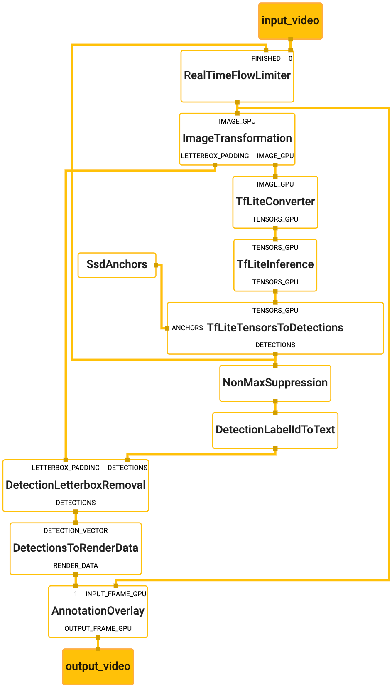

MediaPipe
=====================================
`MediaPipe <http://github.com/google/mediapipe>`_ is a graph-based framework for
building multimodal (video, audio, and sensor) applied machine learning pipelines.
MediaPipe is cross-platform running on mobile devices, workstations and servers,
and supports mobile GPU acceleration. With MediaPipe, an applied
machine learning pipeline can be built as a graph of modular components,
including, for instance, inference models and media processing functions. Sensory
data such as audio and video streams enter the graph, and perceived descriptions
such as object-localization and face-landmark streams exit the graph. An example
graph that performs real-time face detection on mobile GPU is shown below.

MediaPipe is designed for machine learning (ML) practitioners, including
researchers, students, and software developers, who implement production-ready
ML applications, publish code accompanying research work, and build technology
prototypes. The main use case for MediaPipe is rapid prototyping of applied
machine learning pipelines with inference models and other reusable components.
MediaPipe also facilitates the deployment of machine learning technology into
demos and applications on a wide variety of different hardware platforms
(e.g., Android, iOS, workstations).

APIs for MediaPipe
    * Calculator API in C++
    * Graph Construction API in ProtoBuf
    * (Coming Soon) Graph Construction API in C++
    * Graph Execution API in C++
    * Graph Execution API in Java (Android)
    * (Coming Soon) Graph Execution API in Objective-C (iOS)

User Documentation
==================

.. toctree::
   :maxdepth: 3

   install
   concepts
   calculator
   Examples <examples>
   visualizer
   measure_performance
   how_to_questions
   troubleshooting
   help
   framework_concepts
   gpu
   scheduling_sync
   license

Indices and tables
==================

* :ref:`genindex`
* :ref:`modindex`
* :ref:`search`

