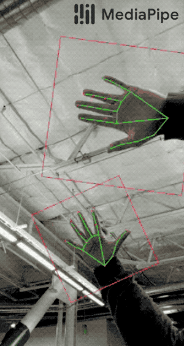
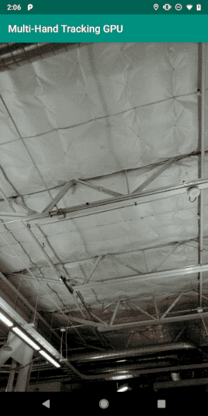
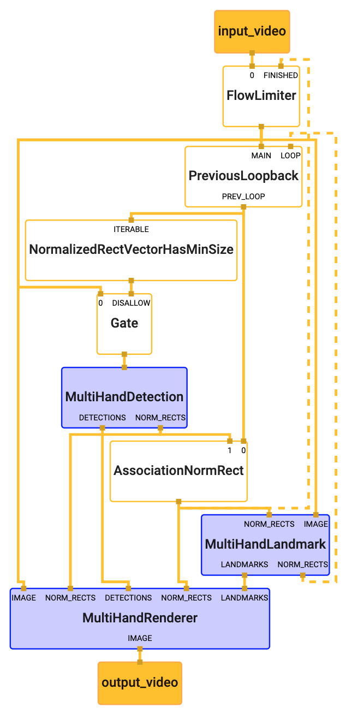
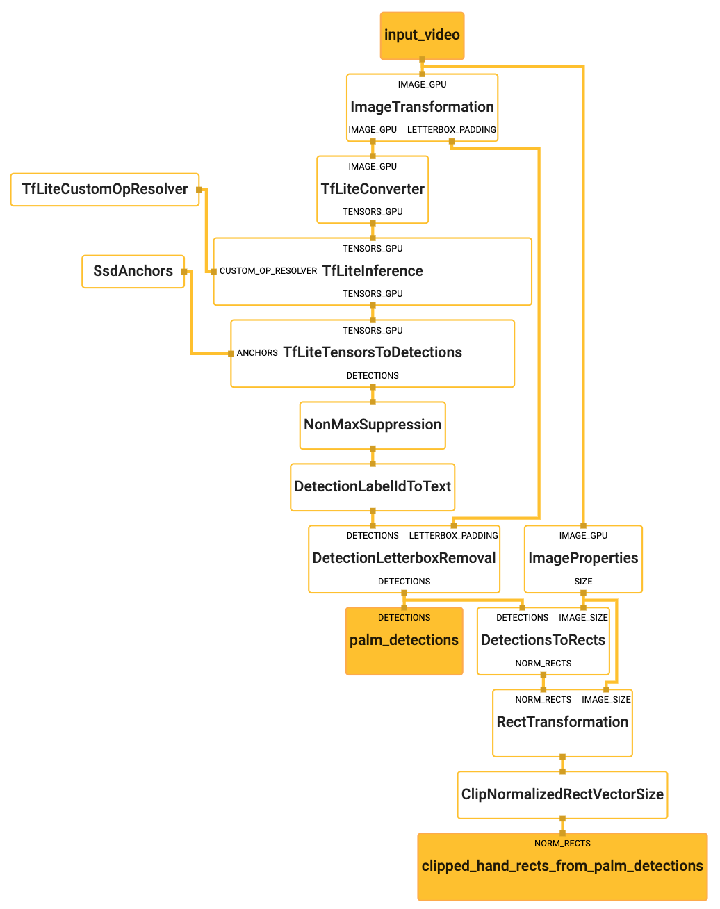
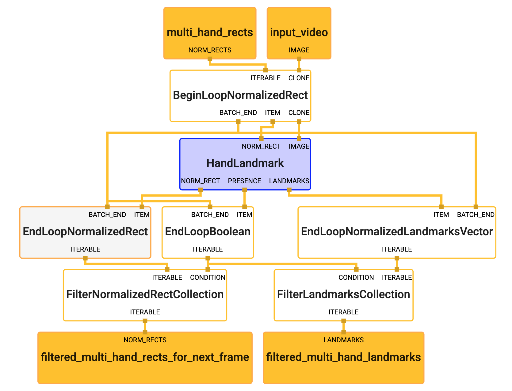

# Multi-Hand Tracking (GPU)

This doc focuses on the
[example graph](https://github.com/google/mediapipe/tree/master/mediapipe/graphs/hand_tracking/multi_hand_tracking_mobile.pbtxt)
that performs multi-hand tracking with TensorFlow Lite on GPU. It is related to
the [hand_tracking_example](./hand_tracking_mobile_gpu.md), and we recommend
users to review the (single) hand tracking example first.



In the visualization above, the red dots represent the hand landmarks and the
green lines are simply connections between selected landmark paris for
visualization of the hand skeleton. When there are fewer than `N` hands (`N=2`
in the graphs here), the purple box represents a hand rectangle that covers the
entire hand, derived from hand detection (see
[hand_detection_example](./hand_detection_mobile_gpu.md)). When there are `N`
hands (i.e. 2 hands for the graphs here), the red boxes represent hand
rectangles for each of the hands, derived from the previous round of hand
landmark localization using an ML model (see also
[model card](https://mediapipe.page.link/handmc)). Hand landmark localization
for each hand is performed only within the hand rectangle for computational
efficiency and accuracy. Hand detection is only invoked whenever there are fewer
than `N` hands in the previous iteration.

This example can also run a model that localizes hand landmarks in 3D (i.e.,
estimating an extra z coordinate):



In the visualization above, the localized hand landmarks are represented by dots
in different shades, with the brighter ones denoting landmarks closer to the
camera.

## Android

[Source](https://github.com/google/mediapipe/tree/master/mediapipe/examples/android/src/java/com/google/mediapipe/apps/multihandtrackinggpu)

To build the app yourself, run:

```bash
bazel build -c opt --config=android_arm64 mediapipe/examples/android/src/java/com/google/mediapipe/apps/multihandtrackinggpu
```

Once the app is built, install it on Android device with:

```bash
adb install bazel-bin/mediapipe/examples/android/src/java/com/google/mediapipe/apps/multihandtrackinggpu/multihandtrackinggpu.apk
```

## iOS

[Source](https://github.com/google/mediapipe/tree/master/mediapipe/examples/ios/multihandtrackinggpu).

See the general [instructions](./building_examples.md#ios) for building iOS
examples and generating an Xcode project. This will be the HandDetectionGpuApp
target.

To build on the command line:

```bash
bazel build -c opt --config=ios_arm64 mediapipe/examples/ios/multihandtrackinggpu:MultiHandTrackingGpuApp
```

## Graph

The multi-hand tracking [main graph](#main-graph) internal utilizes a
[multi_hand_detection_subgraph](#multi-hand-detection-subgraph), a
[multi_hand_landmark_subgraph](#multi-hand-landmark-subgraph), and a
[multi_hand_renderer_subgraph](#multi-hand-renderer-subgraph).

The subgraphs show up in the main graph visualization as nodes colored in
purple, and the subgraph itself can also be visualized just like a regular
graph. For more information on how to visualize a graph that includes subgraphs,
see the Visualizing Subgraphs section in the
[visualizer documentation](./visualizer.md).

### Main Graph



There are two key differences between this graph and the
[single_hand_tracking_mobile_graph](./hand_tracking_mobile_gpu.md).

1.  There is a `NormalizedRectVectorHasMinSize` calculator, that checks if in
    input vector of `NormalizedRect` objects has a minimum size equal to `N`. In
    this graph, if the vector contains fewer than `N` objects,
    `MultiHandDetection` subgraph runs. Otherwise, the `GateCalculator` doesn't
    send any image packets to the `MultiHandDetection` subgraph. This way, the
    main graph is efficient in that it avoids running the costly hand detection
    step when there are already `N` hands in the frame.
2.  The `MergeCalculator` has been replaced by the `AssociationNormRect`
    calculator. This `AssociationNormRect` takes as input a vector of
    `NormalizedRect` objects from the `MultiHandDetection` subgraph on the
    current frame, and a vector of `NormalizedRect` objects from the
    `MultiHandLandmark` subgraph from the previous frame, and performs an
    association operation between these objects. This calculator ensures that
    the output vector doesn't contain overlapping regions based on the specified
    `min_similarity_threshold`.

[Source pbtxt file](https://github.com/google/mediapipe/tree/master/mediapipe/graphs/hand_tracking/multi_hand_tracking_mobile.pbtxt)

```bash
# MediaPipe graph that performs multi-hand tracking with TensorFlow Lite on GPU.
# Used in the examples in
# mediapipie/examples/android/src/java/com/mediapipe/apps/multihandtrackinggpu.

# Images coming into and out of the graph.
input_stream: "input_video"
output_stream: "output_video"

# Throttles the images flowing downstream for flow control. It passes through
# the very first incoming image unaltered, and waits for downstream nodes
# (calculators and subgraphs) in the graph to finish their tasks before it
# passes through another image. All images that come in while waiting are
# dropped, limiting the number of in-flight images in most part of the graph to
# 1. This prevents the downstream nodes from queuing up incoming images and data
# excessively, which leads to increased latency and memory usage, unwanted in
# real-time mobile applications. It also eliminates unnecessarily computation,
# e.g., the output produced by a node may get dropped downstream if the
# subsequent nodes are still busy processing previous inputs.
node {
  calculator: "FlowLimiterCalculator"
  input_stream: "input_video"
  input_stream: "FINISHED:multi_hand_rects"
  input_stream_info: {
    tag_index: "FINISHED"
    back_edge: true
  }
  output_stream: "throttled_input_video"
}

# Determines if an input vector of NormalizedRect has a size greater than or
# equal to the provided min_size.
node {
  calculator: "NormalizedRectVectorHasMinSizeCalculator"
  input_stream: "ITERABLE:prev_multi_hand_rects_from_landmarks"
  output_stream: "prev_has_enough_hands"
  node_options: {
    [type.googleapis.com/mediapipe.CollectionHasMinSizeCalculatorOptions] {
      # This value can be changed to support tracking arbitrary number of hands.
      # Please also remember to modify max_vec_size in
      # ClipVectorSizeCalculatorOptions in
      # mediapipe/graphs/hand_tracking/subgraphs/multi_hand_detection_gpu.pbtxt
      min_size: 2
    }
  }
}

# Drops the incoming image if the previous frame had at least N hands.
# Otherwise, passes the incoming image through to trigger a new round of hand
# detection in MultiHandDetectionSubgraph.
node {
  calculator: "GateCalculator"
  input_stream: "throttled_input_video"
  input_stream: "DISALLOW:prev_has_enough_hands"
  output_stream: "multi_hand_detection_input_video"
  node_options: {
    [type.googleapis.com/mediapipe.GateCalculatorOptions] {
      empty_packets_as_allow: true
    }
  }
}

# Subgraph that detections hands (see multi_hand_detection_gpu.pbtxt).
node {
  calculator: "MultiHandDetectionSubgraph"
  input_stream: "multi_hand_detection_input_video"
  output_stream: "DETECTIONS:multi_palm_detections"
  output_stream: "NORM_RECTS:multi_palm_rects"
}

# Subgraph that localizes hand landmarks for multiple hands (see
# multi_hand_landmark.pbtxt).
node {
  calculator: "MultiHandLandmarkSubgraph"
  input_stream: "IMAGE:throttled_input_video"
  input_stream: "NORM_RECTS:multi_hand_rects"
  output_stream: "LANDMARKS:multi_hand_landmarks"
  output_stream: "NORM_RECTS:multi_hand_rects_from_landmarks"
}

# Caches a hand rectangle fed back from MultiHandLandmarkSubgraph, and upon the
# arrival of the next input image sends out the cached rectangle with the
# timestamp replaced by that of the input image, essentially generating a packet
# that carries the previous hand rectangle. Note that upon the arrival of the
# very first input image, an empty packet is sent out to jump start the
# feedback loop.
node {
  calculator: "PreviousLoopbackCalculator"
  input_stream: "MAIN:throttled_input_video"
  input_stream: "LOOP:multi_hand_rects_from_landmarks"
  input_stream_info: {
    tag_index: "LOOP"
    back_edge: true
  }
  output_stream: "PREV_LOOP:prev_multi_hand_rects_from_landmarks"
}

# Performs association between NormalizedRect vector elements from previous
# frame and those from the current frame if MultiHandDetectionSubgraph runs.
# This calculator ensures that the output multi_hand_rects vector doesn't
# contain overlapping regions based on the specified min_similarity_threshold.
node {
  calculator: "AssociationNormRectCalculator"
  input_stream: "prev_multi_hand_rects_from_landmarks"
  input_stream: "multi_palm_rects"
  output_stream: "multi_hand_rects"
  node_options: {
    [type.googleapis.com/mediapipe.AssociationCalculatorOptions] {
      min_similarity_threshold: 0.5
    }
  }
}

# Subgraph that renders annotations and overlays them on top of the input
# images (see multi_hand_renderer_gpu.pbtxt).
node {
  calculator: "MultiHandRendererSubgraph"
  input_stream: "IMAGE:throttled_input_video"
  input_stream: "DETECTIONS:multi_palm_detections"
  input_stream: "LANDMARKS:multi_hand_landmarks"
  input_stream: "NORM_RECTS:0:multi_palm_rects"
  input_stream: "NORM_RECTS:1:multi_hand_rects"
  output_stream: "IMAGE:output_video"
}
```

### Multi-Hand Detection Subgraph



This graph outputs a vector of `NormalizedRect` objects corresponding to each of
the hand instances visible in the frame. Note that at the end of this graph,
there is a `ClipNormalizedRectVectorSizeCalculator`. This calculator clips the
size of the input vector to a maximum size `N`. This implies that the
`MultiHandDetection` subgraph outputs a vector of maximum `N` hand instance
locations.

[Source pbtxt file](https://github.com/google/mediapipe/tree/master/mediapipe/graphs/hand_tracking/subgraphs/multi_hand_detection_gpu.pbtxt)

```bash
# MediaPipe multi-hand detection subgraph.

type: "MultiHandDetectionSubgraph"

input_stream: "input_video"
output_stream: "DETECTIONS:palm_detections"
output_stream: "NORM_RECTS:clipped_hand_rects_from_palm_detections"

# Transforms the input image on GPU to a 256x256 image. To scale the input
# image, the scale_mode option is set to FIT to preserve the aspect ratio,
# resulting in potential letterboxing in the transformed image.
node: {
  calculator: "ImageTransformationCalculator"
  input_stream: "IMAGE_GPU:input_video"
  output_stream: "IMAGE_GPU:transformed_input_video"
  output_stream: "LETTERBOX_PADDING:letterbox_padding"
  node_options: {
    [type.googleapis.com/mediapipe.ImageTransformationCalculatorOptions] {
      output_width: 256
      output_height: 256
      scale_mode: FIT
    }
  }
}

# Generates a single side packet containing a TensorFlow Lite op resolver that
# supports custom ops needed by the model used in this graph.
node {
  calculator: "TfLiteCustomOpResolverCalculator"
  output_side_packet: "opresolver"
  node_options: {
    [type.googleapis.com/mediapipe.TfLiteCustomOpResolverCalculatorOptions] {
      use_gpu: true
    }
  }
}

# Converts the transformed input image on GPU into an image tensor stored as a
# TfLiteTensor.
node {
  calculator: "TfLiteConverterCalculator"
  input_stream: "IMAGE_GPU:transformed_input_video"
  output_stream: "TENSORS_GPU:image_tensor"
}

# Runs a TensorFlow Lite model on GPU that takes an image tensor and outputs a
# vector of tensors representing, for instance, detection boxes/keypoints and
# scores.
node {
  calculator: "TfLiteInferenceCalculator"
  input_stream: "TENSORS_GPU:image_tensor"
  output_stream: "TENSORS_GPU:detection_tensors"
  input_side_packet: "CUSTOM_OP_RESOLVER:opresolver"
  node_options: {
    [type.googleapis.com/mediapipe.TfLiteInferenceCalculatorOptions] {
      model_path: "mediapipe/models/palm_detection.tflite"
      use_gpu: true
    }
  }
}

# Generates a single side packet containing a vector of SSD anchors based on
# the specification in the options.
node {
  calculator: "SsdAnchorsCalculator"
  output_side_packet: "anchors"
  node_options: {
    [type.googleapis.com/mediapipe.SsdAnchorsCalculatorOptions] {
      num_layers: 5
      min_scale: 0.1171875
      max_scale: 0.75
      input_size_height: 256
      input_size_width: 256
      anchor_offset_x: 0.5
      anchor_offset_y: 0.5
      strides: 8
      strides: 16
      strides: 32
      strides: 32
      strides: 32
      aspect_ratios: 1.0
      fixed_anchor_size: true
    }
  }
}

# Decodes the detection tensors generated by the TensorFlow Lite model, based on
# the SSD anchors and the specification in the options, into a vector of
# detections. Each detection describes a detected object.
node {
  calculator: "TfLiteTensorsToDetectionsCalculator"
  input_stream: "TENSORS_GPU:detection_tensors"
  input_side_packet: "ANCHORS:anchors"
  output_stream: "DETECTIONS:detections"
  node_options: {
    [type.googleapis.com/mediapipe.TfLiteTensorsToDetectionsCalculatorOptions] {
      num_classes: 1
      num_boxes: 2944
      num_coords: 18
      box_coord_offset: 0
      keypoint_coord_offset: 4
      num_keypoints: 7
      num_values_per_keypoint: 2
      sigmoid_score: true
      score_clipping_thresh: 100.0
      reverse_output_order: true

      x_scale: 256.0
      y_scale: 256.0
      h_scale: 256.0
      w_scale: 256.0
      min_score_thresh: 0.7
    }
  }
}

# Performs non-max suppression to remove excessive detections.
node {
  calculator: "NonMaxSuppressionCalculator"
  input_stream: "detections"
  output_stream: "filtered_detections"
  node_options: {
    [type.googleapis.com/mediapipe.NonMaxSuppressionCalculatorOptions] {
      min_suppression_threshold: 0.3
      overlap_type: INTERSECTION_OVER_UNION
      algorithm: WEIGHTED
      return_empty_detections: true
    }
  }
}

# Maps detection label IDs to the corresponding label text ("Palm"). The label
# map is provided in the label_map_path option.
node {
  calculator: "DetectionLabelIdToTextCalculator"
  input_stream: "filtered_detections"
  output_stream: "labeled_detections"
  node_options: {
    [type.googleapis.com/mediapipe.DetectionLabelIdToTextCalculatorOptions] {
      label_map_path: "mediapipe/models/palm_detection_labelmap.txt"
    }
  }
}

# Adjusts detection locations (already normalized to [0.f, 1.f]) on the
# letterboxed image (after image transformation with the FIT scale mode) to the
# corresponding locations on the same image with the letterbox removed (the
# input image to the graph before image transformation).
node {
  calculator: "DetectionLetterboxRemovalCalculator"
  input_stream: "DETECTIONS:labeled_detections"
  input_stream: "LETTERBOX_PADDING:letterbox_padding"
  output_stream: "DETECTIONS:palm_detections"
}

# Extracts image size from the input images.
node {
  calculator: "ImagePropertiesCalculator"
  input_stream: "IMAGE_GPU:input_video"
  output_stream: "SIZE:image_size"
}

# Converts each palm detection into a rectangle (normalized by image size)
# that encloses the palm and is rotated such that the line connecting center of
# the wrist and MCP of the middle finger is aligned with the Y-axis of the
# rectangle.
node {
  calculator: "DetectionsToRectsCalculator"
  input_stream: "DETECTIONS:palm_detections"
  input_stream: "IMAGE_SIZE:image_size"
  output_stream: "NORM_RECTS:palm_rects"
  node_options: {
    [type.googleapis.com/mediapipe.DetectionsToRectsCalculatorOptions] {
      rotation_vector_start_keypoint_index: 0  # Center of wrist.
      rotation_vector_end_keypoint_index: 2  # MCP of middle finger.
      rotation_vector_target_angle_degrees: 90
      output_zero_rect_for_empty_detections: true
    }
  }
}

# Expands and shifts the rectangle that contains the palm so that it's likely
# to cover the entire hand.
node {
  calculator: "RectTransformationCalculator"
  input_stream: "NORM_RECTS:palm_rects"
  input_stream: "IMAGE_SIZE:image_size"
  output_stream: "hand_rects_from_palm_detections"
  node_options: {
    [type.googleapis.com/mediapipe.RectTransformationCalculatorOptions] {
      scale_x: 2.6
      scale_y: 2.6
      shift_y: -0.5
      square_long: true
    }
  }
}

# Clips the size of the input vector to the provided max_vec_size. This
# determines the maximum number of hand instances this graph outputs.
# Note that the performance gain of clipping detections earlier in this graph is
# minimal because NMS will minimize overlapping detections and the number of
# detections isn't expected to exceed 5-10.
node {
  calculator: "ClipNormalizedRectVectorSizeCalculator"
  input_stream: "hand_rects_from_palm_detections"
  output_stream: "clipped_hand_rects_from_palm_detections"
  node_options: {
    [type.googleapis.com/mediapipe.ClipVectorSizeCalculatorOptions] {
      # This value can be changed to support tracking arbitrary number of hands.
      # Please also remember to modify min_size in
      # CollectionHsMinSizeCalculatorOptions in
      # mediapipe/graphs/hand_tracking/multi_hand_tracking_mobile.pbtxt and
      # mediapipe/graphs/hand_tracking/multi_hand_tracking_desktop_live.pbtxt.
      max_vec_size: 2
    }
  }
}
```

### Multi-Hand Landmark Subgraph



This graph accepts as input a vector of `NormalizedRect` objects, corresponding
the the region of each hand instance in the input image. For each
`NormalizedRect` object, the graph runs the existing `HandLandmark` subgraph and
collect the outputs of this subgraph into vectors. This is enabled by
`BeginLoop` and `EndLoop` calculators.

The `BeginLoop` calculator accepts as input a packet containing an iterable
collection of elements. This calculator is templatized (see
[begin_loop_calculator.h](https://github.com/google/mediapipe/tree/master/mediapipe/calculators/core/begin_loop_calculator.h)).
If the input packet arrived at a timestamp `ts`, this calculator outputs each
element in the collection at a fake timestamp `internal_ts`. At the end of the
collection, the calculator outputs the arrival timestamp `ts` in the output
stream tagged with `BATCH_END`.

The nodes between the `BeginLoop` calculator and the corresponding `EndLoop`
calculator process individual packets at the fake timestamps `internal_ts`.
After each element is processed, it is sent to the `EndLoop` calculator (see
[end_loop_calculator.h](https://github.com/google/mediapipe/tree/master/mediapipe/calculators/core/end_loop_calculator.h)),
which collects these elements in an output collection. The `EndLoop` calculator
listens for packets from the `BATCH_END` output stream of the `BeginLoop`
calculator. When the `BATCH_END` packet containing the real timestamp `ts`
arrives at the `EndLoop` calculator, the `EndLoop` calculator outputs a packet
containing the collection of processed elements at the real timestamp `ts`.

In the multi-hand landmark subgraph, the `EndLoop` calculators collect the
output vector of hand landmarks per hand instance, the boolean values indicating
the presence of each hand and the `NormalizedRect` objects corresponding to the
regions surrounding each hand into vectors.

Finally, based on the hand presence boolean value, the graph filters the
collections of hand landmarks and `NormalizdRect` objects corresponding to each
hand instance.

[Source pbtxt file](https://github.com/google/mediapipe/tree/master/mediapipe/graphs/hand_tracking/subgraphs/multi_hand_landmark.pbtxt)

```bash
# MediaPipe hand landmark localization subgraph.

type: "MultiHandLandmarkSubgraph"

input_stream: "IMAGE:input_video"
# A vector of NormalizedRect, one per each hand detected.
input_stream: "NORM_RECTS:multi_hand_rects"
# A vector of NormalizedLandmarks, one set per each hand.
output_stream: "LANDMARKS:filtered_multi_hand_landmarks"
# A vector of NormalizedRect, one per each hand.
output_stream: "NORM_RECTS:filtered_multi_hand_rects_for_next_frame"

# Outputs each element of multi_hand_rects at a fake timestamp for the rest
# of the graph to process. Clones the input_video packet for each
# single_hand_rect at the fake timestamp. At the end of the loop,
# outputs the BATCH_END timestamp for downstream calculators to inform them
# that all elements in the vector have been processed.
node {
  calculator: "BeginLoopNormalizedRectCalculator"
  input_stream: "ITERABLE:multi_hand_rects"
  input_stream: "CLONE:input_video"
  output_stream: "ITEM:single_hand_rect"
  output_stream: "CLONE:input_video_cloned"
  output_stream: "BATCH_END:single_hand_rect_timestamp"
}

node {
  calculator: "HandLandmarkSubgraph"
  input_stream: "IMAGE:input_video_cloned"
  input_stream: "NORM_RECT:single_hand_rect"
  output_stream: "LANDMARKS:single_hand_landmarks"
  output_stream: "NORM_RECT:single_hand_rect_from_landmarks"
  output_stream: "PRESENCE:single_hand_presence"
}

# Collects the boolean presence value for each single hand into a vector. Upon
# receiving the BATCH_END timestamp, outputs a vector of boolean values at the
# BATCH_END timestamp.
node {
  calculator: "EndLoopBooleanCalculator"
  input_stream: "ITEM:single_hand_presence"
  input_stream: "BATCH_END:single_hand_rect_timestamp"
  output_stream: "ITERABLE:multi_hand_presence"
}

# Collects a set of landmarks for each hand into a vector. Upon receiving the
# BATCH_END timestamp, outputs the vector of landmarks at the BATCH_END
# timestamp.
node {
  calculator: "EndLoopNormalizedLandmarkListVectorCalculator"
  input_stream: "ITEM:single_hand_landmarks"
  input_stream: "BATCH_END:single_hand_rect_timestamp"
  output_stream: "ITERABLE:multi_hand_landmarks"
}

# Collects a NormalizedRect for each hand into a vector. Upon receiving the
# BATCH_END timestamp, outputs the vector of NormalizedRect at the BATCH_END
# timestamp.
node {
  calculator: "EndLoopNormalizedRectCalculator"
  input_stream: "ITEM:single_hand_rect_from_landmarks"
  input_stream: "BATCH_END:single_hand_rect_timestamp"
  output_stream: "ITERABLE:multi_hand_rects_for_next_frame"
}

# Filters the input vector of landmarks based on hand presence value for each
# hand. If the hand presence for hand #i is false, the set of landmarks
# corresponding to that hand are dropped from the vector.
node {
  calculator: "FilterLandmarkListCollectionCalculator"
  input_stream: "ITERABLE:multi_hand_landmarks"
  input_stream: "CONDITION:multi_hand_presence"
  output_stream: "ITERABLE:filtered_multi_hand_landmarks"
}

# Filters the input vector of NormalizedRect based on hand presence value for
# each hand. If the hand presence for hand #i is false, the NormalizedRect
# corresponding to that hand are dropped from the vector.
node {
  calculator: "FilterNormalizedRectCollectionCalculator"
  input_stream: "ITERABLE:multi_hand_rects_for_next_frame"
  input_stream: "CONDITION:multi_hand_presence"
  output_stream: "ITERABLE:filtered_multi_hand_rects_for_next_frame"
}
```

### Multi-Hand Renderer Subgraph


This graph also uses `BeginLoop` and `EndLoop` calculators to iteratively
convert a set of hand landmarks per hand instance into corresponding
`RenderData` objects.

[Source pbtxt file](https://github.com/google/mediapipe/tree/master/mediapipe/graphs/hand_tracking/subgraphs/multi_hand_renderer_gpu.pbtxt)

```bash
# MediaPipe multi-hand tracking rendering subgraph.

type: "MultiHandRendererSubgraph"

input_stream: "IMAGE:input_image"
# A vector of NormalizedLandmarks, one for each hand.
input_stream: "LANDMARKS:multi_hand_landmarks"
# A vector of NormalizedRect, one for each hand.
input_stream: "NORM_RECTS:0:multi_palm_rects"
# A vector of NormalizedRect, one for each hand.
input_stream: "NORM_RECTS:1:multi_hand_rects"
# A vector of Detection, one for each hand.
input_stream: "DETECTIONS:palm_detections"
output_stream: "IMAGE:output_image"

# Converts detections to drawing primitives for annotation overlay.
node {
  calculator: "DetectionsToRenderDataCalculator"
  input_stream: "DETECTIONS:palm_detections"
  output_stream: "RENDER_DATA:detection_render_data"
  node_options: {
    [type.googleapis.com/mediapipe.DetectionsToRenderDataCalculatorOptions] {
      thickness: 4.0
      color { r: 0 g: 255 b: 0 }
    }
  }
}

# Converts normalized rects to drawing primitives for annotation overlay.
node {
  calculator: "RectToRenderDataCalculator"
  input_stream: "NORM_RECTS:multi_hand_rects"
  output_stream: "RENDER_DATA:multi_hand_rects_render_data"
  node_options: {
    [type.googleapis.com/mediapipe.RectToRenderDataCalculatorOptions] {
      filled: false
      color { r: 255 g: 0 b: 0 }
      thickness: 4.0
    }
  }
}

# Converts normalized rects to drawing primitives for annotation overlay.
node {
  calculator: "RectToRenderDataCalculator"
  input_stream: "NORM_RECTS:multi_palm_rects"
  output_stream: "RENDER_DATA:multi_palm_rects_render_data"
  node_options: {
    [type.googleapis.com/mediapipe.RectToRenderDataCalculatorOptions] {
      filled: false
      color { r: 125 g: 0 b: 122 }
      thickness: 4.0
    }
  }
}

# Outputs each element of multi_palm_landmarks at a fake timestamp for the rest
# of the graph to process. At the end of the loop, outputs the BATCH_END
# timestamp for downstream calculators to inform them that all elements in the
# vector have been processed.
node {
  calculator: "BeginLoopNormalizedLandmarkListVectorCalculator"
  input_stream: "ITERABLE:multi_hand_landmarks"
  output_stream: "ITEM:single_hand_landmarks"
  output_stream: "BATCH_END:landmark_timestamp"
}

# Converts landmarks to drawing primitives for annotation overlay.
node {
  calculator: "LandmarksToRenderDataCalculator"
  input_stream: "NORM_LANDMARKS:single_hand_landmarks"
  output_stream: "RENDER_DATA:single_hand_landmark_render_data"
  node_options: {
    [type.googleapis.com/mediapipe.LandmarksToRenderDataCalculatorOptions] {
      landmark_connections: 0
      landmark_connections: 1
      landmark_connections: 1
      landmark_connections: 2
      landmark_connections: 2
      landmark_connections: 3
      landmark_connections: 3
      landmark_connections: 4
      landmark_connections: 0
      landmark_connections: 5
      landmark_connections: 5
      landmark_connections: 6
      landmark_connections: 6
      landmark_connections: 7
      landmark_connections: 7
      landmark_connections: 8
      landmark_connections: 5
      landmark_connections: 9
      landmark_connections: 9
      landmark_connections: 10
      landmark_connections: 10
      landmark_connections: 11
      landmark_connections: 11
      landmark_connections: 12
      landmark_connections: 9
      landmark_connections: 13
      landmark_connections: 13
      landmark_connections: 14
      landmark_connections: 14
      landmark_connections: 15
      landmark_connections: 15
      landmark_connections: 16
      landmark_connections: 13
      landmark_connections: 17
      landmark_connections: 0
      landmark_connections: 17
      landmark_connections: 17
      landmark_connections: 18
      landmark_connections: 18
      landmark_connections: 19
      landmark_connections: 19
      landmark_connections: 20
      landmark_color { r: 255 g: 0 b: 0 }
      connection_color { r: 0 g: 255 b: 0 }
      thickness: 4.0
    }
  }
}

# Collects a RenderData object for each hand into a vector. Upon receiving the
# BATCH_END timestamp, outputs the vector of RenderData at the BATCH_END
# timestamp.
node {
  calculator: "EndLoopRenderDataCalculator"
  input_stream: "ITEM:single_hand_landmark_render_data"
  input_stream: "BATCH_END:landmark_timestamp"
  output_stream: "ITERABLE:multi_hand_landmarks_render_data"
}

# Draws annotations and overlays them on top of the input images. Consumes
# a vector of RenderData objects and draws each of them on the input frame.
node {
  calculator: "AnnotationOverlayCalculator"
  input_stream: "IMAGE_GPU:input_image"
  input_stream: "detection_render_data"
  input_stream: "multi_hand_rects_render_data"
  input_stream: "multi_palm_rects_render_data"
  input_stream: "VECTOR:0:multi_hand_landmarks_render_data"
  output_stream: "IMAGE_GPU:output_image"
}
```
