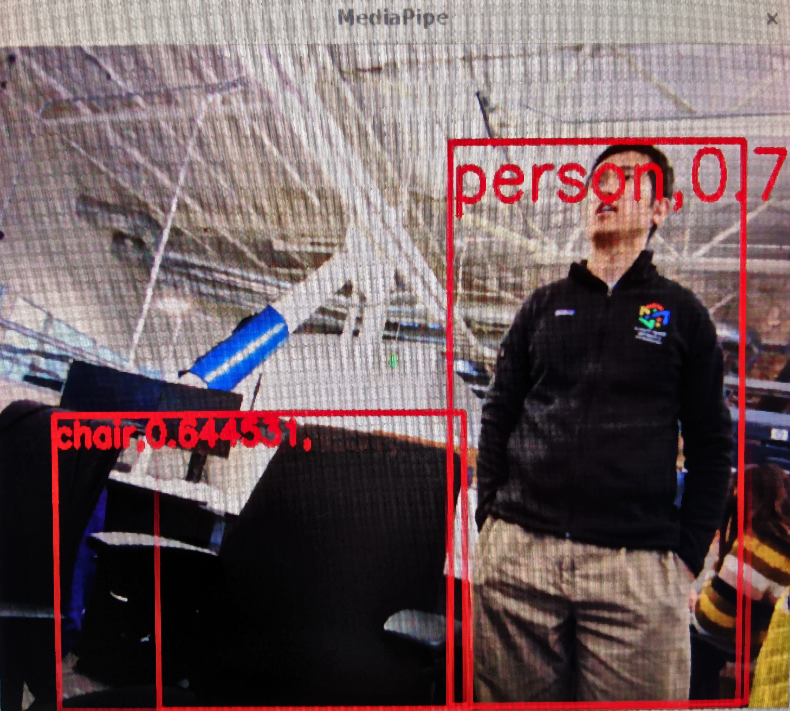

## Object Detection on Coral with Webcam

MediaPipe is able to run cross platform across device types like desktop, mobile
and edge devices. Here is an example of running MediaPipe
[object detection pipeline](./object_detection_desktop.md) on edge device like
the [Coral Dev Board](https://coral.ai/products/dev-board).

This MediaPipe Coral object
detection pipeline is running [coral specific quantized version](https://github.com/google/mediapipe/blob/master/mediapipe/examples/coral/models/object-detector-quantized_edgetpu.tflite)
of the [MediaPipe object detection TFLite model](https://github.com/google/mediapipe/blob/master/mediapipe/models/object_detection_front.tflite)
accelerated on Edge TPU.

### Cross compilation of MediaPipe Coral binaries in Docker

We recommend building the MediaPipe binaries not on the edge device due to
limited compute resulting in long build times. Instead, we will build MediaPipe
binaries using Docker containers on a more powerful host machine.

For step by
step details of cross compiling and running MediaPipe binaries on the Coral Dev
Board, please refer to [README.md in MediaPipe Coral example folder](https://github.com/google/mediapipe/tree/master/mediapipe/examples/coral).

