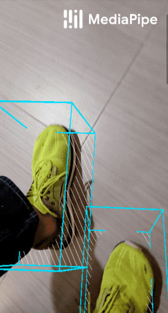
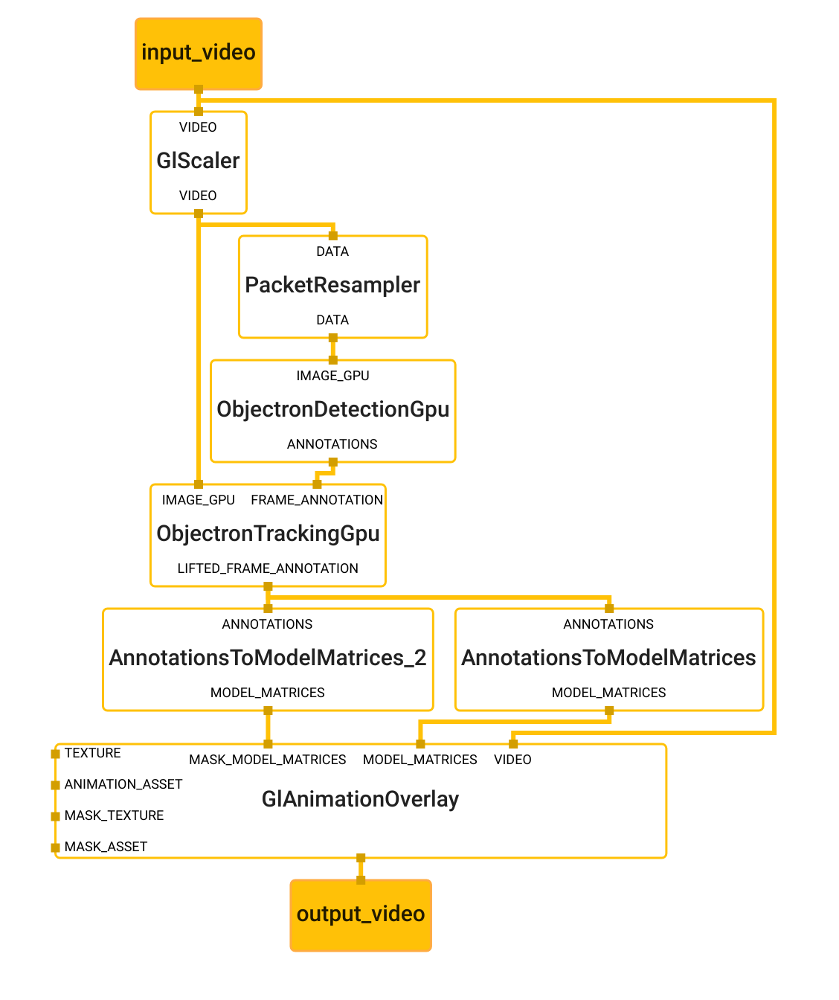
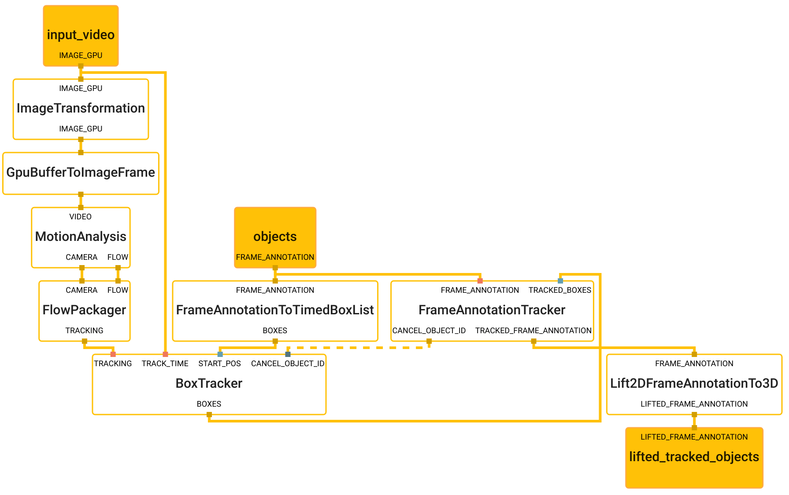

# MediaPipe Objectron (GPU)

This doc focuses on the
[below example graph](https://github.com/google/mediapipe/tree/master/mediapipe/graphs/object_detection_3d/shoe_classic_occlusion_tracking.pbtxt)
that performs 3D object detection and tracking with TensorFlow Lite on GPU.

Objectron for shoes                                                             | Objectron for chairs
:-----------------------------------------------------------------------------: | :------------------:
 | 

For overall context on MediaPipe Objectron, please read the
[Google AI Blog](https://mediapipe.page.link/objectron-aiblog). The Objectron's
ML model (see also the [model card](https://mediapipe.page.link/objectron-mc))
estimates a 3D bounding box for the detected object.

## Android

[Source](https://github.com/google/mediapipe/tree/master/mediapipe/examples/android/src/java/com/google/mediapipe/apps/objectdetection3d)

An arm64 build of Objectron for shoes can be
[downloaded here](https://drive.google.com/open?id=1S0K4hbWt3o31FfQ4QU3Rz7IHrvOUMx1d),
and for chairs can be
[downloaded here](https://drive.google.com/open?id=1MM8K-13bXLCVS1EHQ-KgkVyEahEPrKej).

To build and install the Objectron for shoes:

```bash
bazel build -c opt --config android_arm64 mediapipe/examples/android/src/java/com/google/mediapipe/apps/objectdetection3d:objectdetection3d
```

Similarly to build and install the Objectron for chairs, add **--define
chair=true** flag to build command.

```bash
bazel build -c opt --define chair=true --config android_arm64 mediapipe/examples/android/src/java/com/google/mediapipe/apps/objectdetection3d:objectdetection3d
```

Once the app is built, install in on Android device with:

```bash
adb install bazel-bin/mediapipe/examples/android/src/java/com/google/mediapipe/apps/objectdetection3d/objectdetection3d.apk
```

## Graph

The Objectron main graph internally utilizes the Objectron detection subgraph,
and the Objectron tracking subgraph. To visualize the graph as shown above, copy
the text specification of the graph below and paste it into
[MediaPipe Visualizer](https://viz.mediapipe.dev/).

### Main Graph

This is the main graph for the shoe detector. This graph runs detection and
tracking and renders the output to the display.



[Source pbtxt file](https://github.com/google/mediapipe/tree/master/mediapipe/graphs/object_detection_3d/shoe_classic_occlusion_tracking.pbtxt)

```bash
# MediaPipe object detection 3D with tracking graph.

# Images on GPU coming into and out of the graph.
input_stream: "input_video"
output_stream: "output_video"

# Creates a copy of the input_video stream. At the end of the graph, the
# GlAnimationOverlayCalculator will consume the input_video texture and draws
# on top of it.
node: {
  calculator: "GlScalerCalculator"
  input_stream: "VIDEO:input_video"
  output_stream: "VIDEO:input_video_copy"
}

# Resamples the images by specific frame rate. This calculator is used to
# control the frequecy of subsequent calculators/subgraphs, e.g. less power
# consumption for expensive process.
node {
  calculator: "PacketResamplerCalculator"
  input_stream: "DATA:input_video_copy"
  output_stream: "DATA:sampled_input_video"
  node_options: {
    [type.googleapis.com/mediapipe.PacketResamplerCalculatorOptions] {
      frame_rate: 5
    }
  }
}

node {
  calculator: "ObjectronDetectionSubgraphGpu"
  input_stream: "IMAGE_GPU:sampled_input_video"
  output_stream: "ANNOTATIONS:objects"
}

node {
  calculator: "ObjectronTrackingSubgraphGpu"
  input_stream: "FRAME_ANNOTATION:objects"
  input_stream: "IMAGE_GPU:input_video_copy"
  output_stream: "LIFTED_FRAME_ANNOTATION:lifted_tracked_objects"
}

# The rendering nodes:
# We are rendering two meshes: 1) a 3D bounding box, which we overlay directly
# on the texture, and 2) a shoe CAD model, which we use as an occlusion mask.
# These models are designed using different tools, so we supply a transformation
# to bring both of them to the Objectron's coordinate system.

# Creates a model matrices for the tracked object given the lifted 3D points.
# This calculator does two things: 1) Estimates object's pose (orientation,
# translation, and scale) from the 3D vertices, and
# 2) bring the object from the objectron's coordinate system to the renderer
# (OpenGL) coordinate system. Since the final goal is to render a mesh file on
# top of the object, we also supply a transformation to bring the mesh to the
# objectron's coordinate system, and rescale mesh to the unit size.
node {
  calculator: "AnnotationsToModelMatricesCalculator"
  input_stream: "ANNOTATIONS:lifted_tracked_objects"
  output_stream: "MODEL_MATRICES:model_matrices"
  node_options: {
    [type.googleapis.com/mediapipe.AnnotationsToModelMatricesCalculatorOptions] {
      # Re-scale the CAD model to the size of a unit box
      model_scale: 0.05
      model_scale: 0.05
      model_scale: 0.05
      # Bring the box CAD model to objectron's coordinate system. This
      # is equivalent of -pi/2 rotation along the y-axis (right-hand rule):
      # Eigen::AngleAxisf(-M_PI / 2., Eigen::Vector3f::UnitY())
      model_transformation: 0.0
      model_transformation: 0.0
      model_transformation: -1.0
      model_transformation: 0.0
      model_transformation: 0.0
      model_transformation: 1.0
      model_transformation: 0.0
      model_transformation: 0.0
      model_transformation: 1.0
      model_transformation: 0.0
      model_transformation: 0.0
      model_transformation: 0.0
      model_transformation: 0.0
      model_transformation: 0.0
      model_transformation: 0.0
      model_transformation: 1.0
    }
  }
}

# Compute the model matrices for the CAD model of the shoe, to be used as an
# occlusion mask. The model will be rendered at the exact same location as the
# bounding box.
node {
  calculator: "AnnotationsToModelMatricesCalculator"
  input_stream: "ANNOTATIONS:lifted_tracked_objects"
  output_stream: "MODEL_MATRICES:mask_model_matrices"
  #input_side_packet: "MODEL_SCALE:model_scale"
  node_options: {
    [type.googleapis.com/mediapipe.AnnotationsToModelMatricesCalculatorOptions] {
      # Re-scale the CAD model to the size of a unit box
      model_scale: 0.45
      model_scale: 0.25
      model_scale: 0.15
      # Bring the shoe CAD model to Deep Pursuit 3D's coordinate system. This
      # is equivalent of -pi/2 rotation along the x-axis (right-hand rule):
      # Eigen::AngleAxisf(-M_PI / 2., Eigen::Vector3f::UnitX())
      model_transformation: 1.0
      model_transformation: 0.0
      model_transformation: 0.0
      model_transformation: 0.0
      model_transformation: 0.0
      model_transformation: 0.0
      model_transformation: 1.0
      model_transformation: 0.0
      model_transformation: 0.0
      model_transformation: -1.0
      model_transformation: 0.0
      model_transformation: 0.0
      model_transformation: 0.0
      model_transformation: 0.0
      model_transformation: 0.0
      model_transformation: 1.0
    }
  }
}

# Render everything together. First we render the 3D bounding box animation,
# then we render the occlusion mask.
node: {
  calculator: "GlAnimationOverlayCalculator"
  input_stream: "VIDEO:input_video"
  input_stream: "MODEL_MATRICES:model_matrices"
  input_stream: "MASK_MODEL_MATRICES:mask_model_matrices"
  output_stream: "output_video"
  input_side_packet: "TEXTURE:box_texture"
  input_side_packet: "ANIMATION_ASSET:box_asset_name"
  input_side_packet: "MASK_TEXTURE:obj_texture"
  input_side_packet: "MASK_ASSET:obj_asset_name"
  node_options: {
    [type.googleapis.com/mediapipe.GlAnimationOverlayCalculatorOptions] {
      # Output resolution is 480x640 with the aspect ratio of 0.75
      aspect_ratio: 0.75
      vertical_fov_degrees: 70.
      animation_speed_fps: 25
    }
  }
}

```

### Objectron Detection Subgraph

Objectron detection subgraph uses the *TfLiteInferenceCalculator* to run
inference and decodes the output tensor to *FrameAnnotation* protobuf. The
*FrameAnnotation* contains nine keypoints: the bounding box's center, as well as
its eight vertices. The boxes will be passed to the Objectron tracking subgraph.


[Source pbtxt file](https://github.com/google/mediapipe/tree/master/mediapipe/graphs/object_detection_3d/subgraphs/objectron_detection_gpu.pbtxt)

```bash
# MediaPipe Objectron detection gpu subgraph

type: "ObjectronDetectionSubgraphGpu"

input_stream: "IMAGE_GPU:input_video"
output_stream: "ANNOTATIONS:objects"

# Transforms the input image on GPU to a 480x640 image. To scale the input
# image, the scale_mode option is set to FIT to preserve the aspect ratio,
# resulting in potential letterboxing in the transformed image.
node: {
  calculator: "ImageTransformationCalculator"
  input_stream: "IMAGE_GPU:input_video"
  output_stream: "IMAGE_GPU:transformed_input_video"
  node_options: {
    [type.googleapis.com/mediapipe.ImageTransformationCalculatorOptions] {
      output_width: 480
      output_height: 640
      scale_mode: FIT
    }
  }
}

# Converts the transformed input image on GPU into an image tensor stored as a
# TfLiteTensor.
node {
  calculator: "TfLiteConverterCalculator"
  input_stream: "IMAGE_GPU:transformed_input_video"
  output_stream: "TENSORS_GPU:image_tensor"
}

# Generates a single side packet containing a TensorFlow Lite op resolver that
# supports custom ops needed by the model used in this graph.
node {
  calculator: "TfLiteCustomOpResolverCalculator"
  output_side_packet: "opresolver"
  node_options: {
    [type.googleapis.com/mediapipe.TfLiteCustomOpResolverCalculatorOptions] {
      use_gpu: true
    }
  }
}

# Runs a TensorFlow Lite model on GPU that takes an image tensor and outputs a
# vector of tensors representing, for instance, detection boxes/keypoints and
# scores.
node {
  calculator: "TfLiteInferenceCalculator"
  input_stream: "TENSORS_GPU:image_tensor"
  output_stream: "TENSORS:detection_tensors"
  input_side_packet: "CUSTOM_OP_RESOLVER:opresolver"
  node_options: {
    [type.googleapis.com/mediapipe.TfLiteInferenceCalculatorOptions] {
      model_path: "object_detection_3d.tflite"
    }
  }
}

# Decodes the model's output tensor (the heatmap and the distance fields) to 2D
# keypoints. There are nine 2D keypoints: one center keypoint and eight vertices
# for the 3D bounding box. The calculator parameters determine's the decoder's
# sensitivity.
node {
  calculator: "TfLiteTensorsToObjectsCalculator"
  input_stream: "TENSORS:detection_tensors"
  output_stream: "ANNOTATIONS:objects"
  node_options: {
    [type.googleapis.com/mediapipe.TfLiteTensorsToObjectsCalculatorOptions] {
      num_classes: 1
      num_keypoints: 9
      decoder_config {
        heatmap_threshold: 0.6
        local_max_distance: 2
        offset_scale_coef: 1.0
        voting_radius: 2
        voting_allowance: 1
        voting_threshold: 0.2
      }
    }
  }
}
```

### Object Tracking Subgraph

Object tracking subgraph uses a *BoxTracker* calculator which is a generic
tracking library, also used in
[Mediapipe's 2D Object Detection and Tracking](https://github.com/google/mediapipe/tree/master/mediapipe/g3doc/object_tracking_mobile_gpu.md).
The tracking runs every frame and when a new detection is available, it
consolidates the detection and tracking results. The tracker tracks the box with
its 2D keypoints, so at the end we lift the 2D keypoints to 3D using EPnP
algorithm in *Lift2DFrameAnnotationTo3D* Calculator.



[Source pbtxt file](https://github.com/google/mediapipe/tree/master/mediapipe/graphs/object_detection_3d/subgraphs/objectron_tracking_gpu.pbtxt)

```bash
# MediaPipe Objectron tracking gpu subgraph

type: "ObjectronTrackingSubgraphGpu"

input_stream: "FRAME_ANNOTATION:objects"
input_stream: "IMAGE_GPU:input_video"
output_stream: "LIFTED_FRAME_ANNOTATION:lifted_tracked_objects"


# Converts the detected keypoints to Boxes, used by the tracking subgraph.
node {
  calculator: "FrameAnnotationToTimedBoxListCalculator"
  input_stream: "FRAME_ANNOTATION:objects"
  output_stream: "BOXES:start_pos"
}

node: {
  calculator: "ImageTransformationCalculator"
  input_stream: "IMAGE_GPU:input_video"
  output_stream: "IMAGE_GPU:downscaled_input_video"
  node_options: {
    [type.googleapis.com/mediapipe.ImageTransformationCalculatorOptions] {
      output_width: 240
      output_height: 320
    }
  }
}

# Converts GPU buffer to ImageFrame for processing tracking.
node: {
  calculator: "GpuBufferToImageFrameCalculator"
  input_stream: "downscaled_input_video"
  output_stream: "downscaled_input_video_cpu"
}

# Performs motion analysis on an incoming video stream.
node: {
  calculator: "MotionAnalysisCalculator"
  input_stream: "VIDEO:downscaled_input_video_cpu"
  output_stream: "CAMERA:camera_motion"
  output_stream: "FLOW:region_flow"

  node_options: {
    [type.googleapis.com/mediapipe.MotionAnalysisCalculatorOptions]: {
      analysis_options {
        analysis_policy: ANALYSIS_POLICY_CAMERA_MOBILE
        flow_options {
          fast_estimation_min_block_size: 100
          top_inlier_sets: 1
          frac_inlier_error_threshold: 3e-3
          downsample_mode: DOWNSAMPLE_TO_INPUT_SIZE
          verification_distance: 5.0
          verify_long_feature_acceleration: true
          verify_long_feature_trigger_ratio: 0.1
          tracking_options {
            max_features: 500
            adaptive_extraction_levels: 2
            min_eig_val_settings {
              adaptive_lowest_quality_level: 2e-4
            }
            klt_tracker_implementation: KLT_OPENCV
          }
        }
      }
    }
  }
}

# Reads optical flow fields defined in
# mediapipe/framework/formats/motion/optical_flow_field.h,
# returns a VideoFrame with 2 channels (v_x and v_y), each channel is quantized
# to 0-255.
node: {
  calculator: "FlowPackagerCalculator"
  input_stream: "FLOW:region_flow"
  input_stream: "CAMERA:camera_motion"
  output_stream: "TRACKING:tracking_data"

  node_options: {
    [type.googleapis.com/mediapipe.FlowPackagerCalculatorOptions]: {
      flow_packager_options: {
        binary_tracking_data_support: false
      }
    }
  }
}

# Tracks box positions over time.
node: {
  calculator: "BoxTrackerCalculator"
  input_stream: "TRACKING:tracking_data"
  input_stream: "TRACK_TIME:input_video"
  input_stream: "START_POS:start_pos"
  input_stream: "CANCEL_OBJECT_ID:cancel_object_id"
  input_stream_info: {
    tag_index: "CANCEL_OBJECT_ID"
    back_edge: true
  }
  output_stream: "BOXES:boxes"

  input_stream_handler {
    input_stream_handler: "SyncSetInputStreamHandler"
    options {
      [mediapipe.SyncSetInputStreamHandlerOptions.ext] {
        sync_set {
          tag_index: "TRACKING"
          tag_index: "TRACK_TIME"
        }
        sync_set {
          tag_index: "START_POS"
        }
        sync_set {
          tag_index: "CANCEL_OBJECT_ID"
        }
      }
    }
  }

  node_options: {
    [type.googleapis.com/mediapipe.BoxTrackerCalculatorOptions]: {
      tracker_options: {
        track_step_options {
          track_object_and_camera: true
          tracking_degrees: TRACKING_DEGREE_OBJECT_ROTATION_SCALE
          inlier_spring_force: 0.0
          static_motion_temporal_ratio: 3e-2
        }
      }
      visualize_tracking_data: false
      streaming_track_data_cache_size: 100
    }
  }
}

# Consolidates tracking and detection results.
node {
  calculator: "FrameAnnotationTrackerCalculator"
  input_stream: "FRAME_ANNOTATION:objects"
  input_stream: "TRACKED_BOXES:boxes"
  output_stream: "TRACKED_FRAME_ANNOTATION:tracked_objects"
  output_stream: "CANCEL_OBJECT_ID:cancel_object_id"
  node_options: {
    [type.googleapis.com/mediapipe.FrameAnnotationTrackerCalculatorOptions] {
      img_width: 240
      img_height: 320
    }
  }

  input_stream_handler {
    input_stream_handler: "SyncSetInputStreamHandler"
    options {
      [mediapipe.SyncSetInputStreamHandlerOptions.ext] {
        sync_set {
          tag_index: "FRAME_ANNOTATION"
        }
        sync_set {
          tag_index: "TRACKED_BOXES"
        }
      }
    }
  }
}

# Lift the tracked 2D keypoints to 3D using EPnP algorithm.
node {
  calculator: "Lift2DFrameAnnotationTo3DCalculator"
  input_stream: "FRAME_ANNOTATION:tracked_objects"
  output_stream: "LIFTED_FRAME_ANNOTATION:lifted_tracked_objects"
}
```
