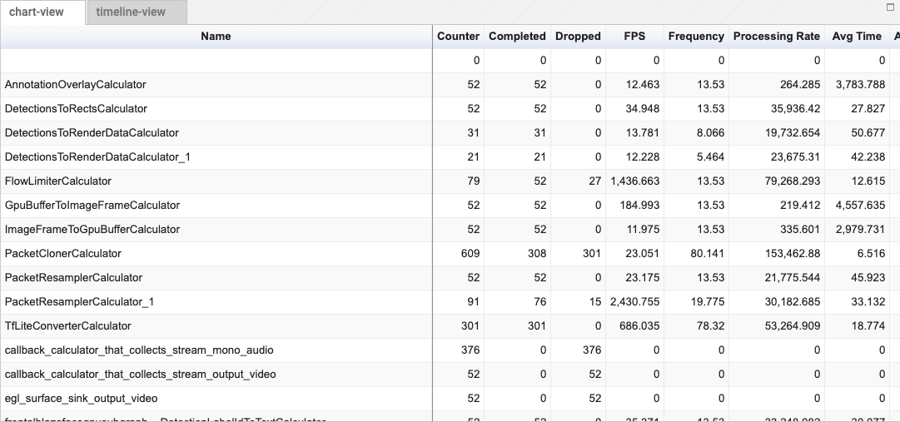

# Tracing / Profiling MediaPipe Graphs

The MediaPipe framework includes a built-in tracer and profiler. Tracing can
be activated using a setting in the CalculatorGraphConfig. The tracer records
various timing events related to packet processing, including the start and
end time of each Calculator::Process call. The tracer writes trace log files
in binary protobuf format.  The tracer is available on Linux, Android, or iOS.

## Enabling tracing

To enable profiling of a mediapipe graph, the proto buffer representing the graph
must have a profiler_config message at its root. This tag is defined inside
calculator.proto and our public definition can be found in our github repository
with a complete list of settings. Here is a simple setup that turns on a few
extra options:

```
profiler_config {
  enable_profiler: true
  trace_enabled: true
  trace_log_count: 5
}
```

*   `enable_profiler` is required to emit any logging at all.

*   `trace_enabled` gives us packet level information needed for offline
    profiling.

*   `trace_log_count` is a convenience that allows us to, by default, to chop up
    our log into five separate files which are filled up in a round robin
    fashion (after the fifth file is recorded, the first file is used again).
    The trace log files are named `trace_0.log` through `trace_k.log`.

    See [Profiler Configuration](profiler_config.md) for other settings
    available in the profiler config. Note that most of the other settings are
    considered advanced, and in general should not be needed.

## Collecting the Logs

MediaPipe will emit data into a pre-specified directory:

*   On the desktop, this will be the `/tmp` directory.

*   On Android, this will be the `/sdcard` directory.

*   On iOS, this can be reached through XCode. Select "Window/Devices and
    Simulators" and select the "Devices" tab.

    

    You can open the Download Container. Logs will be located in `application
    container/.xcappdata/AppData/Documents/`

    

Log files are written to `\<trace_log_path index\>.binarypb` where, by default,
`\<trace_log_path\>` is equal to `mediapipe_trace_` (the entire path and file
prefix can be overwritten by setting `trace_log_path` within the
`profiler_config` message). The index will, by default, alternate between 0 and
1, unless you've overridden the trace_log_count as we did, above.

By default, each file records five seconds of events. (Advanced: Specifically,
we record ten intervals of half a second each. This can be overridden by adding
`trace_log_interval_usec` and `trace_log_interval_count` to `profiler_config`).

### Tracing on Linux

1.  Follow the instructions stated above in `Enable tracing`

2.  Build and run your MediaPipe graph. The running graph writes trace events as
    stated above in `Collect the logs`

### Tracing on Android

*   Ensure that the Android app has write permissions to external storage.

    *   Include the line below in your `AndroidManifest.xml` file.

        ```xml
        <uses-permission android:name="android.permission.WRITE_EXTERNAL_STORAGE" />
        ```

    *   Grant the permission either upon first app launch, or by going into
        `Settings -> Apps & notifications -> $YOUR_APP -> Permissions` and
        enable `Storage`.

*   Add the following protobuf message into the existing calculator-graph-config
    protobuf, such as the existing `.pbtxt` file. Follow the instructions stated
    above in `Enable tracing`

*   Connect your Android device and run `adb devices`.

    ```bash
      adb devices
      # should print:
      # List of devices attached
      # 805KPWQ1876505    device
    ```

*   Use `bazel build` to compile the Android app and use `adb install` to get it
    installed on your Android device.

*   Open the installed Android app. The running MediaPipe graph appends trace
    events to a trace log files at:

    ```bash
    /sdcard/mediapipe_trace_0.binarypb
    /sdcard/mediapipe_trace_1.binarypb
    ```

    After every 5 sec, writing shifts to a successive trace log file, such that
    the most recent 5 sec of events are preserved. You can check whether the
    trace files have been written to the device using adb shell.

    ```bash
    adb shell "ls -la /sdcard/"
    ```

    On android, MediaPipe selects the external storage directory `/sdcard` for
    trace logs. This directory can be overridden using the setting
    `trace_log_path`, like:

    ```bash
    profiler_config {
      trace_enabled: true
      trace_log_path: "/sdcard/profiles"
    }
    ```

*   Download the trace files from the device.

    ```bash
    # from your terminal
    adb pull /sdcard/mediapipe_trace_0.binarypb
    # if successful you should see something like
    # /sdcard/mediapipe_trace_0.binarypb: 1 file pulled. 0.1 MB/s (6766 bytes in 0.045s)
    ```

## Analyzing the Logs

Trace logs can be analyzed from within the visualizer.

1.  Navigate to
    [viz.mediapipe.dev](https://viz.mediapipe.dev)

2.  Click on the "Upload" button in the upper right.

    

3.  Click on "Upload trace file".

    

    A sample trace file has been generated for you:
    [sample_trace_binary.pb](data/visualizer/sample_trace.binarypb)

4.  A file selection popup will appear. Select the `.binarypb` that holds your
    trace information.

5.  A chart view will appear. All of your calculators will appear along the left
    with profiling information listed along the top.

    

    Click on a header to alternately sort that column in ascending or descending
    order. You can also scroll horizontally and vertically within the control to
    see more columns and more calculators.

### Explanation of columns:

name
:   The name of the calculator.

fps
:   The number of frames that this calculator can generate each second, on
    average. `1 / (input_latency_mean + time_mean`) (Units are 1 / second).

frequency
:   The rate that this calculator was asked to process packets per second.
    (Computed by `# of calls total / (last_call_time - first_call_time))`.
    (Units are `1 / second`)

counter
:   Number of times process() was called on the calculator. It is the `sum of
    dropped + completed`.

dropped
:   Number of times the calculator was called but did not produce an output.

completed
:   Number of times that this calculator was asked to process inputs after which
    it generated outputs.

processing_rate
:   `1E+6 / time_mean`. The number of times per second this calculator could run
    process, on average. (Units are `1 / second`).

thread_count
:   The number of threads that made use of each calculator.

time_mean
:   Average time spent within a calculator (in microseconds).

time_stddev
:   Standard deviation of time_mean (in microseconds).

time_total
:   Total time spent within a calculator (in microseconds).

time_percent
:   Percent of total time spent within a calculator.

input_latency_mean
:   Average latency between earliest input packet used by a iteration of the
    calculator and when the calculator actually begins processing (in
    microseconds).

input_latency_stddev
:   Standard deviation of input_latency_mean (in microseconds).

input_latency_total
:   Total accumulated input_latency (in microseconds).
