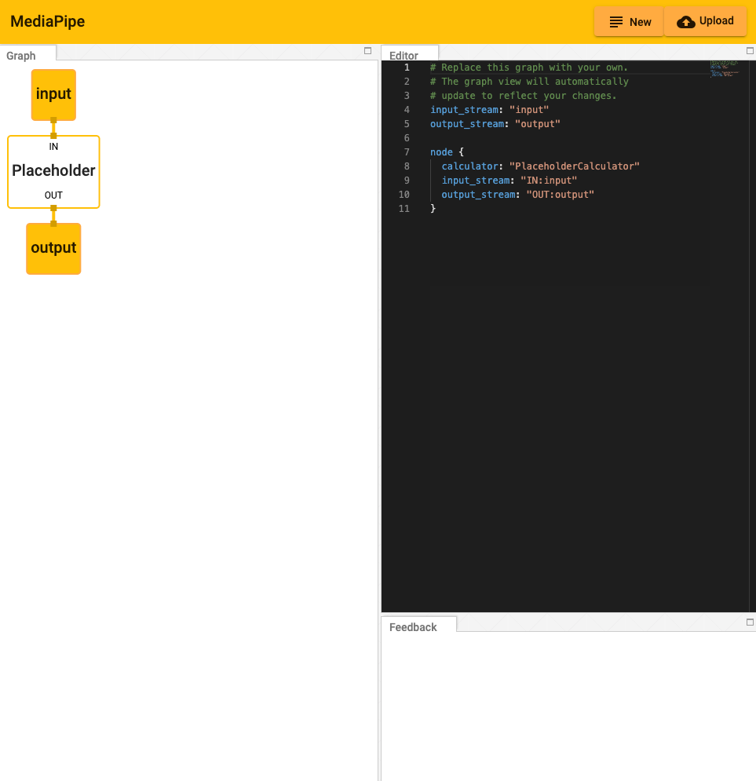
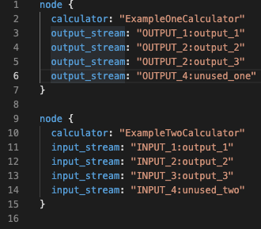
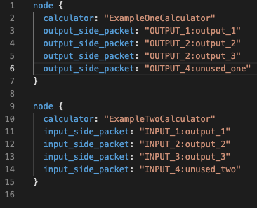
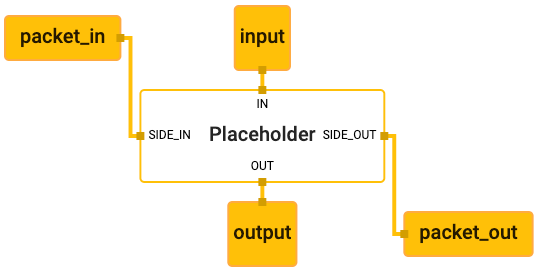
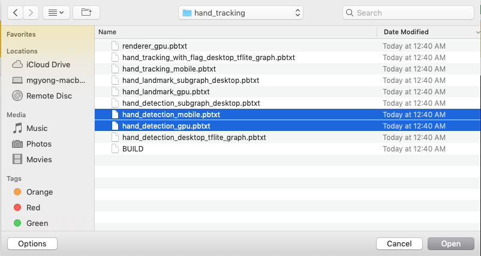

## Visualizing & Tracing MediaPipe Graphs

-   [Working within the Editor](#working-within-the-editor)
-   [Understanding the Graph](#understanding-the-graph)
-   [Tracing the Graph](#tracing-the-graph)
-   [Visualizing Subgraphs](#visualizing-subgraphs)

To help users understand the structure of their calculator graphs and to
understand the overall behavior of their machine learning inference pipelines,
we have built the [MediaPipe Visualizer](https://viz.mediapipe.dev/)
that is available online.

*   A graph view allows users to see a connected calculator graph as expressed
    through a graph configuration that is pasted into the graph editor or
    uploaded. The user can visualize and troubleshoot a graph they have created.

    

### Working within the Editor

Getting Started:

The graph can be modified by adding and editing code in the Editor view.

*   Pressing the "New" button in the upper right corner will clear any existing
    code in the Editor window.

    

*   Pressing the "Upload" button will prompt the user to select a local PBTXT
    file, which will everwrite the current code within the editor.

*   Alternatively, code can be pasted directly into the editor window.

*   Errors and informational messages will appear in the Feedback window.

    

### Understanding the Graph

The visualizer graph shows the connections between calculator nodes.

*   Streams exit from the bottom of the calculator producing the stream and
    enter the top of any calculator receiving the stream. (Notice the use of the
    key, "input_stream" and "output_stream").

    

    

*   Sidepackets work the same, except that they exit a node on the right and
    enter on the left. (Notice the use of the key, "input_side_packet" and
    "output_side_packet").

    

    

*   There are special nodes that represent inputs and outputs to the graph and
    can supply either side packets or streams.

    

    

### Tracing the Graph

The MediaPipe visualizer can display either a calculator graph definition or a
calculator graph execution trace. In a MediaPipe graph, execution tracing can be
activated using a setting in the CalculatorGraphConfig,
`profiler_config.tracing_enabled`. When activated the tracer writes trace log
files on either Linux, Android, or iOS.

For more details on activating execution tracing, see
[Tracing MediaPipe Graphs](./tracer.md)

### Visualizing Subgraphs

The MediaPipe visualizer can display multiple graphs in separate tabs. If a
graph has a `type` field in the top level of the graph's text proto definition,
and that value of graph `type` is used as a calculator name in another graph, it
is considered a subgraph by the visualizer and colored appropriately where it is
used. Clicking on a subgraph will navigate to the corresponding tab which holds
the subgraph's definition.

For instance, there are two graphs involved in the
[hand detection example](./hand_detection_mobile_gpu.md): the main graph
([source pbtxt file](https://github.com/google/mediapipe/blob/master/mediapipe/graphs/hand_tracking/hand_detection_mobile.pbtxt))
and its associated subgraph
([source pbtxt file](https://github.com/google/mediapipe/blob/master/mediapipe/graphs/hand_tracking/subgraphs/hand_detection_gpu.pbtxt)).
To visualize them:

*   In the MediaPipe visualizer, click on the upload graph button and select the
    2 pbtxt files to visualize (main graph and its associated subgraph).

    

    

*   There will be 2 additional tabs. The main graph tab is
    `hand_detection_mobile.pbtxt`.

    

*   Clicking on the `HandDetection` node in purple redirects the view to the
    `hand_detection_gpu.pbtxt` tab.

    
