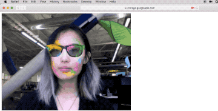
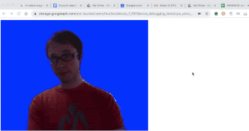

## MediaPipe on the Web

MediaPipe on the Web is an effort to use [WebAssembly](https://webassembly.org/)
to bring MediaPipe graphs, calculators, and related technologies to the web. The
aim is to have all the pieces (ML, rendering, and processing) running directly
in the browser client-side. The official API is under construction, but the core
technology has been proven effective, and we can already show interactive
cross-platform demos using your live webcam.

[For more details, read this Google Developer blog post](https://mediapipe.page.link/webdevblog)

 

### Hand Tracking (with and without SIMD support)

For [Chrome Developer Summit 2019](https://developer.chrome.com/devsummit/), we
used this technology to showcase the potential for performance improvements
using Chrome experimental [WebAssembly SIMD](https://github.com/WebAssembly/simd)
support.  Below are two different versions of the
[MediaPipe Hand Tracking Example](https://mediapipe.readthedocs.io/en/latest/hand_tracking_desktop.html)
 running on the web:

  1. WebAssembly MVP [demo](https://mediapipe.page.link/cds-ht) running around 5-8 frames per second on Desktop Chrome

  2. WebAssembly SIMD [demo](https://mediapipe.page.link/cds-ht-simd) running around 15-18 frames per second on *Canary* Chrome for Desktop, which must additionally be launched with the option `--js-flags="--experimental-wasm-simd"`
